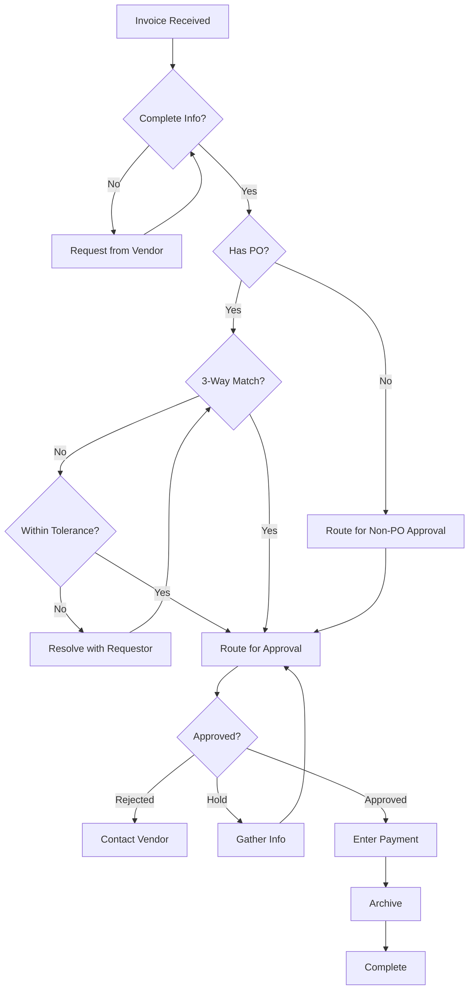
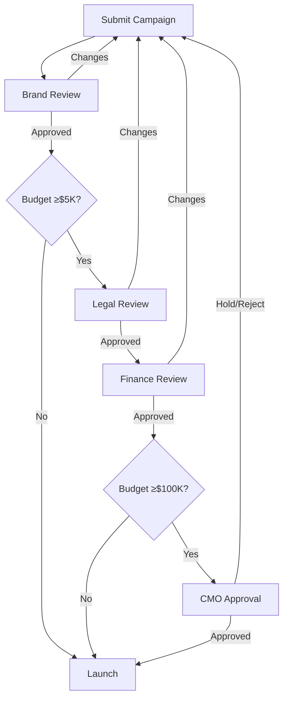

# Examples: Workflow Process Generator

**15 Worked Examples Across Industries and Document Types**

This document provides complete examples of workflow documentation requests and responses, demonstrating the variety and quality of outputs.

---

## Table of Contents

1. [Employee Onboarding SOP](#example-1-employee-onboarding-sop)
2. [Invoice Processing Workflow](#example-2-invoice-processing-workflow)
3. [IT Access Provisioning](#example-3-it-access-provisioning)
4. [Sales Lead Qualification](#example-4-sales-lead-qualification)
5. [Inventory Replenishment](#example-5-inventory-replenishment)
6. [Customer Escalation Playbook](#example-6-customer-escalation-playbook)
7. [Software Deployment Runbook](#example-7-software-deployment-runbook)
8. [Data Retention Compliance](#example-8-data-retention-compliance)
9. [Marketing Campaign Approval](#example-9-marketing-campaign-approval)
10. [Support Ticket Triage](#example-10-support-ticket-triage)
11. [Quarterly Access Review](#example-11-quarterly-access-review)
12. [Expense Reimbursement](#example-12-expense-reimbursement)
13. [Vendor Onboarding](#example-13-vendor-onboarding)
14. [Change Management](#example-14-change-management)
15. [Month-End Close](#example-15-month-end-close)

---

## Example 1: Employee Onboarding SOP

### User Request

```
Create an SOP for new employee onboarding. We're a 200-person tech company.
HR initiates after offer acceptance, and it involves IT, Facilities, and the
hiring manager. Need to ensure all equipment, accounts, and training are
ready for day one.
```

### Response

---

## STANDARD OPERATING PROCEDURE

**Document ID:** SOP-HR-001
**Title:** New Employee Onboarding
**Version:** 1.0
**Effective Date:** [Date]
**Owner:** Director of People Operations

---

### 1. PURPOSE

Establish a standardized process to prepare for and integrate new employees, ensuring all equipment, system access, workspace, and training are ready for a successful first day and productive first 90 days.

### 2. SCOPE

**Applies to:**
- All new full-time and part-time employees
- Contractors with >30-day engagement
- Internal transfers to new departments

**Does not apply to:**
- Temporary employees (<30 days)
- Interns (see SOP-HR-003)
- Consultants without system access

### 3. RESPONSIBILITIES

| Role | Responsibilities |
|------|------------------|
| HR Coordinator | Initiate process, coordinate parties, track completion |
| IT Support | Provision equipment and accounts |
| Facilities | Prepare workspace and access |
| Hiring Manager | Role-specific preparation, Day 1 welcome, 30-60-90 plan |
| New Employee | Complete paperwork, attend orientation |

### 4. PREREQUISITES

Before initiating this procedure:
- [ ] Signed offer letter received
- [ ] Start date confirmed
- [ ] Background check passed
- [ ] Position and department confirmed
- [ ] Hiring manager identified

### 5. PROCEDURE

#### Phase 1: Pre-Boarding (Offer Acceptance to Day -5)

**5.1** HR Coordinator creates onboarding ticket in HRIS within 24 hours of offer acceptance:
- New hire name and personal email
- Position title and department
- Start date
- Hiring manager
- Work location (office/remote/hybrid)

**Expected Result:** Onboarding ticket created with unique ID, notifications sent to IT, Facilities, and Hiring Manager.

**5.2** IT Support provisions equipment by Day -5:

For on-site employees:
- Laptop configured per role standard
- Monitor(s) and peripherals
- Phone and headset
- Badge access request submitted

For remote employees:
- Laptop shipped to arrive by Day -2
- Shipping notification sent to new hire
- Peripherals included

**Expected Result:** Equipment ready or in transit, noted in onboarding ticket.

**5.3** IT Support provisions system access by Day -5:
- Email account created
- Active Directory account created
- VPN access configured
- Standard software installed
- Role-specific systems access requested

**Expected Result:** Credentials generated, documented in secure location for Day 1 distribution.

**5.4** Facilities prepares workspace by Day -3 (on-site only):
- Desk assigned and cleaned
- Chair adjusted
- Supplies stocked
- Welcome signage placed

**Expected Result:** Workspace ready, photo sent to HR Coordinator.

**5.5** Hiring Manager prepares role-specific items by Day -3:
- 30-60-90 day plan drafted
- First week schedule created
- Buddy/mentor assigned
- Team meeting scheduled
- Initial project identified

**Expected Result:** Preparation checklist completed in onboarding ticket.

**5.6** HR Coordinator sends welcome email to new hire by Day -2:
- First day logistics (time, location, parking, contact)
- Required documents to bring
- Dress code guidance
- First week overview
- New hire forms link

**Expected Result:** Email sent with read receipt, forms link activated.

#### Phase 2: Day 1 - Welcome and Setup

**5.7** HR Coordinator conducts New Hire Orientation (9:00-12:00):
- Company overview and culture
- Benefits enrollment
- Policy acknowledgments
- Compliance training (harassment, security)
- Office tour (if on-site)

**Expected Result:** All required acknowledgments signed, benefits elections entered.

**5.8** IT Support completes technical setup:
- Distribute credentials and instructions
- Verify system access
- Complete security training
- Verify 2FA setup

**Expected Result:** New hire can access email, VPN, and core systems.

**5.9** Hiring Manager welcomes new hire (1:00 PM):
- Team introduction
- Role expectations discussion
- Review 30-60-90 day plan
- Assign first tasks
- Introduce buddy

**Expected Result:** New hire understands immediate priorities and has first assignment.

#### Phase 3: First Week Integration (Days 2-5)

**5.10** New hire completes required training:
- [ ] Security awareness training
- [ ] Code of conduct acknowledgment
- [ ] Role-specific compliance (if applicable)
- [ ] Product/service overview

**Expected Result:** All training marked complete in LMS by Day 5.

**5.11** Hiring Manager conducts daily check-ins (15 minutes):
- Progress on first tasks
- Questions and blockers
- Cultural observations
- Resource needs

**Expected Result:** Issues identified and resolved quickly.

**5.12** Buddy schedules social activities:
- Lunch with team members
- Coffee with cross-functional partners
- Introduction to key stakeholders

**Expected Result:** New hire begins building network.

#### Phase 4: 30-60-90 Day Milestones

**5.13** Hiring Manager conducts 30-day review:
- Progress against 30-day plan
- Training completion verification
- Cultural fit assessment
- Goal setting for Days 31-60

**Expected Result:** Review documented, any concerns addressed.

**5.14** HR Coordinator sends 30-day survey to new hire:
- Onboarding experience feedback
- Support adequacy
- Improvement suggestions

**Expected Result:** Survey responses collected, trends reported.

**5.15** Hiring Manager conducts 60-day and 90-day reviews:
- Progressive milestone achievement
- Performance discussion
- Development opportunities
- Long-term goal setting

**Expected Result:** Reviews documented, new hire on path to full productivity.

### 6. QUALITY CONTROLS

**Pre-Day 1 Verification (Day -1):**
- [ ] Equipment ready/delivered
- [ ] All accounts provisioned
- [ ] Workspace prepared
- [ ] Manager preparation complete
- [ ] Welcome email sent

**Day 1 Verification (End of Day):**
- [ ] Orientation completed
- [ ] System access confirmed
- [ ] Manager welcome conducted
- [ ] First assignment given

**Day 5 Verification:**
- [ ] Required training complete
- [ ] Buddy assigned and active
- [ ] Daily check-ins occurring

### 7. EXCEPTION HANDLING

**Equipment delay:**
- Notify HR Coordinator and Hiring Manager immediately
- Arrange loaner equipment
- Document delay and resolution

**System access issues:**
- IT provides temporary workaround
- Escalate if not resolved within 4 hours
- Document for process improvement

**Remote start complications:**
- HR Coordinator calls new hire to troubleshoot
- Reschedule orientation components if needed
- Ensure daily video check-ins

### 8. REFERENCES

- SOP-HR-002: Employee Offboarding
- SOP-HR-003: Intern Onboarding
- SOP-IT-001: Equipment Provisioning
- SOP-IT-002: Access Provisioning
- Employee Handbook
- Benefits Guide

### 9. METRICS

- Time to full equipment provisioning: Target <3 days
- Day 1 readiness: Target 100%
- Training completion by Day 5: Target 100%
- New hire satisfaction: Target ≥4.5/5
- Time to productivity: Track against role benchmarks

---

**Implementation Guidance:**

1. Create onboarding checklist in HRIS for tracking
2. Train all stakeholders on their responsibilities
3. Establish escalation path for readiness issues
4. Review metrics monthly and adjust process

---

## Example 2: Invoice Processing Workflow

### User Request

```
Document our AP invoice processing. Invoices come in via email or mail,
need to be matched to POs, approved based on amount, and entered in NetSuite.
Approval thresholds: <$5K manager, $5K-25K director, >$25K VP.
```

### Response

---

## Invoice Processing Procedure

**Document ID:** SOP-FIN-002
**Version:** 1.0

---

### Procedure Overview

| Step | Action | System | Time |
|------|--------|--------|------|
| 1 | Receive and log | Email/Mail | Same day |
| 2 | Match to PO | NetSuite | Same day |
| 3 | Route for approval | NetSuite Workflow | Auto |
| 4 | Review and approve | NetSuite | 48 hours |
| 5 | Enter for payment | NetSuite | Same day |
| 6 | Archive | Document storage | Same day |

---

### Detailed Procedure

#### 6.1 Invoice Receipt

**6.1.1** Check AP inbox (ap@company.com) and physical mailbox twice daily (10:00 AM and 3:00 PM).

**6.1.2** For each invoice, create an entry in the Invoice Log spreadsheet:
- Date received
- Vendor name
- Invoice number
- Invoice amount
- PO number (if referenced)

**6.1.3** Scan physical invoices to PDF (300 dpi, searchable).

**Expected Result:** All invoices logged with unique tracking number assigned.

#### 6.2 Invoice Validation and Matching

**6.2.1** Verify invoice contains required information:
- [ ] Vendor name and address
- [ ] Invoice number and date
- [ ] Line item details
- [ ] Total amount
- [ ] Payment terms
- [ ] PO number (for PO-based purchases)

**IF** any required information is missing:
→ Contact vendor for corrected invoice
→ Note in Invoice Log
→ Hold processing until received

**6.2.2** Match invoice to purchase order in NetSuite:

1. Navigate to Transactions > Purchases > Match Bills to POs
2. Search by PO number or vendor name
3. Verify three-way match:
   - PO quantity ≥ Invoice quantity
   - PO unit price = Invoice unit price
   - Goods/services received

**IF** three-way match succeeds:
→ Proceed to Step 6.3 (Approval Routing)

**IF** quantity or price variance exists:
→ Determine if within tolerance (±5% or $100, whichever is greater)
→ IF within tolerance: Proceed with note
→ IF outside tolerance: Contact requestor for resolution

**IF** no PO exists:
→ Route to department manager for non-PO approval
→ Flag for procurement policy follow-up

#### 6.3 Approval Routing

**6.3.1** System automatically routes based on amount:

| Invoice Amount | Approval Required | Max Time |
|----------------|-------------------|----------|
| $0 - $4,999.99 | Department Manager | 48 hours |
| $5,000 - $24,999.99 | Director | 48 hours |
| $25,000+ | Vice President | 72 hours |

**6.3.2** Monitor approval queue daily:
- Check for invoices pending >24 hours
- Send reminder to approver
- Escalate if approaching payment deadline

#### 6.4 Approval Review

**6.4.1** Approver reviews invoice in NetSuite:
1. Open invoice from Approval Queue
2. Verify against PO/contract
3. Confirm goods/services received
4. Check budget availability

**6.4.2** Take action:
- **Approve:** Click "Approve" to advance to payment processing
- **Reject:** Click "Reject" with reason; returns to AP for vendor contact
- **Request Info:** Click "Hold" with question; routes back to AP

#### 6.5 Payment Entry

**6.5.1** For approved invoices, enter payment in NetSuite:
1. Navigate to Transactions > Payables > Bills
2. Select vendor
3. Enter invoice details
4. Attach scanned invoice
5. Set payment date based on terms

**6.5.2** Verify GL coding:
- Expense account matches PO
- Department code correct
- Project code (if applicable)

**Expected Result:** Bill created with payment scheduled per terms.

#### 6.6 Document Archival

**6.6.1** Move completed invoice to archive:
- Folder structure: /AP/[Year]/[Month]/[Vendor]
- File name: [InvoiceNumber]_[VendorName]_[Date].pdf

**6.6.2** Update Invoice Log with:
- Approval date
- Payment date
- NetSuite transaction number

---

### Process Flow



---

## Example 3: IT Access Provisioning

### User Request

```
Need to document our user access provisioning process. New users need
Active Directory accounts, email, VPN, and role-specific apps.
Must include manager approval and quarterly access reviews for SOX.
```

### Response

---

## User Access Provisioning Procedure

**Document ID:** SOP-IT-002
**SOX Control Reference:** ITGC-AC-01

---

### 1. PURPOSE

Ensure all user access is appropriately authorized, provisioned with least privilege, and documented for regulatory compliance.

### 2. PROCEDURE

#### 2.1 Access Request

**2.1.1** Requestor submits access request via ServiceNow:
- User name and employee ID
- Role/position
- Manager name
- Required systems (select from list)
- Business justification

**Expected Result:** Request ticket created with unique ID.

**2.1.2** System validates request:
- User exists in HRIS
- Manager relationship confirmed
- Role profile exists

**IF** validation fails:
→ Ticket returned to requestor with correction needed

#### 2.2 Manager Approval

**2.2.1** Manager receives approval notification via email with link to ServiceNow.

**2.2.2** Manager reviews and takes action within 48 hours:
- **Approve:** Confirms user needs stated access
- **Modify:** Adjusts access levels
- **Reject:** Access not appropriate for role

**IF** no response in 48 hours:
→ System sends reminder
→ Escalate to director if no response in 72 hours

**SOX Evidence:** Manager approval timestamp and name captured in ticket.

#### 2.3 Access Provisioning

**2.3.1** IT Administrator provisions standard access within 4 business hours of approval:

| System | Provisioning Steps | Verification |
|--------|-------------------|--------------|
| Active Directory | Create account, add to role groups | User can log in |
| Email | Create mailbox, add to distribution lists | User receives test email |
| VPN | Enable profile, install certificates | User connects remotely |

**2.3.2** IT Administrator provisions role-specific access based on approved request:
- Reference Role Access Matrix (Appendix A)
- Add to appropriate security groups
- Configure application-specific permissions

**2.3.3** Document all access granted:
- List systems and permission levels
- Note any deviations from request
- Attach screenshots if required

**SOX Evidence:** Provisioning log with timestamp and administrator ID.

#### 2.4 User Notification

**2.4.1** IT Administrator notifies user:
- Credential information (via secure channel)
- Access granted summary
- How to get help
- Security reminders

**Expected Result:** User can access all provisioned systems.

#### 2.5 Quarterly Access Review

**2.5.1** IT generates access reports quarterly:
- All users and their access by system
- Users without activity in 90 days
- Users who have changed roles
- Terminated users with active access

**2.5.2** Distribute to managers for certification:
- Review each user's access
- Confirm still appropriate for role
- Mark exceptions for removal

**2.5.3** Implement certified changes:
- Remove marked access within 5 business days
- Document removals
- Update access records

**SOX Evidence:** Signed certifications and removal documentation retained 7 years.

---

### Access Control Matrix

| Role | AD Groups | Email DLs | Apps |
|------|-----------|-----------|------|
| Sales Rep | SG_Sales, SG_CRM | DL_Sales | Salesforce, Outreach |
| Engineer | SG_Engineering, SG_GitHub | DL_Engineering | GitHub, Jira, AWS |
| Finance | SG_Finance, SG_NetSuite | DL_Finance | NetSuite, Concur |

---

## Example 4: Sales Lead Qualification

### User Request

```
Document our sales lead qualification process. SDRs receive inbound leads
from marketing, need to qualify using BANT criteria, and either convert
to opportunity or mark as nurture. SLA is 4 hours for hot leads.
```

### Response

---

## Sales Lead Qualification Playbook

**Document ID:** PB-SALES-001
**Version:** 1.0

---

### Lead Qualification Framework: BANT

| Criteria | Questions to Ask | Qualified If |
|----------|------------------|--------------|
| **B**udget | What budget is allocated? What's the approval process? | Has budget or can acquire |
| **A**uthority | Who makes this decision? Who else is involved? | Decision maker or influencer |
| **N**eed | What problem are you solving? What happens if unsolved? | Clear pain point we address |
| **T**imeline | When do you need a solution? What's driving timeline? | Active buying within 6 months |

---

### Procedure

#### 3.1 Lead Receipt and Prioritization

**3.1.1** Monitor lead queue in Salesforce throughout the day.

**3.1.2** Prioritize leads based on score:

| Lead Score | Priority | Response SLA |
|------------|----------|--------------|
| 80-100 | Hot | 4 hours |
| 60-79 | Warm | 24 hours |
| 40-59 | Cool | 48 hours |
| <40 | Nurture | 7 days |

**3.1.3** Claim lead by changing owner to yourself.

**Expected Result:** Lead assigned to you in queue.

#### 3.2 Pre-Call Research (5-10 minutes)

**3.2.1** Research company:
- Website and product/service
- Company size and industry
- Recent news or announcements
- Existing relationship (check Salesforce)

**3.2.2** Research contact:
- LinkedIn profile
- Role and tenure
- Shared connections
- Content engagement

**3.2.3** Review lead source and activity:
- What brought them in (content, demo request, etc.)
- Page visits and content downloads
- Previous interactions

**Expected Result:** Personalized talk track prepared.

#### 3.3 Initial Outreach

**3.3.1** Attempt contact using multi-channel approach:

**Attempt 1 (Within SLA):**
- Phone call (leave voicemail if no answer)
- Follow with email referencing call

**Attempt 2 (Next business day):**
- Email with value proposition
- LinkedIn connection request

**Attempt 3 (Day 3):**
- Phone call (different time of day)
- Final email with clear CTA

**3.3.2** Log all activities in Salesforce with:
- Activity type and outcome
- Notes on any information learned
- Next step scheduled

**IF** no response after 3 attempts:
→ Change status to "Nurture"
→ Add to appropriate nurture campaign
→ Set follow-up task for 30 days

#### 3.4 Discovery Call

**3.4.1** Introduction and agenda setting (2 minutes):
- Thank them for their time
- Confirm time available
- State agenda and ask for their priorities

**3.4.2** Qualification questions (10-15 minutes):

**Need:**
- "Tell me about what prompted your interest in [product]?"
- "What challenges are you facing with [current solution/process]?"
- "What would success look like for you?"

**Authority:**
- "Walk me through how decisions like this are typically made?"
- "Who else would be involved in evaluating solutions?"
- "What's your role in this process?"

**Timeline:**
- "Is there a specific event driving your timeline?"
- "When would you ideally have a solution in place?"
- "What would prevent you from moving forward?"

**Budget:**
- "Have you allocated budget for this initiative?"
- "How does this compare to other priorities?"
- "What's the approval process for this type of investment?"

**3.4.3** Determine qualification:

**QUALIFIED** - Convert to Opportunity if:
- Clear need we can solve
- Decision maker or access to them
- Timeline within 6 months
- Budget exists or can be acquired

**NURTURE** - Add to nurture if:
- Need exists but timeline >6 months
- Budget not available this cycle
- Right profile but wrong timing

**DISQUALIFY** - Close if:
- No need for our solution
- Outside our ICP
- Bad fit (size, industry, use case)
- Not a real buyer (researcher, competitor)

#### 3.5 Post-Call Actions

**3.5.1** Update Salesforce within 1 hour:
- Detailed call notes
- BANT answers
- Lead status change
- Next steps with dates

**3.5.2** For qualified leads:
- Create Opportunity
- Complete required fields
- Send summary email to prospect
- Schedule AE introduction

**3.5.3** For nurture leads:
- Update lead status
- Select appropriate nurture campaign
- Set follow-up reminder

---

### Qualification Quick Reference

```
QUALIFIED (→ Opportunity)
✓ Pain point clear
✓ Decision maker/influencer
✓ Timeline <6 months
✓ Budget allocated/allocable

NURTURE (→ Campaign)
○ Right profile, wrong timing
○ Needs budget cycle
○ Requires education

DISQUALIFY (→ Closed)
✗ No need
✗ Wrong ICP
✗ Not real buyer
```

---

## Example 5: Inventory Replenishment

### User Request

```
Document our inventory replenishment process for our warehouse.
We use min/max levels, reorder from approved vendors, and need
to maintain 98% fill rate. Include quality check on receipt.
```

### Response

---

## Inventory Replenishment Procedure

**Document ID:** SOP-WH-003
**Version:** 1.0

---

### Procedure

#### 4.1 Reorder Point Monitoring

**4.1.1** Run daily inventory report at 7:00 AM:
1. Open WMS Dashboard
2. Navigate to Reports > Inventory Status
3. Filter: Current Qty ≤ Reorder Point
4. Export to Replenishment Queue

**4.1.2** Review each item at reorder point:
- Verify min/max levels are current
- Check for open POs already in transit
- Confirm vendor status is active

**Expected Result:** List of items requiring reorder generated.

#### 4.2 Purchase Requisition

**4.2.1** Calculate order quantity for each item:
```
Order Quantity = Max Level - Current Quantity + Safety Stock Adjustment
```

**4.2.2** Create Purchase Requisition in WMS:
- Select vendor (use primary; secondary if primary unavailable)
- Enter item and quantity
- Verify unit of measure
- Note special requirements (lot tracking, expiration, etc.)

**4.2.3** Submit for approval per threshold:
- <$10,000: Warehouse Manager
- ≥$10,000: Operations Director

**Expected Result:** PR submitted for approval with estimated delivery.

#### 4.3 Purchase Order

**4.3.1** Upon PR approval, convert to Purchase Order:
1. Open approved PR
2. Click "Convert to PO"
3. Verify terms and pricing
4. Confirm delivery date and location

**4.3.2** Send PO to vendor via:
- EDI (preferred for active vendors)
- Email (backup)

**4.3.3** Update WMS with expected receipt:
- Expected delivery date
- Inbound appointment (if required)
- Special handling instructions

**Expected Result:** PO sent, vendor confirmed, receipt scheduled.

#### 4.4 Receiving and Quality Inspection

**4.4.1** Upon delivery, verify against PO:
- [ ] Vendor and PO number match
- [ ] Item count matches packing slip
- [ ] No visible damage to packaging

**IF** discrepancy found:
→ Note on delivery receipt
→ Photograph damage
→ Contact vendor within 24 hours

**4.4.2** Perform quality inspection:

| Inspection Type | Criteria | Sampling |
|-----------------|----------|----------|
| Visual | No damage, proper labeling | 100% |
| Quantity | Correct count | 100% |
| Specification | Meets product spec | Per QC matrix |

**4.4.3** Record inspection results:
- Pass: Proceed to putaway
- Fail: Quarantine, notify purchasing and vendor

**Expected Result:** Goods inspected and dispositioned.

#### 4.5 Putaway

**4.5.1** Scan items to receive into WMS:
- Scan each unit or case
- Verify quantity matches PO
- Record lot/serial numbers (if applicable)
- Note expiration dates

**4.5.2** System assigns putaway location:
- Based on velocity, size, and zone
- Override only with supervisor approval

**4.5.3** Transport to location and confirm:
- Scan location barcode
- Scan item barcode
- System confirms match

**Expected Result:** Inventory in correct location, WMS updated.

---

### Fill Rate Monitoring

**Daily Metrics:**
- Orders shipped complete / Total orders
- Target: 98%

**Weekly Review:**
- Analyze any stockouts
- Identify root cause
- Adjust min/max if needed

---

## Example 6: Customer Escalation Playbook

### User Request

```
Create a playbook for handling customer escalations. Need clear criteria
for what constitutes an escalation, response times by severity, and
communication templates. Executive involvement for highest tier.
```

### Response

---

## Customer Escalation Playbook

**Document ID:** PB-CS-001
**Version:** 1.0

---

### Escalation Tiers

| Tier | Criteria | Owner | Response | Update Freq |
|------|----------|-------|----------|-------------|
| **T1** | Dissatisfied, impact limited | CSM | 4 hours | Daily |
| **T2** | Risk of churn, contract impact | CS Manager | 2 hours | 2x daily |
| **T3** | Executive complaint, legal threat | CS Director + Exec | 1 hour | 4x daily |

---

### Escalation Procedure

#### 5.1 Identification and Logging

**5.1.1** Recognize escalation signals:
- Direct statement: "I want to speak to a manager"
- Repeated contacts about same issue
- Threat: "I'm considering canceling"
- Executive involvement at customer
- Legal or compliance mention

**5.1.2** Create escalation record:
1. Open customer account in Salesforce
2. Create Case with Type = "Escalation"
3. Set Tier based on criteria
4. Complete required fields:
   - Customer name and contact
   - Issue summary
   - Impact description
   - Customer expected resolution
   - Timeline

**Expected Result:** Escalation case created, timer started.

#### 5.2 Initial Response

**5.2.1** Contact customer within response SLA:

**T1 (within 4 hours):**
- Phone or email based on preference
- Acknowledge concern
- Confirm understanding
- Set expectation for resolution

**T2 (within 2 hours):**
- Phone call (required)
- CS Manager owns communication
- Bring in technical resources as needed

**T3 (within 1 hour):**
- Phone call from CS Director
- Executive sponsor briefed
- War room assembled

**5.2.2** Send acknowledgment communication:

**Template - Initial Acknowledgment:**
```
Subject: Your Recent Contact - We're On It

Dear [Name],

Thank you for bringing this to our attention. I understand how important
[specific issue] is to your operations, and I want to assure you this
has my full attention.

Here's what's happening:
- I've reviewed [specific details you understand]
- I've assembled [resources] to resolve this
- You can expect an update by [specific time]

I'll be your primary contact until this is resolved. You can reach me
directly at [phone] or [email].

[Name]
[Title]
```

#### 5.3 Investigation and Resolution

**5.3.1** Assemble resolution team based on issue:
- Technical issues: Engineering lead
- Billing issues: Finance contact
- Service issues: Operations lead
- Contract issues: Legal (if needed)

**5.3.2** Conduct root cause analysis:
- Review case history
- Interview internal stakeholders
- Analyze system logs (if technical)
- Document findings

**5.3.3** Develop resolution options:
- Short-term fix (immediate relief)
- Long-term solution (permanent fix)
- Customer consideration (goodwill)

**5.3.4** Propose resolution to customer:
- Clear explanation of what happened
- Specific actions being taken
- Timeline for each action
- Compensation/consideration (if appropriate)

#### 5.4 Communication Cadence

**5.4.1** Maintain communication per tier:

| Tier | Frequency | Method | To Whom |
|------|-----------|--------|---------|
| T1 | Daily | Email | Customer contact |
| T2 | 2x daily | Phone + email | Customer + manager |
| T3 | 4x daily | Phone | Executive + team |

**5.4.2** Internal updates:
- T2: CS Manager brief to Director
- T3: Exec briefing each update

**Template - Progress Update:**
```
Subject: Update on [Issue] - [Date/Time]

Hi [Name],

Here's where we are:

**Status:** [Investigating / Implementing Fix / Monitoring]

**Progress Since Last Update:**
- [Specific action taken]
- [Specific action taken]

**Next Steps:**
- [Planned action] by [time]
- [Planned action] by [time]

**Expected Resolution:** [Date/time]

I'll update you again by [next update time].

[Name]
```

#### 5.5 Resolution and Closure

**5.5.1** Confirm resolution with customer:
- Review all actions taken
- Confirm issue is resolved
- Discuss preventive measures
- Address any remaining concerns

**5.5.2** Complete closure actions:
- Update case with resolution details
- Send closure email
- Schedule follow-up call (1 week)
- Complete internal debrief

**5.5.3** Conduct internal review:
- Root cause documented
- Process improvement identified
- Team recognition (if applicable)
- Update knowledge base

---

### Escalation Prevention

**Proactive measures:**
- Monitor health scores
- Regular business reviews
- Risk flagging in CSM meetings
- Early intervention on at-risk accounts

---

## Example 7: Software Deployment Runbook

### User Request

```
Need a deployment runbook for our SaaS application. We deploy to Kubernetes
on AWS, use GitHub Actions for CI/CD, and have zero-downtime requirements.
Include rollback procedures.
```

### Response

---

## Production Deployment Runbook

**Document ID:** RUN-ENG-001
**Version:** 1.0

---

### Pre-Deployment Checklist

Complete ALL items before proceeding:

- [ ] Code merged to main branch
- [ ] All tests passing (unit, integration, e2e)
- [ ] Security scan clean
- [ ] PR approved by 2+ reviewers
- [ ] QA sign-off obtained
- [ ] Change ticket approved
- [ ] On-call engineer notified
- [ ] Rollback version identified

---

### Deployment Procedure

#### 6.1 Pre-Deployment

**6.1.1** Announce deployment in #deployments:
```
:rocket: Starting production deployment
Version: [version]
Change: [brief description]
Estimated time: [duration]
Rollback: [previous version]
```

**6.1.2** Verify system state:
```bash
# Check current version
kubectl get deployment api -o jsonpath='{.spec.template.spec.containers[0].image}'

# Check pod health
kubectl get pods -l app=api

# Check recent alerts
# Review Datadog dashboard
```

**Expected Result:** All pods healthy, no active alerts.

#### 6.2 Deploy

**6.2.1** Trigger deployment via GitHub Actions:
1. Navigate to Actions > Deploy to Production
2. Click "Run workflow"
3. Select branch: main
4. Enter version tag
5. Click "Run workflow"

**6.2.2** Monitor deployment progress:
```bash
# Watch rollout status
kubectl rollout status deployment/api

# Watch pod transitions
kubectl get pods -l app=api -w
```

**Expected Results:**
- New pods start
- Health checks pass
- Old pods terminate
- Deployment complete

**6.2.3** Verify successful deployment:
```bash
# Confirm new version
kubectl get deployment api -o jsonpath='{.spec.template.spec.containers[0].image}'

# Check pod status
kubectl get pods -l app=api

# Verify endpoints
curl -s https://api.company.com/health | jq .version
```

**Expected Result:** New version running, health check passing.

#### 6.3 Post-Deployment Verification

**6.3.1** Run smoke tests:
```bash
# Execute smoke test suite
./scripts/smoke-tests.sh production
```

**6.3.2** Monitor key metrics (15 minutes):
- Error rate (should remain flat)
- Latency (p50, p95, p99)
- Request rate
- CPU/memory utilization

**IF** any anomaly detected:
→ Proceed to Rollback (Section 6.4)

**6.3.3** Announce completion:
```
:white_check_mark: Deployment complete
Version: [version]
Duration: [time]
Status: Successful
```

#### 6.4 Rollback Procedure

**Use when:**
- Error rate increases >5%
- Latency increases >50%
- Critical functionality broken
- On-call engineer decision

**6.4.1** Announce rollback:
```
:rotating_light: Initiating rollback
Issue: [brief description]
Rolling back to: [version]
```

**6.4.2** Execute rollback:
```bash
# Rollback to previous version
kubectl rollout undo deployment/api

# Or rollback to specific version
kubectl rollout undo deployment/api --to-revision=N
```

**6.4.3** Verify rollback:
```bash
# Confirm version
kubectl get deployment api -o jsonpath='{.spec.template.spec.containers[0].image}'

# Check health
curl -s https://api.company.com/health | jq .version
```

**6.4.4** Announce rollback complete:
```
:rewind: Rollback complete
Restored version: [version]
Status: Stable
Next steps: [investigation plan]
```

**6.4.5** Create incident ticket for investigation.

---

### Emergency Contacts

| Role | Name | Phone | Slack |
|------|------|-------|-------|
| On-call Engineer | Rotation | PagerDuty | @oncall-eng |
| Platform Lead | [Name] | [Phone] | @name |
| VP Engineering | [Name] | [Phone] | @name |

---

## Example 8: Data Retention Compliance

### User Request

```
Document our data retention and deletion process for GDPR compliance.
Need to cover customer data deletion requests, automated retention
enforcement, and evidence for auditors.
```

### Response

---

## Data Retention and Deletion Procedure

**Document ID:** SOP-SEC-003
**Regulation Reference:** GDPR Articles 17, 30

---

### Retention Schedule

| Data Category | Retention Period | Legal Basis | Deletion Method |
|---------------|-----------------|-------------|-----------------|
| Customer accounts | Active + 3 years | Contract | Automated |
| Transaction records | 7 years | Tax law | Automated |
| Marketing data | Until consent withdrawn | Consent | On request |
| Application logs | 90 days | Legitimate interest | Automated |
| Security logs | 1 year | Legitimate interest | Automated |

---

### Procedure

#### 7.1 Customer Deletion Request (Right to Erasure)

**7.1.1** Receive and log request:
- Via privacy@company.com or in-app
- Log in Privacy Request Tracker
- Assign unique request ID

**7.1.2** Verify identity within 24 hours:
- Match email to account
- Request additional verification if needed
- Document verification method

**7.1.3** Assess request:

**IF** request is valid (can proceed):
- Personal data only
- No legal hold
- No ongoing service requirement

**IF** request must be declined:
- Legal obligation to retain
- Ongoing contract
- Establish/defend legal claims
→ Respond with reason and legal basis

**7.1.4** Execute deletion within 30 days:

1. Production database:
```sql
-- Remove personal data
UPDATE users SET
  email = 'deleted-[ID]@anonymized.local',
  name = 'Deleted User',
  phone = NULL,
  address = NULL
WHERE user_id = [ID];
```

2. Backups: Flag for exclusion from restore

3. Third-party systems:
   - CRM (Salesforce): Delete record
   - Email (Customer.io): Delete profile
   - Analytics (Amplitude): Delete user

4. Verify deletion:
   - Run search across all systems
   - Document results

**7.1.5** Confirm to requestor:
- Send confirmation email
- List data deleted
- Note any retained data and basis

**7.1.6** Document for audit:
- Request details
- Verification method
- Actions taken
- Systems affected
- Completion date

#### 7.2 Automated Retention Enforcement

**7.2.1** Daily retention job runs at 02:00 UTC:
- Identifies data past retention period
- Executes deletion scripts
- Logs actions

**7.2.2** Weekly retention report:
- Records deleted by category
- Exceptions requiring manual review
- Errors encountered

**7.2.3** Monthly validation:
- Sample check of retained data
- Verify retention periods correct
- Update retention schedule if needed

---

### Audit Evidence

Maintain for each deletion:
- Request timestamp
- Identity verification record
- Systems inventoried
- Deletion confirmation
- Requestor notification

Retain audit records for 3 years after deletion.

---

## Example 9: Marketing Campaign Approval

### User Request

```
Document our marketing campaign approval workflow. Campaigns need
brand, legal, and budget approval before launch. Different approval
chains for different campaign sizes.
```

### Response

---

## Marketing Campaign Approval Procedure

**Document ID:** SOP-MKT-001
**Version:** 1.0

---

### Approval Matrix

| Campaign Budget | Creative | Legal | Finance | CMO |
|-----------------|----------|-------|---------|-----|
| <$5,000 | Brand Lead | - | - | - |
| $5,000-$25,000 | Brand Lead | Legal Review | Finance Review | - |
| $25,000-$100,000 | Brand Lead | Legal Approval | Finance Approval | Inform |
| >$100,000 | Brand Lead | Legal Approval | Finance Approval | Approve |

---

### Procedure

#### 8.1 Campaign Submission

**8.1.1** Complete Campaign Brief in Asana:
- Campaign name and objective
- Target audience
- Channels
- Budget request
- Timeline
- Success metrics

**8.1.2** Attach creative assets:
- All ad copy and visuals
- Landing pages
- Email templates
- Terms and conditions (if applicable)

**8.1.3** Submit for approval:
- Select approval workflow based on budget
- System routes to first approver

#### 8.2 Brand Review

**8.2.1** Brand Lead reviews within 48 hours:
- Brand voice and tone
- Visual identity compliance
- Message consistency
- Asset quality

**8.2.2** Decision:
- **Approve:** Advances to next approver
- **Request Changes:** Returns to marketer with feedback
- **Reject:** Campaign not aligned with brand

#### 8.3 Legal Review

**8.3.1** Legal reviews within 72 hours:
- Claims and disclosures
- Trademark usage
- Regulatory compliance (FTC, GDPR)
- Terms and conditions

**8.3.2** Decision:
- **Approve:** Advances to next approver
- **Request Changes:** Specific legal revisions required
- **Reject:** Cannot remediate compliance issues

#### 8.4 Finance Review

**8.4.1** Finance reviews within 48 hours:
- Budget availability
- Vendor contracts
- ROI projections
- Coding accuracy

**8.4.2** Decision:
- **Approve:** Budget confirmed
- **Request Changes:** Budget adjustment needed
- **Reject:** Budget not available

#### 8.5 Executive Approval (>$100K)

**8.5.1** CMO reviews within 24 hours:
- Strategic alignment
- Resource allocation
- Timing considerations

**8.5.2** Decision:
- **Approve:** Campaign authorized
- **Hold:** Timing or priority concern
- **Reject:** Strategic misalignment

#### 8.6 Launch

**8.6.1** Upon final approval:
- Campaign status updated to "Approved"
- Launch date confirmed
- Assets released to channels
- Tracking implemented

---

### Process Flow



---

## Example 10: Support Ticket Triage

### User Request

```
Document how our support team should triage incoming tickets.
Need to assign priority, route to right team, and track SLAs.
Use P1-P4 priorities.
```

### Response

---

## Support Ticket Triage Procedure

**Document ID:** SOP-SUP-001
**Version:** 1.0

---

### Priority Matrix

| Priority | Criteria | Response SLA | Resolution Target |
|----------|----------|--------------|-------------------|
| **P1** | Service down, all users affected | 15 minutes | 4 hours |
| **P2** | Major feature broken, workaround exists | 1 hour | 8 hours |
| **P3** | Minor feature issue, limited impact | 4 hours | 24 hours |
| **P4** | Question, enhancement request | 8 hours | 72 hours |

---

### Triage Procedure

#### 9.1 Initial Assessment

**9.1.1** Review new ticket within 10 minutes of submission.

**9.1.2** Gather information:
- Customer tier (Enterprise, Pro, Basic)
- Issue description
- Impact scope (all users, some, one)
- Urgency indicators

**9.1.3** Assign priority using decision tree:

```
Is the entire service unavailable?
├─ Yes → P1
└─ No → Is a major feature broken?
        ├─ Yes → Is there a workaround?
        │       ├─ Yes → P2
        │       └─ No → P1
        └─ No → Does it affect productivity?
                ├─ Yes → P3
                └─ No → P4
```

#### 9.2 Routing

**9.2.1** Route based on issue type:

| Issue Type | Queue | Escalation |
|------------|-------|------------|
| Technical/Bug | Engineering Support | Tier 2 → Engineering |
| Account/Billing | Account Services | → Finance |
| How-to/Training | Customer Education | → CSM |
| Feature Request | Product Feedback | → Product |

**9.2.2** Assign to available agent with:
- Required skill for issue type
- Capacity for new tickets
- Timezone alignment (preferred)

#### 9.3 Initial Response

**9.3.1** Respond within SLA with:
- Acknowledgment of issue
- Priority assigned
- Expected next steps
- Contact information

**Template:**
```
Hi [Name],

Thank you for contacting support. I've reviewed your ticket
regarding [issue summary].

I've assigned this as Priority [X] based on [reason].

Here's what happens next:
- [Next step 1]
- [Next step 2]

You can expect [timeframe]. I'll keep you updated on progress.

Ticket #: [number]
Priority: [P1/P2/P3/P4]
```

---

### SLA Monitoring

**Breach alerts:**
- Warning: 80% of SLA elapsed
- Critical: 90% of SLA elapsed
- Breach: SLA exceeded

**Escalation on breach:**
- P1/P2: Auto-escalate to Tier 2 + notify manager
- P3/P4: Notify agent and manager

---

## Example 11: Quarterly Access Review

### User Request

```
Document our quarterly user access review for SOX compliance.
Need manager certification of their employees' access,
remediation of exceptions, and evidence package for auditors.
```

### Response

---

## Quarterly Access Review Procedure

**Document ID:** SOP-IT-005
**SOX Control ID:** ITGC-AC-05

---

### Timeline

| Week | Activity | Owner |
|------|----------|-------|
| 1 | Generate reports, distribute | IT Security |
| 2-3 | Manager review and certification | Managers |
| 4 | Remediation and evidence compilation | IT Security |

---

### Procedure

#### 10.1 Report Generation (Week 1)

**10.1.1** Extract access reports from each system:
- Active Directory group memberships
- Application role assignments
- Privileged access accounts
- Service accounts

**10.1.2** Generate manager-specific reports:
- Filter by cost center/manager
- Include: User, System, Access Level, Last Use
- Flag: No activity >90 days, terminated users

**10.1.3** Distribute to managers:
- Send via secure portal
- Include certification instructions
- Set deadline (14 calendar days)

#### 10.2 Manager Certification (Weeks 2-3)

**10.2.1** Manager reviews each user's access:
- Confirm appropriate for current role
- Mark for removal if not needed
- Note any concerns

**10.2.2** Certify completeness:
- Electronic signature
- Date of certification
- Attestation statement

**10.2.3** IT Security monitors completion:
- Day 7: Send reminder to incomplete
- Day 10: Escalate to director
- Day 14: Escalate to VP

#### 10.3 Remediation (Week 4)

**10.3.1** Compile removal requests:
- Extract all access marked for removal
- Validate against current access
- Group by system

**10.3.2** Execute access removal:
- Remove access per system procedures
- Document removal confirmation
- Notify user if needed

**10.3.3** Validate removals:
- Regenerate access reports
- Confirm marked access is removed
- Document exceptions

#### 10.4 Evidence Package

**10.4.1** Compile for audit:
- Population completeness (all managers participated)
- Timeliness (certification dates within deadline)
- Remediation evidence (before/after)
- Exception documentation

**10.4.2** Retain per schedule:
- Certification forms: 7 years
- Access reports: 7 years
- Removal evidence: 7 years

---

### Evidence Requirements

| Item | Format | Location |
|------|--------|----------|
| Manager certifications | Signed PDF | SharePoint/Access Reviews |
| Access reports | Excel | SharePoint/Access Reviews |
| Removal tickets | ServiceNow export | SharePoint/Access Reviews |
| Completion metrics | Summary report | SharePoint/Access Reviews |

---

## Example 12: Expense Reimbursement

### User Request

```
Create an SOP for employee expense reimbursement. We use Concur,
have a $100 receipt requirement, manager approval, and direct
deposit reimbursement within 5 business days.
```

### Response

---

## Expense Reimbursement Procedure

**Document ID:** SOP-FIN-003
**Version:** 1.0

---

### Policy Summary

- Receipt required for expenses ≥$100
- Manager approval required
- Submit within 60 days of expense
- Reimbursement via direct deposit within 5 business days

---

### Procedure

#### 11.1 Receipt Capture

**11.1.1** Capture receipt at time of expense:
- Use Concur mobile app
- Photo must show vendor, date, total, items
- Tip separate if >20%

**11.1.2** For expenses <$100:
- Receipt not required
- Must have expense type and business purpose

#### 11.2 Report Creation

**11.2.1** Create expense report in Concur:
1. Log in to Concur
2. Click "Create New Report"
3. Enter report name (format: [Date] - [Purpose])
4. Select business trip or project (if applicable)

**11.2.2** Add expenses:
- Select expense type from list
- Enter date, amount, vendor
- Attach receipt
- Add business purpose

**11.2.3** Verify policy compliance:
- Green checkmark: Compliant
- Yellow warning: Requires justification
- Red X: Policy violation (must resolve or won't submit)

**11.2.4** Submit report:
- Review all entries
- Click "Submit"
- Confirm submission

#### 11.3 Manager Approval

**11.3.1** Manager receives notification.

**11.3.2** Manager reviews within 48 hours:
- Verify business purpose
- Check policy compliance
- Approve or return with comments

**11.3.3** IF returned:
- Employee receives notification
- Make requested corrections
- Resubmit

#### 11.4 Finance Processing

**11.4.1** Finance reviews approved reports daily.

**11.4.2** Verify:
- Receipts attached for ≥$100
- Correct GL coding
- No duplicates

**11.4.3** Process for payment:
- Batch for payroll
- Direct deposit within 5 business days

**11.4.4** Notify employee:
- Payment confirmation email
- Pay date
- Amount deposited

---

## Example 13: Vendor Onboarding

### User Request

```
Document our vendor onboarding process. Need to collect W-9,
verify insurance, set up in NetSuite, and maintain approved
vendor list. Include annual re-verification.
```

### Response

---

## Vendor Onboarding Procedure

**Document ID:** SOP-PROC-001
**Version:** 1.0

---

### Procedure

#### 12.1 Vendor Request

**12.1.1** Requestor submits New Vendor Request:
- Vendor name and type
- Business justification
- Expected annual spend
- Services/goods provided

**12.1.2** Procurement reviews for:
- Existing vendor with capability
- Strategic sourcing opportunity
- Spend threshold

**IF** approved to proceed:
→ Send vendor onboarding package

#### 12.2 Vendor Documentation

**12.2.1** Collect required documents:

| Document | Required For | Validity |
|----------|--------------|----------|
| W-9 | All US vendors | Until info changes |
| Insurance COI | Services >$10K | Annual renewal |
| Banking info | All vendors | Until info changes |
| Tax status | All vendors | Annual |

**12.2.2** Verify documents:
- W-9: TIN validation
- Insurance: Meets minimums, we're additional insured
- Banking: Request confirmation via separate channel

#### 12.3 Risk Assessment

**12.3.1** Assess vendor risk:

| Criteria | Low | Medium | High |
|----------|-----|--------|------|
| Annual spend | <$25K | $25K-$100K | >$100K |
| Data access | None | Internal | Customer |
| Criticality | Non-essential | Important | Critical |

**12.3.2** For Medium/High risk:
- Security questionnaire
- Financial review
- Reference check

#### 12.4 System Setup

**12.4.1** Create vendor in NetSuite:
1. Vendors > New
2. Enter legal name, DBA
3. Add addresses and contacts
4. Enter banking (direct deposit or check)
5. Set terms
6. Attach documents

**12.4.2** Add to Approved Vendor List:
- Vendor name
- Category
- Risk level
- Review date (annual)

#### 12.5 Annual Re-verification

**12.5.1** 60 days before anniversary:
- Request updated insurance COI
- Verify banking unchanged
- Confirm contact information

**12.5.2** Update records:
- Attach new documents
- Update review date
- Note any changes

---

## Example 14: Change Management

### User Request

```
Document our IT change management process. Need standard, emergency,
and pre-approved change types. CAB reviews on Wednesdays.
```

### Response

---

## IT Change Management Procedure

**Document ID:** SOP-IT-010
**Version:** 1.0

---

### Change Types

| Type | Risk | Approval | Lead Time |
|------|------|----------|-----------|
| Standard | Pre-assessed | CAB | 5 business days |
| Pre-approved | Low | Auto-approved | N/A |
| Emergency | Critical | Emergency CAB | ASAP |

---

### Procedure

#### 13.1 Change Request

**13.1.1** Submit RFC in ServiceNow:
- Change summary
- Business justification
- Technical approach
- Risk assessment
- Rollback plan
- Test results
- Implementation schedule

**13.1.2** System assigns type based on criteria.

#### 13.2 Standard Change Approval

**13.2.1** Submit by Monday 5 PM for Wednesday CAB.

**13.2.2** CAB reviews:
- Risk assessment complete
- Testing adequate
- Rollback viable
- Schedule appropriate
- Resources available

**13.2.3** CAB decision:
- **Approved:** Implement per schedule
- **Conditionally Approved:** Meet conditions first
- **Deferred:** Reschedule to future date
- **Rejected:** Rework and resubmit

#### 13.3 Emergency Change

**13.3.1** Invoke only when:
- Service-impacting issue
- Urgent security patch
- Cannot wait for standard CAB

**13.3.2** Emergency CAB (virtual):
- Notify Emergency CAB members
- Convene within 1 hour
- Verbal approval documented
- Post-implementation review required

#### 13.4 Implementation

**13.4.1** Pre-implementation:
- Verify approvals in place
- Confirm team and resources
- Notify stakeholders
- Verify rollback ready

**13.4.2** Implementation:
- Follow implementation plan
- Update change record
- Document any deviations

**13.4.3** Post-implementation:
- Verify success criteria
- Monitor for issues
- Close change record
- Conduct review (emergencies)

---

## Example 15: Month-End Close

### User Request

```
Document our month-end close process for accounting. Need
task assignments, due dates, and reconciliation sign-offs.
Typically closes by Day 5.
```

### Response

---

## Month-End Close Procedure

**Document ID:** SOP-FIN-010
**Version:** 1.0
**Target Completion:** Business Day 5

---

### Close Calendar

| Day | Tasks | Owner |
|-----|-------|-------|
| Last day | Cut-off communications, preliminary close | Controller |
| Day 1 | Subledger close, bank reconciliation | Accountants |
| Day 2 | Intercompany, accruals, prepaids | Accountants |
| Day 3 | Fixed assets, equity, management review | Senior Accountants |
| Day 4 | Final adjustments, flux analysis | Controller |
| Day 5 | Final review, reporting | Controller |

---

### Procedure

#### 14.1 Pre-Close (Last Business Day)

**14.1.1** Send cut-off communication:
- Expense report deadline
- Invoice processing deadline
- Payroll finalization confirmation

**14.1.2** Complete preliminary close:
- Run preliminary trial balance
- Identify obvious issues
- Assign investigation

#### 14.2 Day 1: Subledger Close

**14.2.1** Close AP subledger:
- Process remaining invoices
- Run 3-way match report
- Clear exceptions

**14.2.2** Close AR subledger:
- Post revenue recognition
- Apply payments
- Review aging

**14.2.3** Reconcile bank accounts:
- Download statements
- Identify reconciling items
- Clear outstanding items
- Sign off reconciliation

**Expected Result:** All subledgers closed, bank reconciled.

#### 14.3 Day 2: Accruals and Prepaids

**14.3.1** Record accruals:
- Payroll accrual
- Bonus accrual
- Expense accruals
- Revenue deferrals

**14.3.2** Roll prepaids:
- Calculate monthly amortization
- Post journal entries
- Verify schedule ties to GL

**14.3.3** Intercompany reconciliation:
- Verify IC balances zero
- Investigate differences
- Clear discrepancies

**Expected Result:** All accruals posted, prepaids rolled, IC balanced.

#### 14.4 Day 3: Fixed Assets and Review

**14.4.1** Fixed assets:
- Post depreciation
- Record additions/disposals
- Reconcile to schedule

**14.4.2** Equity reconciliation:
- Roll equity forward
- Post any transactions

**14.4.3** Initial management review:
- Run trial balance
- Review top accounts
- Identify adjustments needed

#### 14.5 Day 4: Final Adjustments

**14.5.1** Record final adjustments:
- Post approved JEs
- Review JE support
- Approvals obtained

**14.5.2** Flux analysis:
- Compare to prior month
- Compare to budget
- Document variances >10%

#### 14.6 Day 5: Close Complete

**14.6.1** Final Controller review:
- Review all reconciliations
- Verify sign-offs complete
- Approve final trial balance

**14.6.2** Generate reporting:
- Financial statements
- Management reports
- Board presentation

**14.6.3** Lock period:
- Close period in NetSuite
- Archive working papers

---

### Close Checklist

**Day 1:**
- [ ] AP closed and posted
- [ ] AR closed and posted
- [ ] Bank accounts reconciled
- [ ] Subledger reconciliations signed

**Day 2:**
- [ ] Accruals recorded
- [ ] Prepaids rolled
- [ ] Intercompany balanced

**Day 3:**
- [ ] Fixed assets posted
- [ ] Equity reconciled
- [ ] Initial review complete

**Day 4:**
- [ ] Adjustments posted
- [ ] Flux analysis complete
- [ ] Variances documented

**Day 5:**
- [ ] Controller sign-off
- [ ] Statements generated
- [ ] Period locked

---

*For additional examples or customization, contact the Workflow Process Generator with your specific requirements.*
