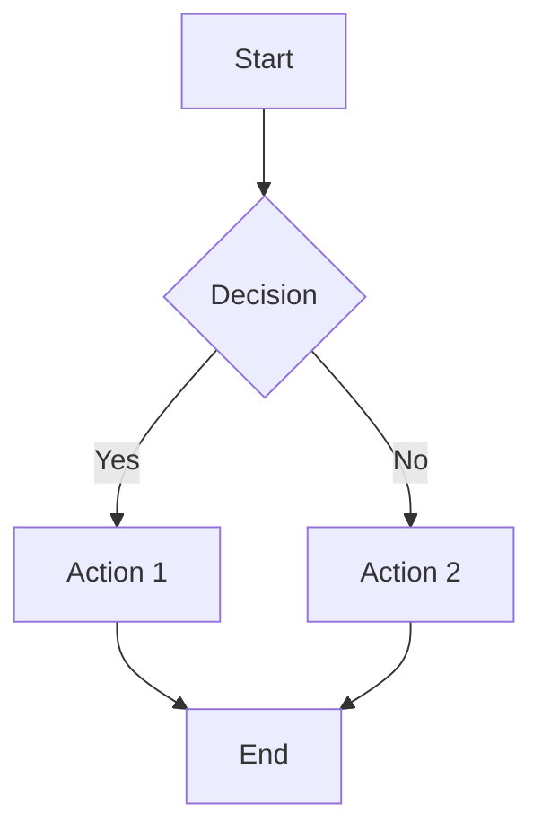
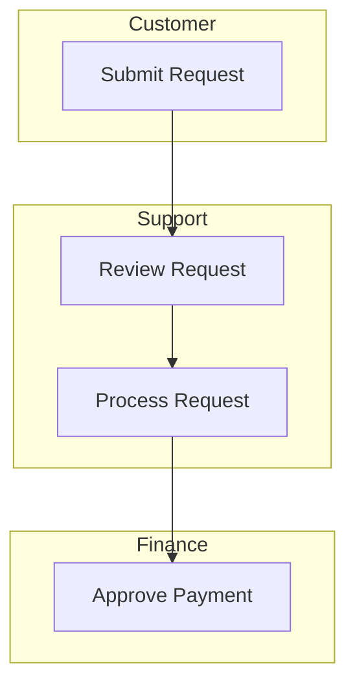
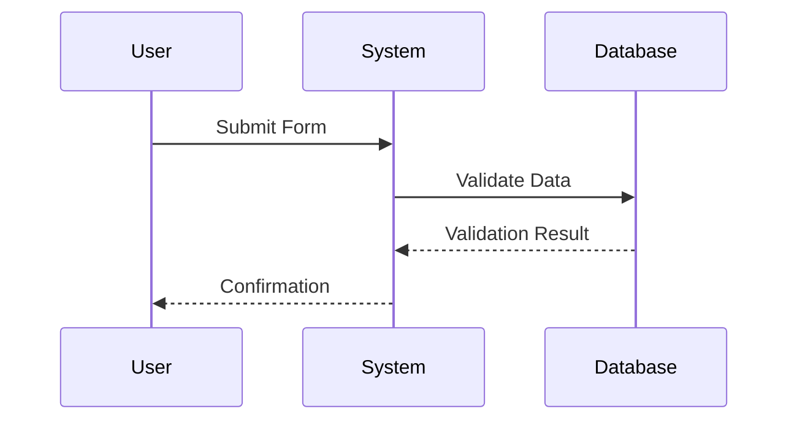

# Implementation Guide: Workflow Process Generator

**Deep Knowledge Base for Professional Process Documentation**

This guide provides comprehensive guidance on implementing, maintaining, and optimizing workflow documentation across your organization.

---

## Table of Contents

1. [Documentation Strategy](#documentation-strategy)
2. [Document Architecture](#document-architecture)
3. [Writing Standards](#writing-standards)
4. [Visual Documentation](#visual-documentation)
5. [Compliance Framework](#compliance-framework)
6. [Change Management](#change-management)
7. [Quality Assurance](#quality-assurance)
8. [Maintenance and Governance](#maintenance-and-governance)
9. [Advanced Techniques](#advanced-techniques)
10. [Industry-Specific Guidance](#industry-specific-guidance)
11. [Troubleshooting](#troubleshooting)

---

## Documentation Strategy

### Assessing Documentation Needs

Before creating any documentation, assess the current state and future needs:

**Current State Assessment:**
1. Inventory existing documentation (even if outdated)
2. Identify critical processes without documentation
3. Evaluate documentation quality and currency
4. Understand user pain points
5. Review audit findings and compliance gaps

**Prioritization Matrix:**

| Priority | Criteria | Action |
|----------|----------|--------|
| Critical | Safety, regulatory, high-volume | Document immediately |
| High | Revenue-impacting, frequent issues | Document within 30 days |
| Medium | Efficiency gains, moderate volume | Document within 90 days |
| Low | Administrative, low frequency | Document as resources allow |

**Risk-Based Prioritization:**
```
Priority Score = Impact × Probability × (1 / Current Documentation Quality)

Where:
- Impact: 1-5 (consequences of failure)
- Probability: 1-5 (likelihood of failure without docs)
- Current Quality: 1-5 (5 = well-documented, 1 = none)
```

### Documentation Architecture

**Hierarchical Process Framework:**

```
Level 0: Enterprise Process Map
         (5-10 core business processes)
              ↓
Level 1: Process Areas
         (20-30 major process areas)
              ↓
Level 2: Process Groups
         (100+ process groups)
              ↓
Level 3: Procedures
         (Individual SOPs)
              ↓
Level 4: Work Instructions
         (Task-level detail)
```

**Example Hierarchy:**
```
L0: Order-to-Cash
    L1: Order Management
        L2: Order Entry
            L3: SOP-OM-001: Standard Order Entry
            L3: SOP-OM-002: Rush Order Processing
                L4: WI-OM-002-01: System Navigation for Rush Orders
        L2: Order Modification
        L2: Order Cancellation
    L1: Fulfillment
    L1: Billing
    L1: Collections
```

### Document Type Selection

**Decision Guide:**

```
What is the primary need?
│
├─ Execute a process step-by-step
│  └─ How many steps?
│     ├─ <10 steps, single role → Work Instruction
│     ├─ 10-50 steps → Standard SOP
│     └─ >50 steps or multiple roles → SOP Suite
│
├─ Understand flow and decisions
│  └─ → Process Map/Flowchart
│
├─ Respond to events/incidents
│  └─ → Runbook/Playbook
│
├─ Quick reference during task
│  └─ → Job Aid/Quick Reference Card
│
├─ Learn a new skill
│  └─ → Training Materials
│
└─ Control and govern
   └─ → Governance Documentation
```

---

## Document Architecture

### Standard Document Components

**Metadata Block (Required for all documents):**

```
Document ID: [Category]-[Area]-[Number]
Title: [Clear, descriptive title]
Version: [Major.Minor.Patch]
Effective Date: [Date]
Review Date: [Date]
Owner: [Role/Name]
Approved By: [Name/Role]
Classification: [Internal/Confidential/Public]
```

**Numbering Conventions:**

| Component | Format | Example |
|-----------|--------|---------|
| Document ID | ABC-XX-NNN | SOP-FIN-001 |
| Section | N.N | 3.2 |
| Step | N.N.N | 3.2.1 |
| Sub-step | N.N.N.N | 3.2.1.1 |

**Version Numbering:**
- Major (X.0.0): Significant process changes
- Minor (0.X.0): Added/removed steps, clarifications
- Patch (0.0.X): Typos, formatting, minor corrections

### SOP Structure Template

```markdown
## 1. PURPOSE
Why this procedure exists, what problem it solves

## 2. SCOPE
### 2.1 Applies To
What's included

### 2.2 Does Not Apply To
Explicit exclusions with cross-references

## 3. RESPONSIBILITIES
RACI or role descriptions

## 4. DEFINITIONS
Terms that might be unfamiliar or have specific meaning

## 5. PREREQUISITES
What must be true before starting

## 6. PROCEDURE
### 6.1 [Phase/Section Name]
#### 6.1.1 [Step]
#### 6.1.2 [Step]

### 6.2 [Phase/Section Name]
...

## 7. QUALITY CONTROLS
Verification steps, checkpoints

## 8. EXCEPTION HANDLING
What to do when things go wrong

## 9. REFERENCES
Related documents, forms, systems

## 10. REVISION HISTORY
Change log

## 11. APPROVAL
Sign-off section

## APPENDICES
Supporting materials
```

### Information Architecture Principles

**Chunking:**
- Group related steps into logical phases
- Keep sections to 5-7 items when possible
- Use clear transitions between sections

**Progressive Disclosure:**
- Start with overview
- Provide detail only when needed
- Use appendices for reference material

**Consistent Patterns:**
- Same structure across similar documents
- Predictable location for information
- Common terminology and formatting

---

## Writing Standards

### Procedural Writing Guidelines

**Step Format:**
```
[Number] [Action Verb] [Object] [Location/Method] [Expected Result]
```

**Good Example:**
```
3.2.1 Enter the customer's email address in the "Email" field
      on the Account Creation screen. The field validates
      automatically and displays a green checkmark when valid.
```

**Bad Example:**
```
3.2.1 The customer's email should be put into the system.
```

**Action Verb Selection:**

| Category | Verbs |
|----------|-------|
| Data Entry | Enter, Input, Type, Select, Choose |
| Navigation | Open, Navigate, Access, Go to, Click |
| Verification | Verify, Confirm, Check, Validate, Review |
| Communication | Send, Notify, Inform, Escalate, Report |
| Documentation | Record, Log, Document, Note, File |
| Decision | Evaluate, Determine, Assess, Decide |

### Clarity Standards

**Specificity Requirements:**

| Vague | Specific |
|-------|----------|
| Soon | Within 2 business hours |
| Some | 3-5 items |
| Regularly | Every Tuesday at 9:00 AM |
| Significant | Greater than $10,000 |
| Appropriate | Meeting criteria in section 4.2 |
| As needed | When inventory falls below minimum |

**Avoiding Ambiguity:**

Instead of: "Process the order if appropriate"
Write: "Process the order if all of the following are true:
- Customer credit status is 'Approved'
- All line items are in stock
- Ship-to address is validated"

### Decision Point Documentation

**Binary Decisions:**
```
3.4 Review the purchase request amount:
    - IF amount ≤ $1,000:
      → Proceed to Step 3.5 (Manager Approval)
    - IF amount > $1,000:
      → Proceed to Step 3.6 (Director Approval)
```

**Multiple Conditions:**
```
3.4 Determine the approval route based on request criteria:

    Route A - Standard Approval:
    IF all of the following:
    - Amount ≤ $5,000
    - Vendor is approved
    - Budget code is valid
    → Proceed to Step 3.5

    Route B - Enhanced Review:
    IF any of the following:
    - Amount > $5,000 and ≤ $25,000
    - New vendor
    - Special budget code
    → Proceed to Step 3.8

    Route C - Executive Approval:
    IF any of the following:
    - Amount > $25,000
    - Capital expenditure
    - Multi-year commitment
    → Proceed to Step 3.12
```

### Expected Results and Verification

Every significant step should include:
1. What success looks like
2. How to verify completion
3. What to do if result differs

**Example:**
```
4.3 Submit the expense report by clicking "Submit for Approval"

    Expected Result:
    - Confirmation message displays: "Report [Number] submitted"
    - Status changes to "Pending Approval"
    - Approver receives email notification within 5 minutes

    Verification:
    - Check report status in "My Reports" dashboard
    - Confirm email notification in outbox (or check with approver)

    If Result Differs:
    - If error message displays → See Troubleshooting Appendix B
    - If status doesn't change → Refresh page and re-attempt
    - If approver doesn't receive email → Check approver assignment in settings
```

---

## Visual Documentation

### When to Use Visuals

**Always use visuals when:**
- Process has more than 3 decision points
- Multiple roles interact (handoffs)
- Sequence is critical
- Spatial relationships matter
- System navigation is complex

**Visual types by purpose:**

| Purpose | Visual Type |
|---------|-------------|
| Show overall flow | Flowchart |
| Show role interactions | Swimlane diagram |
| Show decisions | Decision tree |
| Show system screens | Annotated screenshots |
| Show physical layout | Diagrams, floor plans |
| Show data relationships | Entity diagrams |

### BPMN 2.0 Notation

**Core Elements:**

| Symbol | Name | Use |
|--------|------|-----|
| ○ | Start Event | Process beginning |
| ◉ | End Event | Process completion |
| □ | Task | Activity/action |
| ◇ | Gateway | Decision point |
| → | Sequence Flow | Order of activities |
| ⤍ | Message Flow | Communication |
| ═ | Pool/Lane | Role/participant |

**Gateway Types:**

| Symbol | Type | Use |
|--------|------|-----|
| ◇ with X | Exclusive (XOR) | One path only |
| ◇ with + | Parallel (AND) | All paths execute |
| ◇ with O | Inclusive (OR) | One or more paths |

### Mermaid Diagram Syntax

**Basic Flowchart:**


**Swimlane Diagram:**


**Sequence Diagram:**


### Screenshot Guidelines

**Capture Standards:**
- Full window, not partial
- Consistent zoom level (100%)
- Clear, readable text
- No personal data visible
- Current version of software

**Annotation Standards:**
- Use red for emphasis
- Numbered callouts (1, 2, 3)
- Brief callout labels
- Consistent arrow style
- Clear, sans-serif font

**Example Annotation Format:**
```
[Screenshot]

Callouts:
1. Click "New Request" button
2. Select category from dropdown
3. Enter description (required field - red asterisk)
4. Click "Submit"
```

---

## Compliance Framework

### Regulatory Requirements by Industry

**Healthcare (HIPAA, FDA):**
- Document access controls
- Audit trail requirements
- Training verification
- Retention: 6 years minimum
- Annual review required

**Financial Services (SOX, PCI-DSS):**
- Segregation of duties documented
- Access review procedures
- Change management controls
- Evidence retention: 7 years
- Quarterly review for critical processes

**Manufacturing (ISO 9001, FDA cGMP):**
- Document control system required
- Training records linked
- Deviation procedures
- CAPA integration
- Annual review minimum

**General Data Protection (GDPR, CCPA):**
- Data handling procedures
- Consent documentation
- Deletion procedures
- Cross-border transfer procedures
- Regular review for regulation changes

### Document Control Requirements

**Version Control:**
```
Requirements:
- Unique document identifier
- Version number (Major.Minor.Patch)
- Effective date
- Review date
- Supersedes information
- Change description
```

**Approval Workflow:**
```
Standard Documents:
1. Author creates/revises
2. SME reviews for accuracy
3. Quality reviews for standards
4. Owner approves
5. Document control publishes

Regulated Documents:
1. Author creates/revises
2. SME reviews for accuracy
3. Quality reviews for standards
4. Compliance/Regulatory reviews
5. Owner approves
6. Document control publishes
7. Training records updated
```

**Distribution Control:**
```
Controlled Copy:
- Stamped "Controlled"
- Registered location
- Old versions collected on update
- Destruction verified

Electronic Access:
- Role-based permissions
- Automatic version control
- Read receipts/acknowledgments
- Audit trail of access
```

### Audit Evidence Requirements

**What to Document:**
- Who performed the action
- What action was performed
- When it was performed
- What the outcome was
- Any deviations and resolutions

**Evidence Retention:**

| Record Type | Minimum Retention |
|-------------|-------------------|
| Training records | Duration of employment + 3 years |
| Process execution records | 7 years (financial) |
| Audit trail | 6 years (healthcare) |
| Quality records | 10 years (FDA medical device) |
| Deviation records | Life of product + 3 years |

### Compliance Mapping

**Linking SOPs to Requirements:**

```markdown
## Regulatory Mapping

| Requirement | Regulation | SOP Section |
|-------------|------------|-------------|
| Access control review | SOX 404 | 6.2.1 |
| Segregation of duties | SOX 404 | 3.1 |
| Change authorization | ISO 27001 A.12.1.2 | 6.4 |
| Audit logging | HIPAA 164.312(b) | 6.5 |
```

---

## Change Management

### Process Change Management

**Change Types:**

| Type | Description | Process |
|------|-------------|---------|
| Emergency | Immediate risk mitigation | Expedited, post-hoc documentation |
| Urgent | Business-critical, time-sensitive | Accelerated review |
| Standard | Normal business change | Full review cycle |
| Administrative | Typos, formatting, clarifications | Simplified review |

**Change Request Workflow:**

```
1. Request Submission
   - Change description
   - Business justification
   - Impact assessment
   - Proposed effective date

2. Impact Analysis
   - Affected documents
   - Training requirements
   - System changes
   - Compliance implications

3. Review and Approval
   - SME review
   - Quality review
   - Compliance review (if needed)
   - Owner approval

4. Implementation
   - Document update
   - Training delivery
   - Communication
   - Old version archive

5. Verification
   - Confirm deployment
   - Verify training
   - Monitor adoption
   - Address feedback
```

### Documentation Updates

**Revision Process:**

```
Minor Revision (0.X.0):
1. Author makes changes in track changes
2. SME reviews
3. Quality approves
4. Owner approves
5. Publish with training notification

Major Revision (X.0.0):
1. Full document review
2. SME walkthrough
3. User testing
4. Quality approval
5. Compliance approval
6. Owner approval
7. Training program
8. Phased rollout
```

**What Triggers a Revision:**

- Regulatory change
- System update
- Process improvement
- Audit finding
- User feedback
- Organizational change
- Annual review

### Communication Strategy

**Stakeholder Communication:**

| Change Type | Audience | Timing | Method |
|-------------|----------|--------|--------|
| Emergency | All affected | Immediate | Email + meeting |
| Urgent | Process users | 24-48 hours | Email + huddle |
| Standard | Process users | 1-2 weeks | Email + training |
| Administrative | Document users | On publication | System notification |

**Communication Content:**
- What is changing
- Why it's changing
- When it takes effect
- What users need to do
- Where to find help

---

## Quality Assurance

### Quality Review Checklist

**Technical Accuracy:**
- [ ] Steps are correct and complete
- [ ] System names and paths are accurate
- [ ] Forms and templates are current
- [ ] Calculations are verified
- [ ] Timelines are realistic

**Clarity and Usability:**
- [ ] Steps are atomic (one action each)
- [ ] Language is clear and specific
- [ ] Decision criteria are explicit
- [ ] Visual aids are helpful
- [ ] Format is consistent

**Completeness:**
- [ ] All scenarios covered
- [ ] Exceptions documented
- [ ] Prerequisites listed
- [ ] Expected results stated
- [ ] References are complete

**Compliance:**
- [ ] Regulatory requirements met
- [ ] Document control elements present
- [ ] Approval workflow defined
- [ ] Training requirements specified
- [ ] Audit evidence identified

### User Testing Protocol

**Walkthrough Testing:**

1. Select test participants
   - Unfamiliar with process
   - Represent target audience
   - 2-3 participants minimum

2. Set up test environment
   - Test system access
   - Sample data prepared
   - Observer present

3. Execute test
   - User follows documentation only
   - Observer notes questions/issues
   - Time each section
   - No coaching during test

4. Debrief
   - Review pain points
   - Discuss confusion areas
   - Gather improvement suggestions

5. Revise documentation
   - Address all blocking issues
   - Improve clarity where noted
   - Re-test if major changes

**Success Criteria:**
- First-pass success rate ≥85%
- Time to complete within expected range
- No safety or compliance errors
- User confidence rating ≥4/5

### Quality Metrics

**Documentation Quality:**

| Metric | Target | Measurement |
|--------|--------|-------------|
| Clarity score | ≥90% | User testing pass rate |
| Completeness | 100% | Audit checklist |
| Currency | 100% | Within review cycle |
| Usability | ≥4.0/5.0 | User survey |
| Error rate | <5% | Deviation reports |

**Process Quality:**

| Metric | Target | Measurement |
|--------|--------|-------------|
| Consistency | <10% variation | Performance comparison |
| Compliance | 100% | Audit results |
| Efficiency | Baseline +20% | Cycle time |
| Error rate | 50% reduction | Quality metrics |

---

## Maintenance and Governance

### Document Lifecycle

```
                    ┌─────────────────┐
                    │   Development   │
                    └────────┬────────┘
                             │
                    ┌────────▼────────┐
                    │     Review      │
                    └────────┬────────┘
                             │
                    ┌────────▼────────┐
                    │    Approval     │
                    └────────┬────────┘
                             │
                    ┌────────▼────────┐
         ┌─────────►│     Active      │◄──────────┐
         │          └────────┬────────┘           │
         │                   │                    │
    ┌────┴────┐      ┌───────▼───────┐     ┌─────┴─────┐
    │ Revision│      │ Periodic Review│     │   Update  │
    └─────────┘      └───────┬───────┘     └───────────┘
                             │
                    ┌────────▼────────┐
                    │    Retirement   │
                    └────────┬────────┘
                             │
                    ┌────────▼────────┐
                    │     Archive     │
                    └─────────────────┘
```

### Review Schedule

**Review Frequency by Risk:**

| Risk Level | Review Frequency | Trigger Events |
|------------|-----------------|----------------|
| Critical | 6 months | Any regulation/system change |
| High | Annually | Audit findings, incidents |
| Moderate | 18 months | User feedback, process changes |
| Low | 2 years | Organizational changes |

**Review Checklist:**
- [ ] Process still exists and is performed
- [ ] Steps are still accurate
- [ ] Systems and forms are current
- [ ] Regulatory requirements unchanged
- [ ] Roles and responsibilities accurate
- [ ] Training requirements appropriate
- [ ] Metrics still relevant

### Governance Structure

**Roles and Responsibilities:**

| Role | Responsibilities |
|------|------------------|
| Process Owner | Accountable for process and documentation accuracy |
| Document Author | Creates and maintains documentation |
| Subject Matter Expert | Validates technical accuracy |
| Quality Reviewer | Ensures standards compliance |
| Document Controller | Manages version control and distribution |
| Training Coordinator | Links documentation to training |

**Governance Bodies:**

| Body | Scope | Frequency |
|------|-------|-----------|
| Document Review Board | Major changes, new documents | Monthly |
| Process Council | Cross-functional processes | Quarterly |
| Compliance Committee | Regulatory documentation | As needed |

### Document Repository Management

**Organization Structure:**
```
/Processes
  /Operations
    /Order-Management
      SOP-OM-001-Order-Entry.md
      SOP-OM-002-Rush-Orders.md
    /Fulfillment
  /Finance
  /HR
  /IT
/Templates
/Archive
/Training
```

**Naming Convention:**
```
[Type]-[Area]-[Number]-[Title]-v[Version].[Extension]

Examples:
SOP-FIN-001-Expense-Reimbursement-v1.0.md
WI-IT-003-Password-Reset-v2.1.md
RUN-OPS-001-Incident-Response-v1.2.md
```

**Access Control:**
- Read: All employees in area
- Edit: Document authors, owners
- Approve: Process owners, quality
- Administer: Document control

---

## Advanced Techniques

### Process Optimization Integration

**Identifying Improvement Opportunities:**

During documentation, note:
- Unnecessary steps
- Redundant approvals
- Manual workarounds
- Bottlenecks
- Error-prone steps

**Documentation for Lean/Six Sigma:**

Include in documentation:
- Cycle time per step
- Wait time between steps
- Value-add vs. non-value-add
- Defect opportunities
- Process capability data

### Automation Readiness

**Preparing for Process Automation:**

1. **Structured Data Capture**
   - Explicit inputs and outputs
   - Data types and formats
   - Validation rules
   - Exception conditions

2. **Decision Logic**
   - Complete decision trees
   - All conditions documented
   - Edge cases identified
   - Rules in structured format

3. **System Integration Points**
   - API endpoints
   - Data mappings
   - Error handling
   - Retry logic

4. **Human Touch Points**
   - Where judgment required
   - Approval decisions
   - Exception handling
   - Quality review

### Multi-Language Documentation

**Translation Considerations:**

- Use controlled vocabulary
- Avoid idioms and colloquialisms
- Keep sentences short and simple
- Use consistent terminology
- Include visual aids (reduce text dependency)

**Structure for Translation:**
```
## [Section Title]

[English Text]

---

**Translation Notes:**
- Term "widget" → use approved translation
- Date format: localize for each language
- Image text: provide separate for localization
```

### Knowledge Management Integration

**Linking to Knowledge Base:**

- Tag procedures with categories
- Link to related articles
- Reference FAQs
- Connect to troubleshooting guides
- Integrate with search

**Living Documentation:**

- Embed in workflow tools
- Context-sensitive help
- Chatbot integration
- Performance support systems

---

## Industry-Specific Guidance

### Healthcare and Life Sciences

**FDA 21 CFR Part 11 Compliance:**
- Electronic signatures requirements
- Audit trail specifications
- System validation
- Access control documentation

**Clinical Trial Documentation:**
- Protocol deviation procedures
- Adverse event reporting
- Data integrity controls
- Chain of custody

**Key Standards:**
- ISO 13485 (Medical Devices)
- ICH E6 (Good Clinical Practice)
- HIPAA (Privacy and Security)

### Financial Services

**SOX Documentation:**
- Control narratives
- Test of design
- Test of operating effectiveness
- Segregation of duties

**Operational Resilience:**
- Business continuity procedures
- Disaster recovery runbooks
- Third-party risk procedures
- Incident management

**Key Standards:**
- PCI-DSS (Payment Card)
- FFIEC Guidance
- GDPR/CCPA (Data Privacy)

### Manufacturing

**Quality Management:**
- Inspection procedures
- Non-conformance handling
- Corrective action procedures
- Supplier quality documentation

**Production Operations:**
- Work instructions
- Setup procedures
- Changeover procedures
- Preventive maintenance

**Key Standards:**
- ISO 9001 (Quality Management)
- IATF 16949 (Automotive)
- AS9100 (Aerospace)

### Technology and SaaS

**DevOps Documentation:**
- Deployment runbooks
- Incident response
- Change management
- Monitoring procedures

**Security Operations:**
- Access management
- Vulnerability management
- Incident response
- Disaster recovery

**Key Standards:**
- SOC 2 Type II
- ISO 27001
- NIST Cybersecurity Framework

---

## Troubleshooting

### Common Documentation Issues

**Issue: Users don't follow the procedure**

Possible causes:
- Procedure is too long/complex
- Steps don't match reality
- Users don't know it exists
- Procedure is difficult to access

Solutions:
- Simplify and streamline
- Validate with current performers
- Improve communication and training
- Embed in workflow tools

**Issue: Procedure goes out of date quickly**

Possible causes:
- Frequent process/system changes
- No update triggers defined
- Ownership unclear
- Review process too slow

Solutions:
- Implement change management integration
- Define specific update triggers
- Assign clear ownership
- Streamline review process

**Issue: Documentation is inconsistent**

Possible causes:
- No templates or standards
- Multiple authors without coordination
- No quality review

Solutions:
- Implement templates
- Create style guide
- Centralize quality review
- Provide author training

**Issue: Users can't find what they need**

Possible causes:
- Poor organization
- Weak search
- Inconsistent naming
- No navigation aids

Solutions:
- Restructure repository
- Improve metadata and tagging
- Implement naming standards
- Create indexes and guides

### FAQ

**Q: How long should an SOP be?**
A: Long enough to be complete, short enough to be usable. Typically 5-15 pages. If longer, consider breaking into multiple documents or adding a quick reference guide.

**Q: How often should we review documentation?**
A: Based on risk: 6 months for critical, annually for standard. Also review after any significant process, system, or regulatory change.

**Q: Who should approve SOPs?**
A: Minimum: Process owner (accuracy) and quality representative (standards). Add compliance for regulated processes, legal for liability concerns.

**Q: How do we handle process variations?**
A: Document the standard process, with variations as separate sections or separate documents. Clearly indicate when each applies.

**Q: How do we get people to actually use the documentation?**
A: Make it easy (accessible, searchable), make it necessary (require for training, reference in systems), make it valuable (genuinely helpful, current).

**Q: Should we document every process?**
A: No. Focus on processes that are critical, complex, compliance-required, or frequently performed by multiple people. Administrative tasks performed by one person rarely need formal documentation.

---

## Appendix: Reference Materials

### Controlled Vocabulary List

Use these terms consistently:

| Use This | Not This |
|----------|----------|
| Select | Choose, Pick, Click on |
| Enter | Type, Input, Key in |
| Verify | Check, Confirm, Make sure |
| Navigate to | Go to, Open |
| If...then | When...then |

### Document ID Prefixes

| Prefix | Document Type |
|--------|---------------|
| SOP | Standard Operating Procedure |
| WI | Work Instruction |
| RUN | Runbook |
| PB | Playbook |
| FRM | Form |
| TMP | Template |
| CHK | Checklist |
| JA | Job Aid |
| TRN | Training Material |

### Quality Review Abbreviations

| Abbreviation | Meaning |
|--------------|---------|
| RACI | Responsible, Accountable, Consulted, Informed |
| BPMN | Business Process Model and Notation |
| cGMP | Current Good Manufacturing Practice |
| CAPA | Corrective and Preventive Action |
| SME | Subject Matter Expert |
| QA | Quality Assurance |
| UAT | User Acceptance Testing |

---

*For operational protocols, see [SKILL.md](./SKILL.md)*
*For worked examples, see [EXAMPLES.md](./EXAMPLES.md)*
*For templates, see [templates/](./templates/)*
