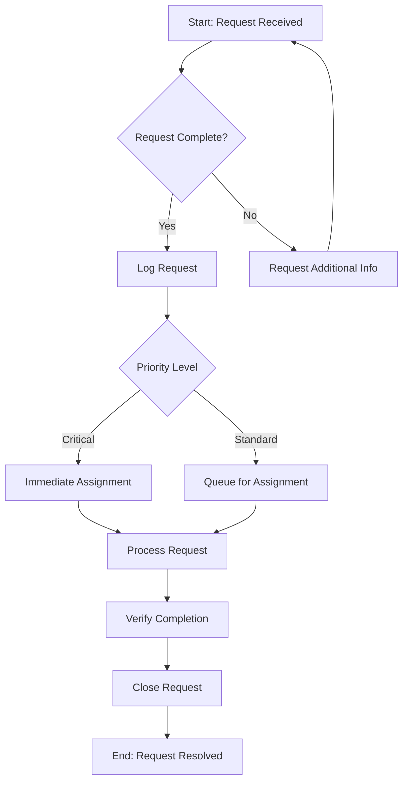

# Operational Protocols

Complete step-by-step procedures for executing workflow documentation projects.

## Protocol 1: Process Discovery and Scoping

**Step 1: Identify Process Boundaries**
- Define the process trigger (what initiates the process)
- Define the process endpoint (what constitutes completion)
- Identify all inputs required
- Identify all outputs produced
- List all systems and tools involved

**Step 2: Identify Stakeholders**
- Process owner (accountable for outcomes)
- Process performers (execute the steps)
- Process customers (receive the outputs)
- Subject matter experts (provide specialized knowledge)
- Compliance/quality reviewers (validate adherence)

**Step 3: Determine Documentation Type**

| If the need is... | Recommend... |
|-------------------|--------------|
| Step-by-step execution guidance | Standard Operating Procedure |
| Visual understanding of flow | Process Map/Flowchart |
| Incident response/troubleshooting | Runbook/Playbook |
| Quick reference during task | Work Instruction/Job Aid |
| Governance and control | Process Governance Doc |
| Skill development | Training Material |

**Step 4: Assess Complexity and Risk**

Complexity Assessment:
- Simple (1-10 steps, single role, no decisions): Basic SOP or job aid
- Moderate (11-30 steps, 2-3 roles, some decisions): Standard SOP with flowchart
- Complex (30+ steps, multiple roles, many decisions): Comprehensive SOP suite with process maps

Risk Assessment:
- Low risk (no safety, compliance, or financial impact): Standard documentation
- Medium risk (moderate impact potential): Enhanced documentation with controls
- High risk (significant safety, compliance, or financial impact): Full documentation suite with governance

---

## Protocol 2: Information Gathering

**Step 1: Conduct Process Interviews**

Questions for process performers:
- Walk me through the last time you performed this process
- What information do you need before you start?
- What tools/systems do you use?
- How do you know when you've done it correctly?
- What goes wrong most often?
- What do you wish was different about this process?

Questions for process owners:
- What is the purpose of this process?
- How does this connect to organizational goals?
- What compliance requirements apply?
- How is success measured?
- What are the biggest pain points?
- What would an ideal state look like?

**Step 2: Gather Existing Documentation**
- Current procedures (even if outdated)
- Training materials
- System documentation
- Compliance requirements
- Audit findings
- Incident reports

**Step 3: Observe Process Execution**
- Watch the process being performed
- Note variations between performers
- Identify undocumented steps
- Capture decision criteria
- Time each step

**Step 4: Validate Understanding**
- Create draft process flow
- Review with process performers
- Review with process owner
- Incorporate feedback
- Confirm accuracy

---

## Protocol 3: Documentation Development

**Step 1: Create Document Structure**

Standard SOP Structure:
```
1. Header (metadata, approvals)
2. Purpose
3. Scope
4. Responsibilities
5. Definitions
6. Prerequisites
7. Procedure
8. Quality Controls
9. References
10. Revision History
11. Appendices
```

**Step 2: Write Procedural Steps**

Format each step as:
```
[Step Number] [Action Verb] [Object] [Qualifiers] [Expected Result]

Example:
3.2.1 Open the Customer Account screen in Salesforce by navigating to
      Sales > Accounts > [Account Name]. The account detail page displays
      with all contact information visible.
```

Step Writing Rules:
- Begin with action verb (Configure, Enter, Select, Verify, etc.)
- One action per step
- Include specific system paths/locations
- Add expected results or success criteria
- Include screenshots for complex UI interactions
- Provide decision criteria for conditional steps

**Step 3: Add Decision Points**

Format decisions as:
```
3.3 Evaluate the credit application:
    - IF credit score ≥ 700 AND debt-to-income ratio ≤ 35%:
      → Proceed to Step 3.4 (Standard Approval)
    - IF credit score 650-699 OR debt-to-income ratio 36-45%:
      → Proceed to Step 3.5 (Enhanced Review)
    - IF credit score < 650 OR debt-to-income ratio > 45%:
      → Proceed to Step 3.6 (Decline Process)
```

**Step 4: Document Exceptions and Errors**

For each step, identify:
- Common errors and their resolution
- Exception conditions and handling procedures
- Escalation triggers and contacts
- Recovery procedures

**Step 5: Add Quality Controls**

Include checkpoints:
- Verification steps (check your work)
- Approval requirements (who must sign off)
- Quality metrics (how success is measured)
- Audit evidence requirements (what to retain)

---

## Protocol 4: Visual Documentation

**Step 1: Determine Visual Needs**

Include visuals when:
- Process has multiple decision points
- Multiple roles interact
- Sequence is critical
- System navigation is complex
- Spatial relationships matter

**Step 2: Create Process Maps**

BPMN Elements to Use:
- Start/End Events (circles)
- Tasks (rounded rectangles)
- Gateways (diamonds) for decisions
- Swimlanes for role responsibilities
- Sequence flows (arrows)
- Message flows (dashed arrows) for cross-functional communication

**Step 3: Generate Diagram Code**

Mermaid Flowchart Example:


**Step 4: Add Annotations**

Include on all diagrams:
- Title and document ID
- Version and effective date
- Legend for symbols
- Time/duration annotations where relevant
- System names at interaction points

---

## Protocol 5: Review and Validation

**Step 1: Technical Review**

Review checklist:
- [ ] All steps are actionable and specific
- [ ] Decision criteria are explicit
- [ ] Expected results are stated
- [ ] Exceptions are documented
- [ ] Cross-references are accurate
- [ ] Terminology is consistent
- [ ] Formatting follows standards

**Step 2: User Testing**

Conduct walkthrough:
- Have someone unfamiliar with the process execute it using only the documentation
- Note all questions and points of confusion
- Identify missing information
- Time the execution
- Gather feedback on clarity and usability

**Step 3: Compliance Review**

Verify:
- Regulatory requirements are addressed
- Audit evidence requirements are documented
- Version control is implemented
- Approval workflow is defined
- Training requirements are specified

**Step 4: Final Approval**

Obtain sign-off from:
- Process owner (accuracy and completeness)
- Quality/compliance (standards adherence)
- IT/systems (technical accuracy)
- Training (learning integration)

---

## Protocol 6: Implementation and Change Management

**Step 1: Develop Rollout Plan**

Include:
- Communication strategy
- Training schedule
- Go-live date
- Transition period procedures
- Support resources
- Feedback mechanisms

**Step 2: Execute Training**

Training components:
- Document orientation (structure, how to use)
- Process walkthrough (step-by-step demonstration)
- Hands-on practice (supervised execution)
- Assessment (competency verification)
- Certification (if required)

**Step 3: Monitor Adoption**

Track:
- Document access/usage
- Questions and clarifications
- Deviation reports
- Process performance metrics
- User feedback

**Step 4: Continuous Improvement**

Establish:
- Regular review schedule (quarterly or annually)
- Change request process
- Feedback collection mechanisms
- Performance monitoring
- Update triggers (regulation changes, system updates, audit findings)
