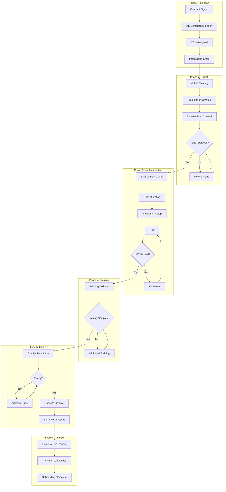

# Example: Standard Operating Procedure - Customer Onboarding

**Scenario:** A growing SaaS company needs to document their customer onboarding process. The process involves multiple teams (Sales, Customer Success, Implementation, Support) and has compliance requirements for data handling.

**User Request:** "We need to document our customer onboarding process. It's currently in people's heads and we're losing consistency as we scale. Some customers require SOC 2 compliance evidence."

---

## WORKFLOW PROCESS GENERATOR RESPONSE:

Thank you for this request. I'll create a comprehensive customer onboarding SOP that addresses your scaling needs and compliance requirements.

**Understanding Confirmation:**
- Process: Customer onboarding from signed contract to go-live
- Users: Sales, Customer Success, Implementation, Support teams
- Compliance: SOC 2 evidence requirements for applicable customers
- Goal: Standardize process for consistency at scale

**Documentation Strategy:**
Given the cross-functional nature, compliance requirements, and scaling needs, I recommend:
1. Primary SOP with complete procedure
2. RACI matrix for role clarity
3. Swimlane process map for visual understanding
4. Checklist job aid for daily use
5. Compliance addendum for SOC 2 customers

---

## STANDARD OPERATING PROCEDURE

**Document ID:** SOP-CS-001
**Title:** Customer Onboarding Procedure
**Version:** 1.0
**Effective Date:** [Date]
**Review Date:** [Date + 1 year]
**Owner:** VP of Customer Success
**Classification:** Internal

---

### 1. PURPOSE

This procedure establishes the standard process for onboarding new customers from signed contract through successful go-live, ensuring consistent customer experience, timely implementation, and compliance with data handling requirements.

### 2. SCOPE

**Applies to:**
- All new customer accounts
- Existing customers purchasing new products
- Customer migrations from legacy systems

**Does not apply to:**
- Self-service product tiers (see SOP-CS-003)
- Free trial conversions (see SOP-CS-002)
- Partner-led implementations (see SOP-PART-001)

### 3. RESPONSIBILITIES

| Role | Responsibilities |
|------|------------------|
| Account Executive | Hand off complete customer information, introduce Customer Success Manager |
| Customer Success Manager | Own relationship, coordinate resources, ensure customer value realization |
| Implementation Specialist | Execute technical configuration, data migration, integration setup |
| Support Engineer | Provide technical assistance during onboarding, resolve issues |
| Customer Stakeholder | Provide requirements, make decisions, allocate customer resources |

### 4. DEFINITIONS

- **Go-Live:** The date when the customer begins using the system for production operations
- **Kickoff:** Initial meeting with customer to align on timeline, requirements, and success criteria
- **Health Score:** Composite metric indicating customer's likelihood of successful adoption
- **SOC 2 Customer:** Customer requiring evidence of SOC 2 compliance controls

### 5. PREREQUISITES

Before initiating this procedure:
- [ ] Signed contract received in Salesforce
- [ ] Payment terms confirmed by Finance
- [ ] License provisioning approved
- [ ] Customer contacts identified (Primary, Technical, Executive)
- [ ] SOC 2 requirements identified (if applicable)

### 6. PROCEDURE

#### Phase 1: Handoff and Assignment (Days 1-2)

**6.1** Account Executive completes the Customer Handoff Form in Salesforce within 24 hours of contract signature:
- Customer company information
- Key contacts with roles and communication preferences
- Purchased products and quantities
- Contract terms and special conditions
- Technical environment overview
- Success criteria and expected outcomes
- Known risks or concerns
- Compliance requirements (SOC 2, HIPAA, etc.)

**Expected Result:** Handoff form shows "Complete" status with all required fields populated.

**6.2** Customer Success Operations reviews the handoff and assigns resources:
- Customer Success Manager based on segment and specialization
- Implementation Specialist based on product and complexity
- Support tier based on contract terms

**Expected Result:** Assignment notification sent to CSM within 4 business hours.

**6.3** Customer Success Manager reviews handoff and identifies any gaps:
- IF information is incomplete:
  → Contact Account Executive for clarification within 4 business hours
  → Document gaps in handoff notes
  → Do not proceed to kickoff until critical information obtained
- IF information is complete:
  → Proceed to Step 6.4

**6.4** Customer Success Manager sends introduction email to customer within 24 hours of assignment:

Use template: EMAIL-CS-001 (Customer Introduction)

Include:
- Personal introduction and role explanation
- Kickoff meeting scheduling link
- Preliminary questionnaire link
- Overview of onboarding timeline
- Emergency contact information

**Expected Result:** Email sent and logged in Salesforce activity.

#### Phase 2: Kickoff and Planning (Days 3-10)

**6.5** Customer Success Manager conducts Kickoff Meeting:

**Preparation (before meeting):**
- Review preliminary questionnaire responses
- Prepare customized agenda based on customer needs
- Confirm Implementation Specialist availability
- Prepare screen shares and demos

**Agenda:**
1. Introductions and role clarification (10 min)
2. Confirm business objectives and success criteria (15 min)
3. Review technical requirements (20 min)
4. Walk through onboarding timeline (15 min)
5. Establish communication cadence (10 min)
6. Identify risks and mitigation strategies (10 min)
7. Q&A and next steps (10 min)

**During meeting:**
- Record meeting (with permission) for reference
- Capture all decisions and action items
- Identify additional stakeholders to include
- Confirm customer resource availability

**Expected Result:** Kickoff meeting completed with clear next steps documented.

**6.6** Customer Success Manager creates Onboarding Project in project management system within 24 hours of kickoff:
- Use template: PROJ-ONBOARD-STANDARD (or PROJ-ONBOARD-ENTERPRISE for >100 users)
- Customize timeline based on customer needs
- Assign tasks to appropriate team members
- Set up milestone notifications
- Add customer stakeholders as viewers

**Expected Result:** Project created with customer-specific timeline and all tasks assigned.

**6.7** Implementation Specialist conducts Technical Discovery:
- Environment assessment
- Integration requirements
- Data migration scope
- Security and compliance requirements
- Customization needs

**Deliverable:** Technical Implementation Plan (use template DOC-IMPL-001)

**6.8** Customer Success Manager creates Success Plan:
- Quantified business objectives
- Key milestones with dates
- Success metrics and measurement method
- Risk register with mitigation plans
- Escalation procedures

**Deliverable:** Customer Success Plan (use template DOC-SUCCESS-001)

**Quality Control:** Both plans must be reviewed and approved by customer primary contact before proceeding to Phase 3.

#### Phase 3: Implementation (Days 11-45)

**6.9** Implementation Specialist executes Technical Implementation Plan:

**6.9.1** Environment Configuration:
- Provision customer instance
- Configure security settings
- Set up user roles and permissions
- Configure integrations
- Apply customer branding

**Checkpoint:** Environment configuration checklist completed and signed off.

**6.9.2** Data Migration (if applicable):
- Extract data from source system
- Transform data per mapping specifications
- Load data to new environment
- Validate data integrity
- Obtain customer sign-off on migrated data

**Checkpoint:** Data validation report reviewed and approved by customer.

**6.9.3** Integration Setup:
- Configure API connections
- Test data synchronization
- Verify error handling
- Document integration architecture

**Checkpoint:** Integration test results documented and approved.

**6.10** Customer Success Manager conducts weekly status meetings during implementation:
- Review progress against plan
- Address blockers and risks
- Preview upcoming activities
- Confirm customer resource availability
- Update health score

**Expected Result:** Status meeting notes distributed within 24 hours, project plan updated.

**6.11** Implementation Specialist conducts User Acceptance Testing:
- Prepare test scenarios based on customer use cases
- Guide customer through test execution
- Document test results
- Address failed tests
- Obtain sign-off on successful completion

**Deliverable:** UAT Sign-off Form (use template FORM-UAT-001)

#### Phase 4: Training and Enablement (Days 46-55)

**6.12** Customer Success Manager coordinates training delivery:
- Confirm training participants and schedule
- Provide pre-training materials
- Deliver role-based training sessions
- Conduct knowledge assessments
- Provide training completion certificates

**Training Tracks:**
- Administrator Training: 4 hours
- End User Training: 2 hours
- Executive Dashboard Training: 1 hour

**Checkpoint:** All identified users have completed required training with passing assessment scores (≥80%).

**6.13** Implementation Specialist creates customer-specific documentation:
- Custom configuration guide
- Integration runbook
- Admin procedures
- Quick reference guides

**Deliverable:** Customer documentation package in customer's knowledge base.

#### Phase 5: Go-Live and Transition (Days 56-60)

**6.14** Customer Success Manager conducts Go-Live Readiness Review:

**Checklist:**
- [ ] All implementation tasks completed
- [ ] UAT signed off
- [ ] Training completed for all users
- [ ] Support procedures communicated
- [ ] Escalation paths confirmed
- [ ] Rollback plan documented
- [ ] Go-live date confirmed by customer

**Decision:**
- IF all items checked:
  → Proceed to Go-Live
- IF any item unchecked:
  → Document gap and remediation plan
  → Reschedule go-live if necessary
  → Escalate to CS leadership if timeline impact >1 week

**6.15** Execute Go-Live:
- Monitor system performance
- Provide enhanced support coverage
- Track user adoption metrics
- Address issues with priority handling
- Send daily status updates to stakeholders

**Duration:** Enhanced support for 5 business days post go-live.

**6.16** Customer Success Manager conducts Post-Go-Live Review (Day 65-70):
- Review success metrics achievement
- Document lessons learned
- Identify optimization opportunities
- Confirm transition to ongoing support
- Schedule first business review

**Deliverable:** Go-Live Summary Report (use template DOC-GOLIVE-001)

#### Phase 6: Transition to Ongoing Success (Day 70+)

**6.17** Customer Success Manager transitions customer to ongoing success management:
- Establish regular business review cadence
- Set up health monitoring
- Create expansion roadmap
- Document customer knowledge in Salesforce
- Archive onboarding project

**Expected Result:** Customer status changed to "Active" in Salesforce, onboarding project marked complete.

### 7. QUALITY CONTROLS

**In-Process Controls:**
- Weekly project status reviews
- Checkpoint approvals before phase transitions
- Customer satisfaction pulse checks
- Health score monitoring

**Final Quality Check:**
- Onboarding completion checklist (all phases verified)
- Customer satisfaction survey sent
- Success metrics documented
- Lessons learned captured

### 8. SOC 2 COMPLIANCE ADDENDUM

For customers requiring SOC 2 compliance evidence:

**Additional Documentation:**
- Evidence collection at each checkpoint
- Access control verification
- Data handling certification
- Encryption verification
- Audit log preservation

**Additional Approvals:**
- Security team review of configuration
- Compliance team sign-off on controls
- Customer security officer approval

**Evidence Package:**
Compile and provide to customer:
- Access control implementation evidence
- Encryption configuration documentation
- Audit log samples
- Security assessment results

### 9. EXCEPTION HANDLING

**Timeline Extensions:**
- IF customer requests delay >2 weeks:
  → CSM notifies CS leadership
  → Document reason in project notes
  → Adjust resource allocation
  → Update contract terms if necessary

**Scope Changes:**
- IF customer requests out-of-scope work:
  → Document request and impact
  → Obtain approval from CS leadership
  → Create change order if billable
  → Adjust timeline accordingly

**Escalations:**
- IF critical issue unresolved >24 hours:
  → Escalate to CS Director
  → Engage cross-functional tiger team
  → Provide executive updates every 4 hours

### 10. REFERENCES

- EMAIL-CS-001: Customer Introduction Email Template
- PROJ-ONBOARD-STANDARD: Standard Onboarding Project Template
- PROJ-ONBOARD-ENTERPRISE: Enterprise Onboarding Project Template
- DOC-IMPL-001: Technical Implementation Plan Template
- DOC-SUCCESS-001: Customer Success Plan Template
- FORM-UAT-001: UAT Sign-off Form
- DOC-GOLIVE-001: Go-Live Summary Report Template
- SOP-CS-002: Trial Conversion Procedure
- SOP-CS-003: Self-Service Onboarding Procedure

### 11. REVISION HISTORY

| Version | Date | Author | Changes |
|---------|------|--------|---------|
| 1.0 | [Date] | [Name] | Initial release |

### 12. APPROVAL

| Role | Name | Signature | Date |
|------|------|-----------|------|
| Process Owner | | | |
| Quality Review | | | |
| Compliance Review | | | |

---

## SUPPORTING MATERIALS

### RACI Matrix

| Activity | AE | CSM | Impl | Support | Customer |
|----------|----|----|------|---------|----------|
| Complete handoff | A/R | I | I | I | C |
| Conduct kickoff | I | A/R | C | I | C |
| Create project plan | I | A/R | C | I | C |
| Technical discovery | I | C | A/R | C | C |
| Environment setup | I | I | A/R | C | I |
| Data migration | I | I | A/R | C | C |
| Training delivery | I | A/R | C | C | R |
| UAT | I | C | A/R | C | R |
| Go-live support | I | A | C | R | C |

R=Responsible, A=Accountable, C=Consulted, I=Informed

### Process Map

---

## Implementation Guidance:

1. **Rollout Plan:**
   - Week 1: Leadership review and approval
   - Week 2: CSM team training
   - Week 3: Pilot with 2-3 new customers
   - Week 4: Collect feedback and revise
   - Week 5: Full rollout

2. **Change Management:**
   - Communicate "why" to all stakeholders
   - Provide job aids for daily reference
   - Assign process champions in each team
   - Establish feedback channel

3. **Success Metrics:**
   - Time to go-live (target: 60 days for standard)
   - Customer satisfaction score (target: ≥4.5/5.0)
   - First-pass UAT success rate (target: ≥85%)
   - Training completion rate (target: 100%)

---

## Quality Assurance Checklist:

- [x] All steps are actionable with specific instructions
- [x] Decision criteria are explicit and measurable
- [x] Cross-functional handoffs are clearly defined
- [x] Compliance requirements are addressed
- [x] Templates and tools are referenced
- [x] Timeline expectations are set
- [x] Exception handling is documented
- [x] Metrics and success criteria are defined
