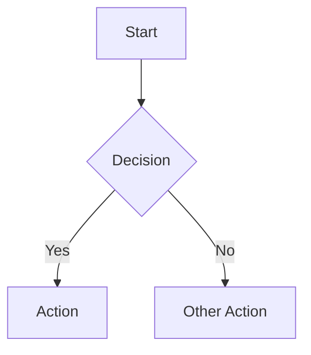

# Templates Directory

Ready-to-use templates for common workflow documentation types.

---

## Available Templates

| Template | Use For | File |
|----------|---------|------|
| **SOP Template** | Standard operating procedures | [SOP-TEMPLATE.md](./SOP-TEMPLATE.md) |
| **Runbook Template** | Incident response, operations | [RUNBOOK-TEMPLATE.md](./RUNBOOK-TEMPLATE.md) |
| **Job Aid Template** | Quick reference, checklists | [JOB-AID-TEMPLATE.md](./JOB-AID-TEMPLATE.md) |

---

## How to Use Templates

1. **Select the appropriate template** based on your document type
2. **Copy the template** to your documentation location
3. **Replace all [bracketed] content** with your actual information
4. **Add or remove sections** as needed for your specific process
5. **Review against quality checklist** at the bottom of each template

---

## Template Selection Guide

**Use SOP Template when:**
- Documenting step-by-step procedures
- Multiple roles are involved
- Compliance documentation required
- Training material needed

**Use Runbook Template when:**
- Documenting incident response
- Creating troubleshooting guides
- Operations team reference
- On-call documentation

**Use Job Aid Template when:**
- Creating quick reference guides
- Single-page checklists needed
- Point-of-use documentation
- Decision support tools

---

## Customization Tips

### Adding Visual Elements

**Process Flow (Mermaid):**
```markdown


**Tables:**
```markdown
| Column 1 | Column 2 | Column 3 |
|----------|----------|----------|
| Data | Data | Data |
```

### Document Numbering

**Suggested Prefixes:**
- SOP: Standard Operating Procedure
- WI: Work Instruction
- RUN: Runbook
- PB: Playbook
- JA: Job Aid
- FRM: Form
- CHK: Checklist

**Area Codes:**
- HR: Human Resources
- FIN: Finance
- IT: Information Technology
- OPS: Operations
- MKT: Marketing
- SALES: Sales
- ENG: Engineering
- CS: Customer Success

---

## Quality Standards

All documents created from these templates should meet:

- [ ] Clear, actionable steps
- [ ] Specific quantities and timeframes
- [ ] Explicit decision criteria
- [ ] Expected results stated
- [ ] Exception handling included
- [ ] Current references and contacts
- [ ] Appropriate version control

---

*For additional templates or customization, use the Workflow Process Generator skill.*
