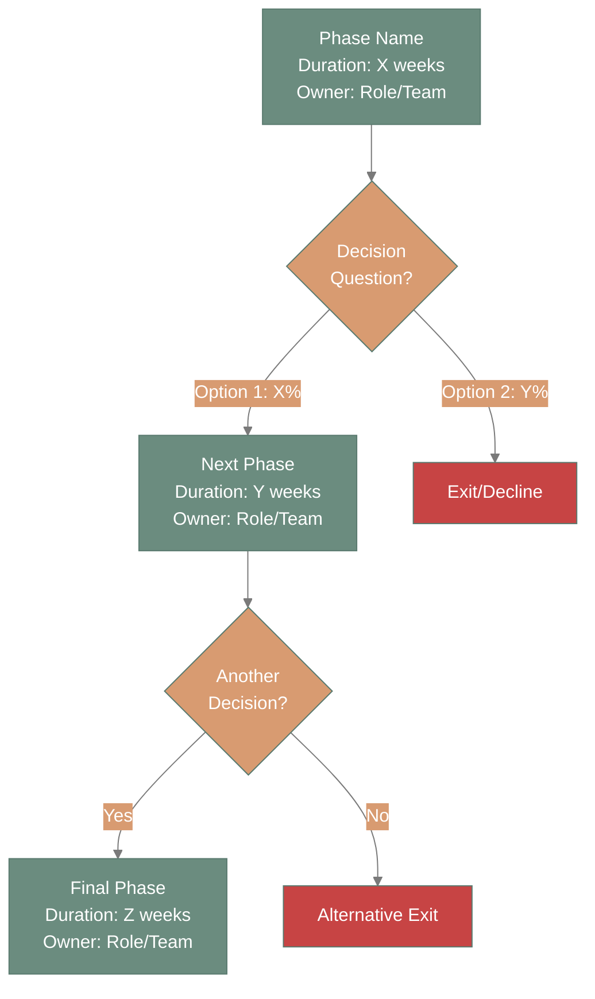
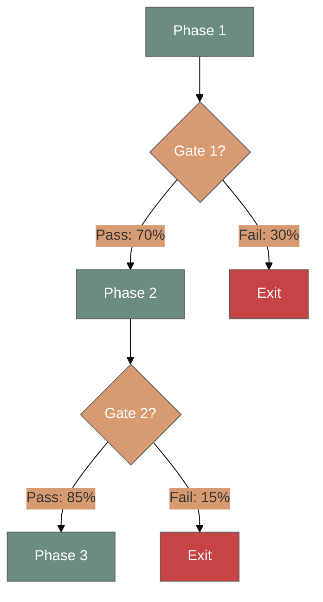
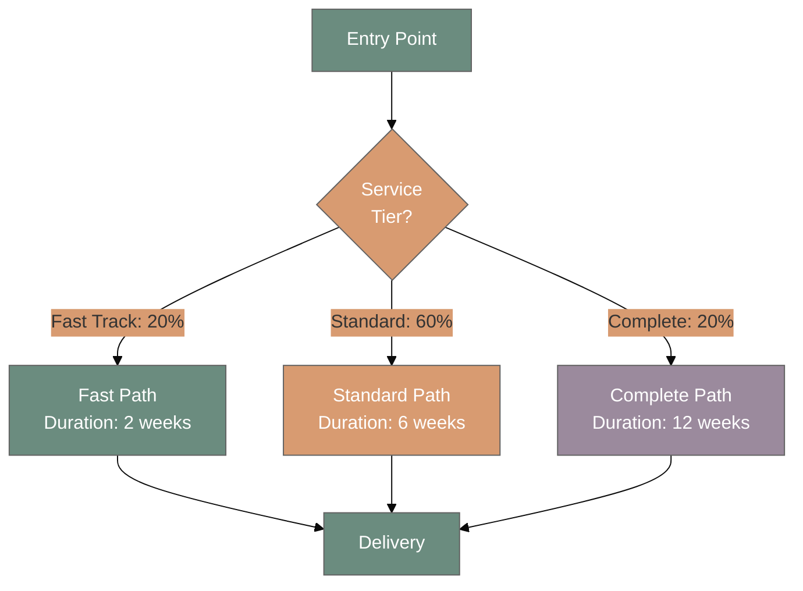
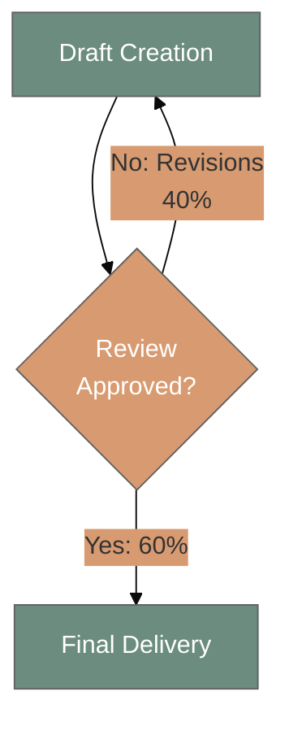
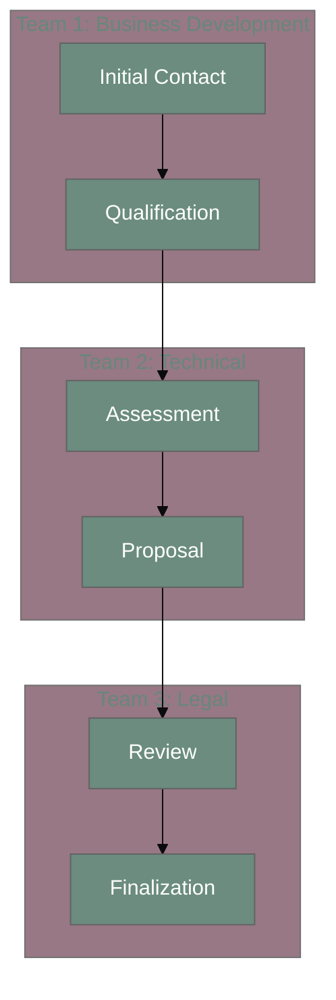

# Mermaid Flowchart Template

Reusable template for creating decision-heavy workflow flowcharts with 360 brand colors.

---

## Basic Template



---

## Node Format Options

### Standard Node (Detailed)
```
NodeID["Phase Name
Duration: X weeks/days
Owner: Role/Team
Activity: Key action
Success: Completion criteria"]
```

### Minimal Node (Space-Constrained)
```
NodeID["Phase Name<br/>Duration: X weeks<br/>Owner: Role"]
```

### Decision Node
```
DecisionID{Decision<br/>Question?}
```

### Exit/Terminal Node
```
ExitID[Exit Reason]
```

---

## Edge (Arrow) Types

```mermaid
graph TD
    A --> B  %% Solid arrow - primary flow
    B -.-> C  %% Dotted arrow - alternative/optional
    C ==> D  %% Thick arrow - emphasized flow
    D -.->|Label: X%| E  %% With volume label
```

---

## Color Coding Guide

### Primary Workflow Nodes
```
style NodeID fill:#6b8c7f,color:#fff
```
**Use for:** Main workflow path, successful outcomes, core activities

### Alternative/Standard Path Nodes
```
style NodeID fill:#d89b71,color:#fff
```
**Use for:** Secondary options, standard service tier, alternative approaches

### Enhanced/Premium Path Nodes
```
style NodeID fill:#9b8a9d,color:#fff
```
**Use for:** Premium service tiers, advanced options, comprehensive paths

### Exit/Failure Nodes
```
style NodeID fill:#c74444,color:#fff
```
**Use for:** Process exits, declined opportunities, failed gates

### Decision Nodes (Using Class)
```
classDef decision fill:#d89b71,color:#fff
class Decision1,Decision2,Decision3 decision
```

---

## Common Patterns

### Pattern 1: Linear with Decision Gates



---

### Pattern 2: Parallel Paths (Service Tiers)



---

### Pattern 3: Iterative Loop



---

### Pattern 4: Multi-Stakeholder Handoff



---

## Customization Checklist

When adapting this template:

- [ ] Replace placeholder phase names with actual workflow phases
- [ ] Update duration estimates based on real data
- [ ] Specify actual owners/roles for each phase
- [ ] Add volume percentages to decision edges (if known)
- [ ] Adjust colors based on workflow path types
- [ ] Include success criteria in node descriptions
- [ ] Add decision criteria for each decision node
- [ ] Test rendering in Mermaid Live Editor
- [ ] Validate readability at standard zoom
- [ ] Export to desired format (PNG, SVG, etc.)

---

## Usage Tips

### For Best Results:

1. **Keep nodes concise** - Max 4-5 lines per node
2. **Use consistent formatting** - Same structure for all nodes
3. **Label all edges** - Especially decision outcomes with percentages
4. **Minimize crossing arrows** - Reorder nodes if needed
5. **Test early** - Paste into Mermaid Live Editor frequently
6. **Apply 360 colors** - Strictly use brand palette

### Common Mistakes to Avoid:

- ❌ Too much text in nodes (becomes unreadable)
- ❌ Unlabeled decision edges (unclear which path is which)
- ❌ Inconsistent node formats (mixing templates)
- ❌ Introducing colors outside 360 palette
- ❌ Crossing arrows creating visual confusion

---

## Export Options

### For GitHub/Notion/Confluence:
- Keep as Mermaid code in markdown
- Renders automatically in these platforms

### For Presentations (PowerPoint/Keynote):
1. Paste code into https://mermaid.live
2. Export as SVG (scalable, crisp quality)
3. Import SVG into slide deck

### For Printing/PDFs:
1. Export as PNG from Mermaid Live
2. Use high resolution (300 DPI)
3. Include in PDF reports

---

## Version History

- **v1.0** - 2025-11-15 - Initial template creation with 360 brand standards

---

**See Also:**
- [Mermaid Generation Standards](../references/mermaid-generation-standards.md) - Complete styling guide
- [Partnership Development Example](../examples/partnership-development.md) - Real workflow using this template
- [Gantt Timeline Template](mermaid-gantt.md) - For timeline-focused workflows
