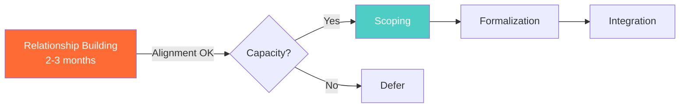

# Workflow Process Generator (360-Specific) - Quick Start

## One-Line Summary
Extract 360's operational workflows from Asana, Drive, and Gmail to generate professional Mermaid diagrams and interactive HTML visualizations for partnerships, client engagement, innovation assessment, and internal processes.

---

## When to Use

✅ **Use this skill when you need to:**
- Visualize 360's partnership development processes
- Document client engagement workflows for onboarding
- Create board-ready process presentations
- Extract workflows from Asana project templates
- Make tribal knowledge explicit and shareable
- Prepare partnership documentation for external stakeholders

❌ **Don't use for:**
- Generic SOPs for client deliverables (use managed `workflow-process-generator`)
- Non-360 organizational workflows
- Simple task lists

---

## 3-Minute Quick Use

### Step 1: State Your Need

**Example requests:**
- "Visualize our partnership development process with Brazilian universities"
- "Document the client engagement workflow for new team members"
- "Create board-ready visualization of our innovation assessment process"
- "Extract the workflow from our CNEN partnership Asana project"

### Step 2: Choose Quality Level

| Level | Time | Output | Best For |
|-------|------|--------|----------|
| **Quick Sketch** | 15-30 min | Mermaid diagram | Internal discussion, rapid iteration |
| **Standard Docs** | 45-90 min | Mermaid + markdown | Team onboarding, process documentation |
| **Executive Presentation** | 2-4 hours | Interactive HTML | Board meetings, partner showcasing |

### Step 3: System Generates

**Skill automatically:**
1. Identifies workflow category (Partnership, Client, Innovation, Ecosystem, Internal)
2. Extracts data from Asana, Drive, Gmail
3. Structures into phases with decision points
4. Generates visual (Mermaid or HTML)
5. Provides insights and next steps

**You receive:**
- Professional workflow visualization (360 brand colors)
- Process documentation
- Bottleneck identification
- Cultural considerations (if international)
- Update and maintenance recommendations

---

## The 5 Workflow Categories

### 1. Partnership Development (2-12 months)
**Pattern:** Relationship building → scoping → formalization → integration
**Examples:** CNEN partnership, GenIP collaboration, Yale network
**Focus:** Decision gates, cultural considerations, senior leader involvement

### 2. Client Engagement (1-6 months)
**Pattern:** Inquiry → qualification → proposal → execution → delivery
**Examples:** Vianeo validation sprints, innovation assessments
**Focus:** Conversion metrics, service tiers, qualification criteria

### 3. Innovation Assessment (2-8 weeks)
**Pattern:** Intake → evaluation → prioritization → validation → recommendations
**Examples:** Technology evaluations using GenIP, Vianeo desirability scoring
**Focus:** Methodology selection, evaluation frameworks, threshold gates

### 4. Ecosystem Mapping (3-12 weeks)
**Pattern:** Discovery → stakeholder analysis → relationship mapping → opportunities
**Examples:** Nuclear tech ecosystem, Brazil cleantech landscape
**Focus:** Stakeholder categories, relationship types, network positions

### 5. Internal Operations (varies)
**Pattern:** Planning → execution → review → optimization
**Examples:** Weekly operations, quarterly planning, board prep
**Focus:** Dependencies, handoffs, capacity planning

---

## Output Formats

### Mermaid Diagram (Quick Sketch / Standard)

**360 Brand Colors (Always Applied):**
- Primary (#FF6B35) - Main phases
- Teal (#4ECDC4) - Success paths
- Amber (#FFA630) - Decision points
- Navy (#1B2845) - Critical activities

### Interactive HTML (Executive Presentation)

Features:
- Professional typography (Apple-level quality)
- Zoom, pan, hover tooltips
- Phase detail modals
- Mobile-responsive
- Print-optimized
- 360 brand consistency

**See example:** [vianeo-reference.md](references/vianeo-reference.md)

---

## Data Sources (Auto-Extracted)

### Asana Integration
- **Sections** → Workflow phases
- **Tasks** → Phase activities
- **Custom fields** → Decision criteria
- **Dependencies** → Flow sequence
- **Timeline** → Duration estimates

### Google Drive Integration
- Sequential language (first, then, next)
- Decision terminology (if, when, depending on)
- Role assignments
- Timeline markers

### Gmail Integration
- Email sequences (phase progression)
- Decision discussions
- Stakeholder handoffs
- Timeline clustering

**Note:** All integrations are optional. If data not accessible, skill works from user descriptions.

---

## Common Use Cases

### Use Case 1: Board Meeting Prep
**Request:** "Visualize partnership development for Q4 board meeting"
**Output:** Interactive HTML showing 6-12 month timeline, decision gates, cultural considerations
**Time:** 2.5-3 hours

### Use Case 2: Team Onboarding
**Request:** "Document client engagement workflow for new BD hire"
**Output:** Mermaid diagram + markdown with conversion metrics, qualification criteria
**Time:** 60-75 minutes

### Use Case 3: Partnership Documentation
**Request:** "Create shareable workflow for Yale collaboration"
**Output:** Standard documentation formatted for external sharing, stakeholder map included
**Time:** 90 minutes

**See more:** [usage-scenarios.md](references/usage-scenarios.md)

---

## Quality Standards

Every output includes:

✅ **Content:**
- All decision points explicitly identified
- Roles/owners assigned to phases
- Timeline estimates
- Success metrics
- Cultural considerations (if international)

✅ **Visual:**
- 360 brand colors correctly applied
- Mobile-responsive
- Logical flow (left-to-right or top-to-bottom)
- Decision points visually distinct

✅ **Data:**
- Source references cited
- Cross-referenced with operational reality
- Edge cases documented

**Apple-level delivery standard** - Presentation-ready, board-meeting quality.

---

## Quick Commands

| Task | Command |
|------|---------|
| Partnership workflow | "Visualize partnership development with [partner]" |
| Client engagement | "Document client engagement workflow" |
| Extract from Asana | "Extract workflow from [Asana project name]" |
| Board presentation | "Create board-ready visualization of [process]" |
| Onboarding docs | "Document [workflow] for team onboarding" |
| Cultural context | "Show [international partnership] with cultural considerations" |

---

## 360-Specific vs. Generic

**This Skill (360-Specific):**
- Extracts from 360's Asana, Drive, Gmail
- 360 brand colors and standards
- 5 workflow categories aligned to 360 operations
- Cultural considerations for international partnerships
- Best for: 360 internal docs, partner showcasing

**Managed Generic Version:**
- Universal SOP generation
- Any organization context
- Compliance-ready documentation
- Best for: Client deliverables, generic SOPs

**Use this skill** when creating documentation specific to 360's operations and partnerships.

---

## Troubleshooting

**"Diagram too complex"**
→ Break into sub-workflows by phase
→ Create high-level overview + detailed phase diagrams

**"Can't access Asana/Drive"**
→ Provide workflow description manually
→ Skill will create from user input

**"Wrong 360 brand colors"**
→ Check [mermaid-generation-standards.md](references/mermaid-generation-standards.md)
→ Colors: #FF6B35 (orange), #4ECDC4 (teal), #FFA630 (amber), #1B2845 (navy)

**"Need more detail than Mermaid allows"**
→ Request Executive Presentation (Interactive HTML)
→ Supports modals with drill-down detail

---

## Supporting Files

**Start Here:**
- [README.md](README.md) - Executive summary (10 min read)
- [INDEX.md](INDEX.md) - Complete file navigation

**Key References:**
- [data-extraction-guide.md](references/data-extraction-guide.md) - How to extract from Asana/Drive/Gmail
- [mermaid-generation-standards.md](references/mermaid-generation-standards.md) - 360 visual standards
- [html-visualization-guide.md](references/html-visualization-guide.md) - Interactive HTML creation
- [quality-checklist.md](references/quality-checklist.md) - Pre-finalization validation

---

## Next Steps

1. ✅ **State your need** - Which workflow do you want to visualize?
2. ✅ **Choose quality level** - Quick sketch, standard, or executive?
3. ✅ **Provide context** - Asana project, Drive docs, or description
4. ✅ **Review output** - Validate against quality checklist
5. ✅ **Store** - GitHub repository with version control

---

**Ready to extract and visualize 360 workflows! 🎨**

Version 1.1.0 | Updated: 2025-11-22 | 360 Social Impact Studios
