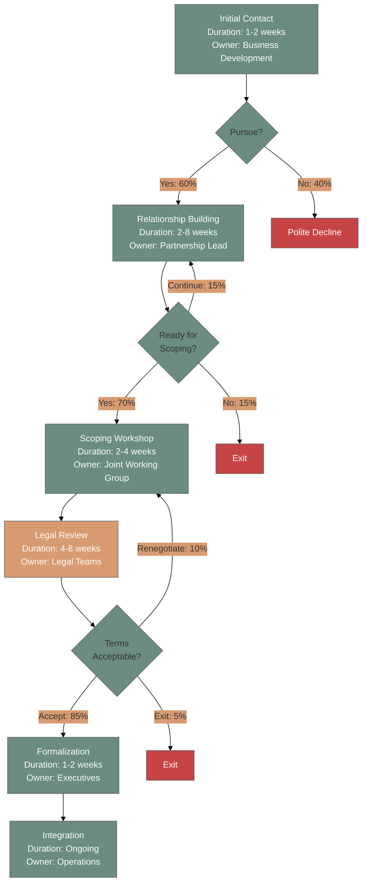

# Workflow Process Generator

## Executive Summary

**Purpose:** Transform 360's operational workflows from implicit tribal knowledge into explicit, shareable visual documentation. Extract real workflow data from Asana, Google Drive, and Gmail to generate professional process flows that enable delegation, partnership documentation, and organizational scaling.

**Output Quality Standard:** Apple-level delivery. Every visualization should be presentation-ready, board-meeting quality, and intuitively navigable.

**Core Capability:** Automated extraction from operational tools combined with intelligent synthesis into Mermaid diagrams, interactive HTML visualizations, and Sankey flow maps. No manual documentation maintenance required.

---

## Quick Start

### When to Use This Skill

Claude should proactively use this skill when you:

- Ask to "visualize a workflow" or "create a process flow"
- Mention "how does [process] work" for any 360 operational area
- Request documentation for partnerships or client engagements
- Need onboarding materials for team members or partners
- Prepare for board meetings requiring process visualization
- Say "make this delegation-ready" or "shareable"
- Reference specific partnership names (GenIP, SpacePlan, CNEN, nuclear tech portfolios)

### Output Formats

**Three Quality Levels:**

1. **Quick Sketch (15-30 min)** - Mermaid flowchart for internal discussion
2. **Standard Documentation (45-90 min)** - Mermaid + comprehensive markdown for onboarding
3. **Executive Presentation (2-4 hours)** - Interactive HTML for board meetings and partner documentation

---

## The Five Workflow Categories

### 1. Partnership Development
**Pattern:** Relationship building → scoping → formalization → integration
**Duration:** 2-12 months (varies by geography)
**Key Focus:** Decision points, cultural considerations, timeline emphasis

### 2. Client Engagement
**Pattern:** Inquiry → qualification → proposal → execution → delivery
**Duration:** 1-6 months
**Key Focus:** Conversion metrics, service tier paths, qualification criteria

### 3. Innovation Assessment
**Pattern:** Intake → evaluation → prioritization → validation → recommendations
**Duration:** 2-8 weeks
**Key Focus:** Methodology selection, evaluation frameworks, threshold gates

### 4. Ecosystem Mapping
**Pattern:** Discovery → stakeholder analysis → relationship mapping → opportunity identification
**Duration:** 3-12 weeks
**Key Focus:** Stakeholder categories, relationship types, value network positions

### 5. Internal Operations
**Pattern:** Planning → execution → review → optimization
**Duration:** Varies (weekly to quarterly cycles)
**Key Focus:** Dependencies, handoffs, capacity planning

---

## Data Sources

### Asana Integration
Extract workflow structure from project templates and active projects:
- Sections → Workflow phases
- Tasks → Activities within phases
- Custom fields → Decision points and metrics
- Dependencies → Flow sequence
- Timeline data → Duration estimates

**See:** [Data Extraction Guide](references/data-extraction-guide.md)

### Google Drive Integration
Parse process documentation for workflow intelligence:
- Sequential language (first, then, next)
- Decision terminology (if, when, depending on)
- Role assignments and stakeholder mapping
- Timeline markers and success criteria

**See:** [Data Extraction Guide](references/data-extraction-guide.md)

### Gmail Integration
Discover implicit workflows from communication patterns:
- Email sequences showing phase progression
- Decision points in discussions
- Handoff language and stakeholder transitions
- Timeline clustering revealing phase boundaries

**See:** [Data Extraction Guide](references/data-extraction-guide.md)

---

## Generation Workflow: 6 Steps

### Step 1: Identify Workflow Type
Ask clarifying questions about workflow category, data source, output use case, and detail level needed.

### Step 2: Extract Source Data
Pull data from Asana, Drive, and/or Gmail using systematic extraction patterns.

### Step 3: Structure Data into Standardized JSON
Convert extracted information into a standardized workflow JSON schema with phases, activities, decisions, roles, and metrics.

### Step 4: Generate Mermaid Diagram
Create visual flowchart, Gantt chart, sequence diagram, or Sankey diagram using 360 brand colors and design standards.

### Step 5: Create Artifact
Package as Mermaid markdown file with comprehensive documentation, phase details, decision points, and metrics.

### Step 6: Provide Context & Next Steps
Summarize key insights, note data gaps, offer optimization recommendations, and suggest next steps.

**See:** [Complete Generation Workflow](references/generation-workflow-guide.md)

---

## Visual Design Standards

### 360 Brand Color Palette

```css
/* Strictly Enforced */
Primary Path:       #6b8c7f  (sage green)
Alternative Path:   #d89b71  (terracotta)
Enhanced/Premium:   #9b8a9d  (plum)
Exit/Failure:       #c74444  (red)
Standard/Neutral:   #7a7a7a  (gray)
```

### Diagram Types by Use Case

- **Flowchart** - Decision-heavy processes with branching paths
- **Gantt Timeline** - Sequential processes with overlapping activities
- **Sequence Diagram** - Multi-stakeholder workflows with handoffs
- **Sankey Flow** - Volume-based flows and conversion funnels

**See:** [Mermaid Generation Standards](references/mermaid-generation-standards.md)

---

## Example Workflows

### Partnership Development Flow


**See:** [Complete Examples](examples/)

---

## Quality Standards

### Content Completeness Checklist
- [ ] All decision points clearly marked with criteria
- [ ] Owners/roles specified for each phase
- [ ] Timeline data included (duration ranges or specific dates)
- [ ] Volume distribution shown for major branches
- [ ] Success metrics and failure modes documented
- [ ] Edge cases and common issues noted
- [ ] Prerequisites and outputs listed per phase

### Visual Quality Checklist
- [ ] Color coding is meaningful and consistent with 360 brand
- [ ] Diagram is readable at standard zoom
- [ ] Node spacing allows clear flow reading
- [ ] Decision diamonds are visually distinct
- [ ] Export format matches use case

### Data Quality Checklist
- [ ] Source data is current (not archived)
- [ ] Cross-reference multiple sources when possible
- [ ] Flag assumptions or inferred data clearly
- [ ] Cite data sources in documentation

**See:** [Quality Standards Checklist](references/quality-checklist.md)

---

## Advanced Features

### Multi-Language Support
Generate parallel versions in Portuguese (Brazil partnerships), Spanish (Latin America), while maintaining consistent visual style and technical terms.

### Interactive HTML Visualizations
For executive presentations and board meetings, generate interactive HTML with:
- Zoom and pan controls
- Hover states and node highlighting
- Click-to-expand modals with detailed phase information
- Professional typography and animations
- Export-ready for presentations

**Reference:** The Vianeo Business Model Evaluation workflow is the gold standard.

**See:** [HTML Visualization Guide](references/html-visualization-guide.md)

---

## Usage Examples

### Example 1: Team Onboarding
**Request:** "Create client engagement workflow for onboarding our new partnerships coordinator."

**Approach:**
- Extract from Asana client engagement template
- Level: Standard Documentation
- Time: 60 minutes

**Output:** Mermaid flowchart + markdown guide with phase descriptions, qualification criteria, and success metrics

### Example 2: Board Meeting Preparation
**Request:** "Need to show the board how partnership development works."

**Approach:**
- Extract from Gmail threads and Drive partnership agreements
- Level: Executive Presentation
- Time: 3 hours

**Output:** Interactive HTML workflow with success metrics dashboard and bottleneck analysis

### Example 3: Partnership Documentation (External)
**Request:** "Create process documentation for our collaboration with GenIP to share with them."

**Approach:**
- Extract from Drive and Gmail
- Level: Standard Documentation with Portuguese translation
- Time: 90 minutes

**Output:** Bilingual workflow showing operational phases, stakeholder roles, and communication protocols

**See:** [Complete Usage Scenarios](references/usage-scenarios.md)

---

## File Organization

```
workflow-process-generator/
├── README.md                          # This file (main entry point)
├── INDEX.md                           # Complete file navigation
├── references/                        # Supporting documentation
│   ├── data-extraction-guide.md      # Asana, Drive, Gmail extraction methods
│   ├── mermaid-generation-standards.md # Visual standards and diagram types
│   ├── html-visualization-guide.md   # Advanced HTML generation
│   ├── generation-workflow-guide.md  # Complete 6-step process
│   ├── quality-checklist.md          # Quality standards
│   ├── usage-scenarios.md            # Common use cases
│   ├── workflow-categories.md        # Detailed category descriptions
│   └── vianeo-reference.md           # Gold standard example
├── examples/                          # Sample workflows
│   ├── partnership-development.md    # Complete example with annotations
│   ├── client-engagement.md          # 8-phase client workflow
│   ├── innovation-assessment.md      # Vianeo framework integration
│   └── ecosystem-mapping.md          # Network visualization example
└── templates/                         # Reusable templates
    ├── mermaid-flowchart.md          # Flowchart template
    ├── mermaid-gantt.md              # Gantt timeline template
    ├── mermaid-sequence.md           # Sequence diagram template
    ├── html-interactive.html         # Interactive HTML template
    └── workflow-json-schema.json     # Standard data structure
```

---

## Integration with Other Skills

**Complementary Skills:**
- **Design Director** - Apply visual polish to workflow diagrams
- **Intelligence Extractor** - Extract partnership intelligence for workflow context
- **Vianeo Persona Builder** - Map stakeholder personas to workflow phases
- **360 Newsletter Generator** - Include workflow visualizations in executive briefs

---

## Maintenance & Updates

### Living Documentation Philosophy
Workflows are living documentation, not static snapshots. Update visualizations when:

1. Asana templates are modified
2. Partnership agreements are revised
3. Process feedback reveals practice diverges from documentation
4. Quarterly workflow optimization reviews

### Version Control
- Maintain version history in each workflow artifact
- Document what changed and why
- Use Git for tracking workflow evolution

**See:** [Maintenance Guide](references/maintenance-guide.md)

---

## Success Metrics

**Skill Effectiveness Indicators:**
- 70% faster documentation vs manual process mapping
- 90% team alignment on process steps
- Workflows referenced in 80%+ of onboarding sessions
- 4.5/5 average clarity rating from partners
- 3+ improvements per workflow annually

---

## Getting Started

### For Quick Workflows (Internal Discussion)
1. "Create a quick workflow diagram for [process name]"
2. Claude extracts from Asana/Drive/Gmail
3. Generates Mermaid flowchart (15-30 minutes)
4. Review and iterate

### For Documentation (Team Onboarding)
1. "Document the [workflow type] process for team onboarding"
2. Specify data sources and detail level
3. Receive Mermaid diagram + comprehensive markdown (45-90 minutes)
4. Embed in Notion/Confluence for team access

### For Executive Presentations (Board Meetings)
1. "Create board-ready visualization of [workflow]"
2. Provide context on key metrics and insights to highlight
3. Receive interactive HTML with modals and analytics (2-4 hours)
4. Export for presentation materials

---

## Version History

- **v1.0** - 2025-11-15 - Initial creation with comprehensive workflow generation capabilities
  - 5 workflow categories (Partnership, Client, Assessment, Ecosystem, Internal)
  - 3 quality levels (Quick, Standard, Executive)
  - Multi-source extraction (Asana, Drive, Gmail)
  - Mermaid + HTML generation
  - 360 brand color palette
  - Quality standards and examples

---

## Contact & Ownership

**Skill Owner:** Chandler Lewis, 360 Social Impact Studios
**Skill Maintainer:** Claude (via this skill document)

**For Questions or Improvements:**
- File GitHub issue in workflow repository
- Update this skill document with new patterns
- Share successful workflow examples with team

---

## Related Skills

- [Design Director](../design-director/README.md) - Visual design elevation
- [Intelligence Extractor](../intelligence-extractor/README.md) - Partnership intelligence extraction
- [Vianeo Persona Builder](../vianeo-persona-builder/README.md) - Stakeholder persona generation
- [360 Newsletter Generator](../360-newsletter-generator/README.md) - Executive briefing and newsletters

---

**Remember:** The goal isn't perfect documentation. It's **useful, living documentation** that helps people do their jobs better.

Quality bar: Would this help someone new to the workflow understand it well enough to execute it successfully? If yes, ship it. Then iterate based on usage.

Apple-level delivery means: professional, intuitive, and valuable on first use. Not perfect, but polished. Not comprehensive, but clear. Not complex, but complete.
