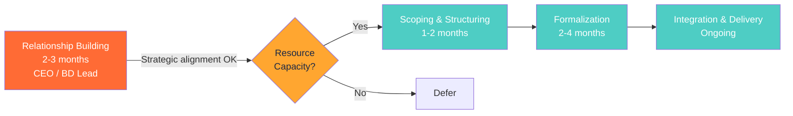

# Workflow Process Generator (360-Specific)

## Purpose

Extract 360's operational workflows from Asana projects, Google Drive documents, and Gmail communication patterns to generate professional process visualizations. Unlike the generic SOP generator, this skill focuses specifically on 360's partnership development, client engagement, innovation assessment, ecosystem mapping, and internal operations workflows.

**Output Quality Standard:** Apple-level delivery. Every visualization should be presentation-ready, board-meeting quality, and intuitively navigable.

---

## When to Use This Skill

### Trigger Phrases

Claude should **proactively use** this skill when the user:

- Says "visualize a workflow" or "create a process flow"
- Mentions "how does [process] work" for any 360 operational area
- Requests documentation for partnerships or client engagements
- Needs onboarding materials for team members or partners
- Prepares for board meetings requiring process visualization
- Says "make this delegation-ready" or "shareable"
- References specific partnerships (GenIP, SpacePlan, CNEN, nuclear tech portfolios)

### When NOT to Use

- Generic SOP documentation (use managed `workflow-process-generator` instead)
- Non-360 organizational workflows
- Simple task lists or checklists
- Workflows without access to Asana/Drive/Gmail data

---

## The Five Workflow Categories

### 1. Partnership Development
**Pattern:** Relationship building → scoping → formalization → integration
**Duration:** 2-12 months (varies by geography)
**Key Focus:** Decision points, cultural considerations, timeline emphasis
**Common Partnerships:** Brazil (CNEN, universities), US (Yale, foundations), Technology transfer

### 2. Client Engagement
**Pattern:** Inquiry → qualification → proposal → execution → delivery
**Duration:** 1-6 months
**Key Focus:** Conversion metrics, service tier paths, qualification criteria
**Services:** Vianeo validation, innovation assessment, ecosystem mapping

### 3. Innovation Assessment
**Pattern:** Intake → evaluation → prioritization → validation → recommendations
**Duration:** 2-8 weeks
**Key Focus:** Methodology selection (GenIP, Vianeo), evaluation frameworks, threshold gates

### 4. Ecosystem Mapping
**Pattern:** Discovery → stakeholder analysis → relationship mapping → opportunity identification
**Duration:** 3-12 weeks
**Key Focus:** Stakeholder categories, relationship types, value network positions

### 5. Internal Operations
**Pattern:** Planning → execution → review → optimization
**Duration:** Varies (weekly to quarterly cycles)
**Key Focus:** Dependencies, handoffs, capacity planning

---

## 6-Step Generation Workflow

### Step 1: Identify Workflow Type

**Ask clarifying questions:**
- Which workflow category does this belong to? (Partnership, Client, Innovation, Ecosystem, Internal)
- Who is the primary audience? (Internal team, external partners, board, clients)
- What output format is needed? (Quick sketch, standard docs, executive presentation)
- What timeframe is covered? (Sprint, project, multi-year partnership)

**Determine quality level:**
- **Quick Sketch** (15-30 min) - Mermaid flowchart for internal discussion
- **Standard Documentation** (45-90 min) - Mermaid + comprehensive markdown for onboarding
- **Executive Presentation** (2-4 hours) - Interactive HTML for board meetings and partner documentation

### Step 2: Extract Source Data

**Data Sources (in priority order):**

#### Asana Integration
Extract workflow structure from project templates and active projects:
- **Sections** → Workflow phases
- **Tasks** → Activities within phases
- **Custom fields** → Decision points and metrics
- **Dependencies** → Flow sequence
- **Timeline data** → Duration estimates

**See:** [data-extraction-guide.md](references/data-extraction-guide.md)

#### Google Drive Integration
Parse process documentation for workflow intelligence:
- Sequential language (first, then, next)
- Decision terminology (if, when, depending on)
- Role assignments and stakeholder mapping
- Timeline markers and success criteria

**See:** [data-extraction-guide.md](references/data-extraction-guide.md)

#### Gmail Integration
Discover implicit workflows from communication patterns:
- Email sequences showing phase progression
- Decision points in discussions
- Handoff language and stakeholder transitions
- Timeline clustering revealing phase boundaries

**See:** [data-extraction-guide.md](references/data-extraction-guide.md)

### Step 3: Structure Data into JSON

**Standardized Workflow Schema:**

```json
{
  "workflow_name": "Partnership Development with Brazilian University",
  "workflow_type": "Partnership Development",
  "duration": "6-12 months",
  "phases": [
    {
      "phase_name": "Relationship Building",
      "description": "Establish trust and mutual understanding",
      "duration": "2-3 months",
      "owner": "CEO / BD Lead",
      "activities": [
        "Initial introductions via warm introduction",
        "Discovery calls to understand priorities",
        "Site visits (if geography permits)"
      ],
      "decision_points": [
        "Strategic alignment check",
        "Resource capacity assessment"
      ],
      "outputs": ["Partnership brief", "Stakeholder map"]
    }
    // Additional phases...
  ],
  "stakeholders": ["University leadership", "360 CEO", "Research teams"],
  "success_metrics": ["MoU signed", "First project initiated"],
  "cultural_considerations": "Brazilian partnerships require relationship-first approach, senior leader approval, longer timeline",
  "source_references": ["Asana: Partnership Pipeline project", "Drive: CNEN partnership history"]
}
```

**See:** [generation-workflow-guide.md](references/generation-workflow-guide.md) Step 3

### Step 4: Generate Mermaid Diagram

**Apply 360 Brand Standards:**

#### Color Palette (Strictly Enforced)
- **Primary (360 Orange)**: `#FF6B35` - Main phases and primary nodes
- **Secondary (Deep Navy)**: `#1B2845` - Decision points and critical activities
- **Accent (Teal)**: `#4ECDC4` - Success metrics and positive outcomes
- **Neutral (Warm Gray)**: `#95A3B3` - Supporting activities and context
- **Warning (Amber)**: `#FFA630` - Risk points and blockers

**Diagram Type Selection:**
- **Flowchart** - Sequential processes with decision points (most common)
- **Gantt** - Timeline-based workflows with dependencies
- **Sequence** - Stakeholder interactions and handoffs
- **Sankey** - Resource or stakeholder flows through ecosystem

**See:** [mermaid-generation-standards.md](references/mermaid-generation-standards.md)

#### Example Output



### Step 5: Create Artifact

**Package the output based on quality level:**

#### Quick Sketch (Mermaid Only)
- Mermaid diagram code block
- Brief context (1-2 paragraphs)
- Source references

#### Standard Documentation
- Mermaid diagram
- Comprehensive markdown document:
  - Workflow overview
  - Phase descriptions with timelines
  - Decision criteria
  - Role responsibilities (RACI if complex)
  - Success metrics
  - Common failure modes
- Source data appendix

#### Executive Presentation (Interactive HTML)
- Professional HTML file with:
  - Interactive Mermaid rendering
  - Zoom, pan, hover tooltips
  - Phase detail modals
  - 360 brand typography and colors
  - Mobile-responsive design
  - Print-optimized CSS

**See:** [html-visualization-guide.md](references/html-visualization-guide.md)

### Step 6: Provide Context & Next Steps

**Insights to include:**
- **Bottleneck identification**: Where delays commonly occur
- **Decision point clarity**: Who owns each gate decision
- **Cultural notes**: If international partnerships, highlight cultural considerations
- **Delegation readiness**: What documentation/training is needed
- **Optimization opportunities**: Quick wins for improvement

**Recommendations:**
- Update triggers (when to regenerate)
- Version control approach
- Storage location (360 GitHub repository recommended)
- Next steps for implementation

**See:** [maintenance-guide.md](references/maintenance-guide.md)

---

## Quality Checklist

Before finalizing any workflow visualization, validate:

### Content Completeness
- [ ] All decision points explicitly identified
- [ ] Roles/owners assigned to each phase
- [ ] Timeline estimates included
- [ ] Success metrics defined
- [ ] Cultural considerations noted (if applicable)

### Visual Quality
- [ ] 360 brand colors correctly applied
- [ ] Readable on mobile devices
- [ ] Logical left-to-right or top-to-bottom flow
- [ ] Sufficient spacing between nodes
- [ ] Decision points visually distinct from activities

### Data Quality
- [ ] Source data validated (not assumptions)
- [ ] Cross-referenced with operational reality
- [ ] Citations provided for extracted data
- [ ] Edge cases and exceptions documented

**See:** [quality-checklist.md](references/quality-checklist.md)

---

## Usage Scenarios

### Scenario 1: Team Onboarding
**Request:** "Document our client engagement workflow for new team members"

**Process:**
1. Extract from Asana "Client Engagement" project template
2. Identify 5 phases: Inquiry → Qualification → Proposal → Execution → Delivery
3. Create Standard Documentation (Mermaid + markdown)
4. Include conversion metrics at each phase
5. Add onboarding notes for new BDleads

**Time:** 60-75 minutes

---

### Scenario 2: Board Meeting Preparation
**Request:** "Visualize our partnership development process for Q4 board meeting"

**Process:**
1. Extract from 3 recent partnership projects (CNEN, GenIP, SpacePlan)
2. Identify common phases and decision gates
3. Create Executive Presentation (Interactive HTML)
4. Highlight 6-12 month timeline, cultural considerations
5. Include success metrics and risk mitigation

**Time:** 2.5-3 hours

---

### Scenario 3: Partnership Documentation
**Request:** "Create shareable workflow for Yale collaboration"

**Process:**
1. Extract from Asana + Drive partnership docs + Gmail threads
2. Identify 4 phases: Scoping → Pilot → Scale → Sustain
3. Create Standard Documentation with cultural notes (US academic institution)
4. Include stakeholder map and decision criteria
5. Format for external sharing (remove internal-only context)

**Time:** 90 minutes

**See:** [usage-scenarios.md](references/usage-scenarios.md) for 5+ additional examples

---

## Relationship to Generic Workflow Skill

| Feature | 360-Specific Version | Managed Generic Version |
|---------|---------------------|------------------------|
| **Purpose** | Extract & visualize 360 workflows from operational tools | Generate SOPs for any organization |
| **Data Sources** | Asana, Drive, Gmail (360-specific projects) | User-provided descriptions |
| **Output Formats** | Mermaid + Interactive HTML (360 brand) | SOP documents (generic compliance) |
| **Workflow Types** | 5 categories (Partnership, Client, Innovation, Ecosystem, Internal) | Universal process types |
| **Best For** | 360 internal documentation, partner showcasing | Client deliverables, compliance SOPs |

**Use 360 version when:** Creating documentation specific to 360's operations, partnerships, or internal processes.
**Use generic version when:** Creating deliverables for clients or universal SOPs.

---

## Supporting Files

**Core Documentation:**
- **README.md** - Executive summary and quick start
- **INDEX.md** - Complete file navigation

**References:**
- `references/data-extraction-guide.md` - Asana, Drive, Gmail extraction
- `references/mermaid-generation-standards.md` - Visual standards and colors
- `references/html-visualization-guide.md` - Interactive HTML creation
- `references/workflow-categories.md` - 5 workflow categories detailed
- `references/generation-workflow-guide.md` - 6-step process walkthrough
- `references/quality-checklist.md` - Quality validation checklist
- `references/usage-scenarios.md` - Common use cases
- `references/maintenance-guide.md` - Living documentation approach
- `references/vianeo-reference.md` - Gold standard example

**Templates:**
- `templates/workflow-json-schema.json` - Standardized data structure
- `templates/html-executive-template.html` - Interactive HTML scaffold
- `templates/markdown-standard-template.md` - Standard documentation template

**Examples:**
- `examples/partnership-brazil-example.html` - Brazilian partnership workflow
- `examples/client-engagement-mermaid.md` - Client engagement flowchart
- `examples/innovation-assessment-gantt.md` - Innovation assessment timeline

---

## Troubleshooting

**"Can't access Asana/Drive/Gmail data"**
→ Confirm API integrations are configured
→ Verify permissions for project/document access
→ Fallback: Create workflow from user-provided description

**"Workflow too complex for single diagram"**
→ Break into sub-workflows by phase
→ Create high-level overview + detailed phase diagrams
→ Use HTML with modals for drill-down detail

**"Cultural considerations unclear"**
→ Reference partnership history in Drive
→ Consult CEO or BD lead for geographic nuances
→ Include explicit notes about relationship-building timelines

**"Output doesn't match 360 brand standards"**
→ Verify color palette from [mermaid-generation-standards.md](references/mermaid-generation-standards.md)
→ Check typography against [html-visualization-guide.md](references/html-visualization-guide.md)
→ Compare to gold standard in [vianeo-reference.md](references/vianeo-reference.md)

---

## Version History

- **v1.1.0** (2025-11-22) - Created SKILL.md with comprehensive operational logic
  - Added 6-step generation workflow
  - Documented 5 workflow categories
  - Established quality checklist
  - Created usage scenarios

- **v1.0.0** (2024-10-08) - Initial implementation
  - Asana, Drive, Gmail integration
  - Mermaid generation
  - 360 brand standards

---

## Next Steps

1. **First-time users**: Read [README.md](README.md) for overview (10 min)
2. **Extract workflow data**: Follow [data-extraction-guide.md](references/data-extraction-guide.md)
3. **Generate visualization**: Use 6-step workflow above
4. **Validate quality**: Apply [quality-checklist.md](references/quality-checklist.md)
5. **Store documentation**: GitHub repository with version control

**Ready to visualize 360 workflows!** 🎨
