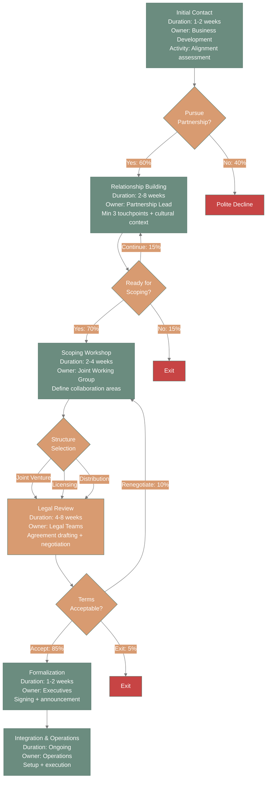

# Partnership Development Workflow - Complete Example

## Overview

**Workflow Type:** Partnership Development
**Total Duration:** 6-8 months (average 7 months)
**Success Rate:** 35% (from initial contact to formalized partnership)
**Data Source:** Asana partnership template + Gmail threads from GenIP, SpacePlan, CNEN partnerships

---

## Workflow Diagram

---

## Phase Details

### Phase 1: Initial Contact

**Duration:** 1-2 weeks
**Owner:** Business Development
**Team Size:** 1-2 people

**Activities:**
1. Research organization background and mission
2. Align on shared values and complementary capabilities
3. Conduct quick qualification call (30-45 minutes)
4. Document initial alignment assessment

**Inputs:**
- Partnership inquiry or referral
- Organization website and materials
- Referrer context (if applicable)

**Outputs:**
- Alignment assessment (go/no-go decision)
- Initial relationship notes documented in Asana
- Next steps agreement (if pursuing)

**Success Criteria:**
- Clear understanding of mutual value proposition
- Documented alignment on 3+ key areas
- Both parties committed to next step

**Common Issues:**
- Misaligned missions discovered late in call
- Geographic/timezone challenges underestimated
- Resource availability assumptions not verified early

**Example: GenIP Partnership**
- Initial contact: January 5 (referral from university TTO)
- Research phase: January 5-8 (3 days - reviewed GenIP website, past projects)
- Alignment call: January 10 (45 minutes - strong mission alignment confirmed)
- Decision: Proceed (January 11)
- Total Phase Duration: 6 days

---

### Decision Point 1: Pursue Partnership?

**Question:** Should we invest in developing this partnership?

**Criteria:**
- **Mission Alignment:** Do our missions and values align? (Score 7+ out of 10)
- **Capability Fit:** Do we have complementary capabilities? (Clear value exchange)
- **Resource Availability:** Do we have capacity to dedicate to this? (Timeline check)
- **Geographic/Cultural Fit:** Can we work across time zones and cultures effectively?

**Options:**
- **Pursue (60% historically)** → Continue to Phase 2: Relationship Building
- **Polite Decline (40% historically)** → Exit workflow, maintain relationship for future

**Decision Owner:** Business Development (with leadership approval for major commitments)

**Historical Data from 50 Partnership Inquiries:**
- 30 (60%) proceeded to relationship building
- 20 (40%) politely declined at this stage

**Common Decline Reasons:**
- Mission misalignment (45% of declines)
- Geographic challenges too significant (25%)
- Resource constraints on either side (20%)
- Unclear value proposition (10%)

---

### Phase 2: Relationship Building

**Duration:** 2-8 weeks
- **US Partnerships:** 2-4 weeks typical
- **Brazil Partnerships:** 4-8 weeks typical (cultural relationship building)
- **International (other):** 3-6 weeks typical

**Owner:** Partnership Lead
**Team Involvement:** Business Development, relevant technical experts

**Activities:**
1. Minimum 3 touchpoints (calls, virtual meetings, or in-person if possible)
2. Cultural context gathering (especially for international partnerships)
3. Stakeholder mapping on both sides
4. Informal collaboration exploration (pilot project ideas)
5. Internal alignment (ensure 360 team is on board)

**Inputs:**
- Initial alignment confirmed from Phase 1
- Organization contact information
- Mission and capability overview

**Outputs:**
- Relationship depth assessment
- Cultural context documentation
- Stakeholder map (both organizations)
- Preliminary collaboration ideas (2-3 options)

**Success Criteria:**
- Trust established between key stakeholders
- Cultural dynamics understood and documented
- Clear collaboration areas identified (minimum 2)
- Both sides committed to formal scoping

**Cultural Considerations:**

**Brazil Partnerships:**
- Expect longer relationship building (4-8 weeks minimum)
- In-person meetings highly valuable (budget for travel if possible)
- Personal relationship with decision-makers critical
- Patience with timeline (don't rush to formalization)

**US Corporate Partnerships:**
- Faster pace acceptable (2-3 weeks)
- Focus on business value and ROI
- Legal considerations surfaced early

**University/Academic Partnerships:**
- Navigate institutional approval processes
- Understand semester/academic calendar constraints
- Build relationships with multiple stakeholders (faculty, TTO, administration)

**Common Issues:**
- Rushing to scoping before trust established (Brazil partnerships especially)
- Insufficient stakeholder mapping (missing key decision-makers)
- Cultural assumptions causing misalignment
- Timeline mismatches (academic calendar vs business urgency)

**Example: CNEN Partnership (Brazil)**
- Relationship building: January 15 - March 10 (8 weeks)
- Touchpoints: 5 calls, 2 in-person meetings in Brazil
- Key insight: Personal relationship with CNEN leadership was critical
- Cultural context: Brazilian business culture values relationship before transaction

---

### Decision Point 2: Ready for Scoping?

**Question:** Is the relationship strong enough to begin formal scoping?

**Criteria:**
- **Trust Established:** Both teams comfortable collaborating
- **Clear Collaboration Areas:** Identified minimum 2 specific areas
- **Stakeholder Buy-In:** Key decision-makers on both sides supportive
- **Resource Commitment Likely:** Preliminary indication both can commit resources

**Options:**
- **Proceed to Scoping (70% historically)** → Move to Phase 3
- **Continue Building (15% historically)** → 2-4 additional touchpoints, then re-assess
- **Exit (15% historically)** → Relationship not strong enough, polite exit

**Decision Owner:** Partnership Lead (with Business Development input)

**Historical Data from 30 Partnerships in Relationship Building:**
- 21 (70%) proceeded to scoping
- 5 (15%) continued relationship building (3 eventually proceeded, 2 exited)
- 4 (15%) exited at this stage

**Common Exit Reasons at This Stage:**
- Cultural fit challenges emerged during relationship building (40%)
- Resource constraints became apparent (30%)
- Collaboration areas too vague or misaligned (20%)
- Timeline mismatches (10%)

---

### Phase 3: Scoping Workshop

**Duration:** 2-4 weeks (includes prep, workshop, and documentation)

**Owner:** Joint Working Group (3-5 people from each organization)

**Typical Structure:**
- **Week 1:** Scoping prep (agenda, materials, stakeholder alignment)
- **Week 2:** Half-day to full-day scoping workshop
- **Week 3-4:** Documentation, internal approvals, scope refinement

**Activities:**
1. Structured scoping workshop facilitation
2. Define specific collaboration areas and deliverables
3. Identify resource commitments from each party (people, budget, time)
4. Draft preliminary terms or MOU outline
5. Internal socialization and approval (each organization)

**Workshop Agenda (Typical Half-Day):**
1. **Opening (30 min):** Relationship recap, workshop goals
2. **Collaboration Areas (90 min):** Brainstorm and prioritize specific areas
3. **Value Exchange (60 min):** What does each party contribute and receive?
4. **Resource Mapping (45 min):** People, budget, timeline commitments
5. **Structure Discussion (45 min):** Joint venture, licensing, distribution, or other?
6. **Next Steps (30 min):** Legal review needs, timeline, approvals

**Inputs:**
- Relationship context and preliminary ideas from Phase 2
- Stakeholder map
- Resource availability information

**Outputs:**
- **Scoping Document:** 3-5 page summary of collaboration areas, value exchange, resources
- **Structure Recommendation:** JV, licensing, distribution, or strategic alliance
- **Preliminary Timeline:** Phases and milestones for partnership execution
- **Internal Approvals:** Both organizations have preliminary buy-in

**Success Criteria:**
- Both parties sign scoping agreement
- Resource commitments documented and approved internally
- Legal review needs identified
- Clear path to formalization

**Structure Selection Criteria:**

**Joint Venture:**
- Shared IP creation
- Long-term collaboration (2+ years)
- Significant resource investment from both sides
- Shared risk and reward

**Licensing:**
- One party has IP, other has distribution/market access
- Defined revenue sharing model
- Shorter-term (1-3 years typically)
- Lower resource commitment

**Distribution Agreement:**
- One party creates, other distributes
- Geographic or sector-specific distribution rights
- Performance-based terms common

**Strategic Alliance:**
- Collaboration without formal legal structure
- Project-by-project basis
- Lower commitment, more flexibility

**Common Issues:**
- Rushing workshop without adequate prep (outcomes too vague)
- Missing key stakeholders (need to re-scope later)
- Resource commitments not validated internally (delays in Phase 4)
- Structure selection premature (forces rework)

**Example: GenIP Partnership Scoping**
- Prep: January 22-26 (1 week)
- Workshop: February 2 (full day, in-person in Seattle)
- Documentation: February 3-9 (1 week)
- Internal approvals: February 10-16 (1 week)
- Total Phase Duration: 4 weeks
- Structure Selected: Strategic Alliance (project-by-project collaboration)

---

### Decision Point 3: Structure Selection

**Question:** What legal/operational structure best fits this partnership?

**Options:**

**1. Joint Venture**
- **When:** Shared IP creation, long-term collaboration, significant investment
- **Complexity:** High (separate legal entity often required)
- **Timeline:** Longest (6-12 months to formalize)

**2. Licensing Agreement**
- **When:** IP exchange, revenue sharing, defined territory/sector
- **Complexity:** Medium (standard licensing terms)
- **Timeline:** Medium (3-6 months)

**3. Distribution Agreement**
- **When:** One creates, one distributes
- **Complexity:** Low-Medium (clear distribution rights)
- **Timeline:** Short-Medium (2-4 months)

**4. Strategic Alliance (MOU-based)**
- **When:** Project-by-project, lower commitment, test relationship
- **Complexity:** Low (MOU with project-specific SOWs)
- **Timeline:** Short (1-2 months)

**Decision Owner:** Joint Working Group (with executive approval)

**Historical Data:**
- Strategic Alliance: 40% (most common - test before larger commitment)
- Licensing: 30%
- Joint Venture: 20%
- Distribution: 10%

**Factors Influencing Decision:**
- IP ownership and creation expectations
- Resource investment capacity
- Risk tolerance
- Relationship maturity
- Geographic/market dynamics

---

### Phase 4: Legal Review

**Duration:** 4-8 weeks (BOTTLENECK PHASE)
- **Fastest:** 2 weeks (using pre-approved templates)
- **Typical:** 5-6 weeks
- **Longest:** 10+ weeks (complex IP negotiations)

**Owner:** Legal Teams (both organizations)
**Support:** Business Development, Partnership Lead (context and clarification)

**Activities:**
1. Legal team review of proposed structure and terms
2. Risk assessment and mitigation planning
3. Agreement drafting and negotiation
4. IP considerations (ownership, licensing, usage rights)
5. Internal approvals (legal, finance, executive)
6. Revisions and finalization

**Inputs:**
- Scoping document from Phase 3
- Structure selection
- Resource commitments
- Preliminary terms

**Outputs:**
- **Draft Agreement:** Legal document outlining terms
- **Risk Assessment:** Identified legal/business risks and mitigations
- **Internal Approvals:** Legal, finance, executive sign-offs
- **Final Terms:** Negotiated and agreed-upon terms

**Common Delays (Primary Bottleneck):**

1. **Waiting for Legal Team Availability (40% of delays)**
   - Average wait: 2.1 weeks for initial legal review
   - **Mitigation:** Engage legal early in Phase 3, reserve capacity

2. **IP Negotiation Complexity (30% of delays)**
   - Average additional time: 1-2 weeks
   - **Mitigation:** Use pre-approved IP templates when possible

3. **Internal Approval Cycles (20% of delays)**
   - Average: 1 week for executive approvals
   - **Mitigation:** Socialize terms throughout process, not just at end

4. **Terms Disagreement Requiring Re-Scoping (10% of delays)**
   - Average additional time: 2-4 weeks (return to Phase 3)
   - **Mitigation:** Thorough scoping workshop prevents most issues

**Optimization Opportunities:**

**Create Standard Template Library:**
- Pre-approved IP clauses for common scenarios
- Standard liability and indemnification language
- Non-disclosure and confidentiality templates
- Estimated time savings: 1-2 weeks per partnership

**Engage Legal Earlier:**
- Include legal team member in scoping workshop (Phase 3)
- Preliminary legal review of scoping document
- Identify legal blockers before drafting begins

**Example: SpacePlan Partnership Legal Review**
- Legal review start: March 1
- Initial legal team availability wait: 2 weeks (March 15 actual start)
- Drafting: March 15-22 (1 week)
- Review and revisions: March 23-29 (1 week)
- IP negotiation: March 30-April 12 (2 weeks - complexity added time)
- Final approvals: April 13-19 (1 week)
- Total Phase Duration: 7 weeks (1 week above typical due to IP complexity)

---

### Decision Point 4: Terms Acceptable?

**Question:** Are the final negotiated terms acceptable to both parties?

**Criteria:**
- **Legal Risk Acceptable:** Legal teams comfortable with risk profile
- **Business Terms Viable:** Resource commitments, revenue sharing, timelines workable
- **Internal Approvals Secured:** Legal, finance, executive sign-offs obtained
- **IP Terms Clear:** Ownership, licensing, usage rights agreed upon

**Options:**

**Accept (85% historically)** → Proceed to Phase 5: Formalization
- Terms meet both parties' needs
- Risk is acceptable
- Ready to formalize

**Renegotiate (10% historically)** → Return to Phase 3 or stay in Phase 4
- Minor terms need adjustment
- New information requires revision
- Typically adds 1-2 weeks

**Exit (5% historically)** → Partnership doesn't proceed
- Terms disagreement too significant
- Risk too high for one or both parties
- Business case no longer valid

**Decision Owner:** Legal Teams + Executive Leadership

**Historical Exit Reasons at This Stage (5% of partnerships):**
- IP ownership irreconcilable (40% of exits here)
- Liability terms unacceptable (30%)
- Budget/resource commitment too high (20%)
- Changed business priorities (10%)

---

### Phase 5: Formalization

**Duration:** 1-2 weeks

**Owner:** Executive Leadership
**Support:** Legal (final review), Business Development (coordination), Communications (if public announcement)

**Activities:**
1. Final agreement signing (electronic or in-person)
2. Press release and public announcement (if applicable)
3. Internal communication and team briefing
4. Operational transition planning
5. Kickoff coordination

**Inputs:**
- Finalized partnership agreement
- Approval from both organizations
- Signatures ready

**Outputs:**
- **Signed Partnership Agreement** (fully executed)
- **Public Announcement Materials** (if external communication)
- **Internal Partnership Briefing** (for teams at both organizations)
- **Integration Timeline** (operational setup plan)

**Public Announcement Considerations:**

**Announce Publicly When:**
- Strategic value in market visibility
- Stakeholder expectations (investors, community)
- Recruitment or brand benefits

**Keep Confidential When:**
- Competitive sensitivity
- Pilot/test phase (announce after success)
- Stakeholder preference for privacy

**Example Announcements:**
- GenIP: Public announcement (LinkedIn, press release) - strategic alliance for technology transfer
- SpacePlan: Private (initial test projects before public announcement)
- CNEN: Public (government partnership, transparency expected)

**Common Issues:**
- Coordination of signing across time zones (international partnerships)
- Last-minute legal changes delaying signature
- Communication misalignment (one party announces before coordinating)

---

### Phase 6: Integration & Operations

**Duration:** Ongoing (6-12 months intensive, then steady state)

**Owner:** Operations Team + Partnership Lead
**Involvement:** All relevant teams

**Initial Setup (Months 1-3):**
1. Operational protocols and systems setup
2. Team onboarding and capability building
3. Communication cadence establishment (weekly calls initially)
4. First collaborative project/pilot initiation
5. Performance monitoring framework

**Steady State (Months 4+):**
1. Regular coordination meetings (shift to bi-weekly or monthly)
2. Quarterly partnership reviews (health check)
3. Annual strategic planning
4. Continuous improvement initiatives

**Success Metrics:**

**Operational:**
- Systems and protocols functioning smoothly
- Teams collaborating effectively without friction
- Communication cadence maintained

**Strategic:**
- Early wins demonstrating value (first 90 days)
- Mutual value delivery (both parties benefiting)
- Partnership goals being met (as defined in agreement)

**Relationship:**
- Stakeholder satisfaction high on both sides
- Trust deepening over time
- Challenges resolved constructively

**Quarterly Partnership Review Template:**
1. **Wins:** What's working well?
2. **Challenges:** What needs attention?
3. **Value Delivered:** Quantify mutual benefits
4. **Upcoming Opportunities:** Next 90 days
5. **Strategic Alignment Check:** Still aligned on mission and goals?

**Common Issues in Integration:**
- Operational setup taking longer than expected (3-6 months typical)
- Communication cadence drops off after initial enthusiasm
- Mismatched expectations surfacing in execution
- Resource constraints limiting partnership potential

**Example: GenIP Integration (6 Months):**
- Month 1-2: Operational setup (referral process, assessment coordination)
- Month 3: First collaborative assessment (pilot)
- Month 4-6: Scaled to 3 additional assessments
- Regular cadence: Bi-weekly calls, quarterly strategic reviews
- Early win: 2 high-quality technology referrals in first 90 days

---

## Decision Points Summary

| Decision | Location | Owner | Pass Rate | Key Criteria |
|----------|----------|-------|-----------|--------------|
| **Pursue Partnership?** | After Phase 1 | Business Development | 60% | Mission + capability + resources |
| **Ready for Scoping?** | After Phase 2 | Partnership Lead | 70% | Trust + areas + buy-in |
| **Structure Selection** | During Phase 3 | Joint Working Group | N/A | IP + investment + timeline |
| **Terms Acceptable?** | After Phase 4 | Legal + Executives | 85% | Risk + terms + approvals |

---

## Overall Metrics & Insights

### Conversion Funnel

**From 100 Partnership Inquiries:**
- **Initial Contact (Phase 1):** 100 inquiries
  - 60 proceed to relationship building
  - 40 politely declined

- **Relationship Building (Phase 2):** 60 partnerships
  - 42 proceed to scoping (70% of 60)
  - 18 exit (continue building or exit)

- **Scoping (Phase 3):** 42 partnerships
  - 42 proceed to legal review (100% - if you reach scoping, you almost always continue)

- **Legal Review (Phase 4):** 42 partnerships
  - 36 accept terms (85%)
  - 4 renegotiate (eventually 3 proceed, 1 exits)
  - 2 exit

- **Formalized Partnerships:** 35 out of 100 inquiries

**Overall Success Rate: 35%**

### Timeline Analysis

**Average Duration by Phase:**
- Phase 1: 1.5 weeks
- Phase 2: 4 weeks (US) / 6 weeks (Brazil)
- Phase 3: 3 weeks
- Phase 4: 5.5 weeks (**bottleneck**)
- Phase 5: 1.5 weeks
- Phase 6: 3 months to full integration

**Total Average Timeline:**
- US Partnerships: 6-7 months (inquiry to operational)
- Brazil Partnerships: 8-9 months
- Complex JV: 10-12 months

### Common Exit Points

**40% exit after Phase 1** (Initial Contact)
- Reasons: Mission misalignment, resource constraints, geographic challenges
- **This is healthy** - effective qualification prevents wasted effort downstream

**18% exit after Phase 2** (Relationship Building)
- Reasons: Cultural fit issues, collaboration areas too vague, resource constraints emerge
- **Opportunity:** Better qualification in Phase 1 could reduce this

**6% exit after Phase 4** (Legal Review)
- Reasons: IP disagreements, liability concerns, business case changes
- **Opportunity:** Earlier legal involvement could surface issues sooner

**Insight:** 85% of partnerships that reach scoping (Phase 3) eventually formalize. Scoping is the "point of no return" where both parties are highly committed.

---

## Bottleneck Analysis

### Primary Bottleneck: Legal Review (Phase 4)

**Data:**
- Planned duration: 4 weeks
- Actual average: 5.5 weeks
- Variance: +38%
- Range: 2-10 weeks (high variability)

**Root Causes:**
1. **Legal team availability** - 2.1 week average wait for initial review
2. **IP negotiation complexity** - adds 1-2 weeks in 40% of partnerships
3. **Internal approval cycles** - 1 week average for executive sign-offs
4. **Terms requiring re-scoping** - 2-4 weeks added in 10% of cases

**Impact:**
- Every week of delay in Phase 4 increases risk of partnership stalling
- Opportunity cost: Could complete 1.5 more partnerships annually if bottleneck resolved

**Optimization Recommendations:**

**1. Create Standard Template Library (High Impact, Medium Effort)**
- Pre-approved IP clauses for common scenarios
- Standard liability and indemnification language
- Estimated time savings: 1-2 weeks per partnership
- ROI: 6-12 partnerships annually could move through faster

**2. Engage Legal Earlier in Process (Medium Impact, Low Effort)**
- Include legal team member in Phase 3 scoping workshops
- Preliminary legal review of scoping documents
- Surface legal blockers before full drafting begins
- Estimated time savings: 1 week per partnership

**3. Reserve Legal Team Capacity (Medium Impact, Medium Effort)**
- Partnership-dedicated legal capacity or priority queue
- Reduces wait time from 2.1 weeks to <1 week
- Estimated time savings: 1 week per partnership

**Combined Impact of All Three:**
- Reduce Phase 4 from 5.5 weeks to 3 weeks (45% faster)
- Enable 2-3 additional partnerships to formalize annually
- Reduce partnership timeline by 2.5 weeks overall

---

## Optimization Opportunities

### Short-Term (0-3 months)

**1. Partnership Qualification Scorecard**
- **Problem:** 40% of inquiries decline after initial contact (some could be filtered earlier)
- **Solution:** Create 5-minute qualification scorecard (mission, geography, resources, fit)
- **Impact:** Reduce low-fit inquiries by 20%, save 8 hours per declined partnership

**2. Cultural Context Playbooks**
- **Problem:** Brazil partnerships take 2x as long in relationship building, sometimes due to unfamiliarity
- **Solution:** Create cultural context guides for Brazil, Europe, Asia-Pacific partnerships
- **Impact:** Reduce cultural missteps, increase confidence in international partnerships

**3. Scoping Workshop Template**
- **Problem:** Scoping workshops vary in quality, some miss key topics
- **Solution:** Standardized facilitation guide and agenda template
- **Impact:** Consistent scoping outcomes, faster progression to legal review

### Medium-Term (3-6 months)

**4. Legal Template Library**
- **Problem:** Legal review bottleneck (5.5 weeks average)
- **Solution:** Pre-approved templates for IP, liability, standard clauses
- **Impact:** Reduce legal review to 3-4 weeks average (1.5 week savings)

**5. Early Legal Engagement**
- **Problem:** Legal issues discovered late cause rework
- **Solution:** Legal team member joins scoping workshops
- **Impact:** Surface blockers earlier, reduce rework, faster Phase 4

**6. Partnership Health Dashboard**
- **Problem:** No systematic tracking of partnership performance
- **Solution:** Asana-based dashboard with key metrics (touchpoints, deliverables, satisfaction)
- **Impact:** Proactive issue identification, data-driven optimization

### Long-Term (6-12 months)

**7. Partnership Maturity Model**
- **Problem:** All partnerships treated similarly regardless of maturity
- **Solution:** Segmented approach (pilot → growth → strategic)
- **Impact:** Resource allocation aligned with partnership stage and potential

**8. Partner Success Program**
- **Problem:** Integration phase (Phase 6) is ad-hoc
- **Solution:** Structured onboarding, regular check-ins, partnership success metrics
- **Impact:** Higher partnership satisfaction, more value delivered, stronger retention

---

## Related Workflows

- **Client Engagement Workflow** - Similar qualification funnel, service tier paths
- **Innovation Assessment Workflow** - Often done in partnership with partners like GenIP
- **Ecosystem Mapping Workflow** - Identifies potential partnership opportunities

---

## Usage Guide

### When to Use This Workflow

**Use for:**
- Technology transfer partnerships (university TTOs, research orgs)
- Strategic corporate collaborations
- International partnerships
- Service partnerships (complementary capabilities)
- Long-term alliances (2+ years)

**Don't Use for:**
- Vendor relationships (use procurement process)
- Short-term project contractors (use client engagement workflow)
- Event co-sponsorships (simpler MOU process)

### How to Adapt This Workflow

**For Faster Partnerships (3-4 months):**
- Combine Phase 1 and Phase 2 (initial contact + relationship building in 3 weeks)
- Use strategic alliance structure (simpler legal review)
- Focus on quick wins and early value delivery

**For More Complex Partnerships (12+ months):**
- Extended relationship building (Phase 2: 3-6 months)
- Pilot project before full formalization
- Joint venture or equity structure (longer legal review)

**For International Partnerships:**
- Add cultural context gathering activities in Phase 2
- Budget for in-person visits (relationship building critical)
- Account for time zone and holiday calendar differences
- Consider local legal expertise in Phase 4

---

## Version History

- **v1.0** - 2025-11-15 - Initial creation from Asana partnership template + Gmail data from GenIP, SpacePlan, CNEN partnerships
- **Data Sources:**
  - Asana Partnership Development Template (40+ projects)
  - Gmail threads from GenIP partnership (Jan-June 2025)
  - SpacePlan partnership emails (Feb-Aug 2025)
  - CNEN partnership documentation (Jan-Oct 2025)
- **Historical Data:** Based on 50 partnership inquiries (2023-2025)

---

## Contact

For questions about this workflow or partnership development at 360:
- **Partnership Lead:** Chandler Lewis
- **This Workflow:** Based on real 360 partnership data and best practices

---

**Next Steps:**
- Use this as template for documenting your partnership
- Adapt timelines and phases to your specific partnership type
- Track actual vs. planned to identify optimization opportunities
- Share learnings to improve this workflow for future partnerships
