# Mermaid Generation Standards

Complete standards for generating professional, 360-branded Mermaid diagrams.

---

## Visual Style Standards: 360 Brand Consistency

### Color Palette (Strictly Enforced)

```css
/* Primary Workflow Colors */
Primary Path:       #6b8c7f  /* sage green - core workflow, required steps */
Alternative Path:   #d89b71  /* terracotta - optional or standard tier */
Enhanced/Premium:   #9b8a9d  /* plum - complete tier or advanced features */
Exit/Failure:       #c74444  /* red - process exits, failures, rejections */
Standard/Neutral:   #7a7a7a  /* gray - supporting elements, timelines */
```

**Usage Rules:**
- **Primary Path (#6b8c7f):** Main workflow nodes, successful outcomes, core activities
- **Alternative Path (#d89b71):** Secondary options, standard service tier, alternative approaches
- **Enhanced/Premium (#9b8a9d):** Premium service tiers, advanced options, comprehensive paths
- **Exit/Failure (#c74444):** Process exits, declined opportunities, failed gates, errors
- **Standard/Neutral (#7a7a7a):** Supporting information, timeline markers, neutral status

---

### Mermaid Theme Configuration

**Standard Theme Template:**

```mermaid
%%{init: {'theme':'base', 'themeVariables': {
  'primaryColor':'#6b8c7f',
  'primaryTextColor':'#fff',
  'primaryBorderColor':'#5a7a6f',
  'lineColor':'#7a7a7a',
  'secondaryColor':'#d89b71',
  'tertiaryColor':'#9b8a9d',
  'errorBkgColor':'#c74444',
  'errorTextColor':'#fff'
}}}%%
```

**Apply to ALL Mermaid diagrams** for brand consistency.

---

## Diagram Type Selection Guide

### 1. Flowchart - For Decision-Heavy Processes

**When to Use:**
- Workflows with multiple decision points
- Branching paths based on criteria
- Conditional logic ("if this, then that")
- Need to show volume distribution percentages

**Best For:**
- Partnership development (pursue/pass decisions)
- Client qualification (fit assessment)
- Assessment methodology selection
- Any workflow with 2+ decision gates

**Structure:**
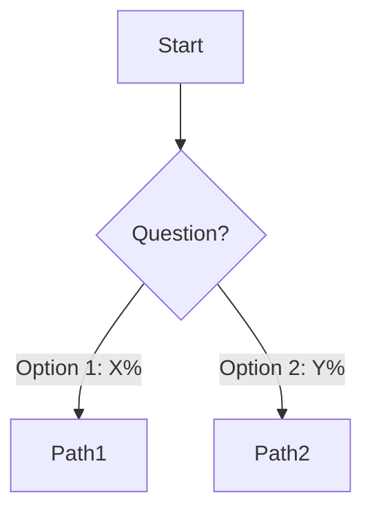

**Example Use Case:**
Partnership development with decision gates at initial contact, scoping readiness, and terms acceptance.

---

### 2. Gantt Chart - For Timeline-Focused Processes

**When to Use:**
- Workflows emphasizing phase duration
- Overlapping or parallel activities
- Project timelines and milestones
- Resource allocation over time

**Best For:**
- Partnership timelines (2-12 month spans)
- Multi-month project execution
- Client engagement schedules
- Strategic planning cycles

**Structure:**
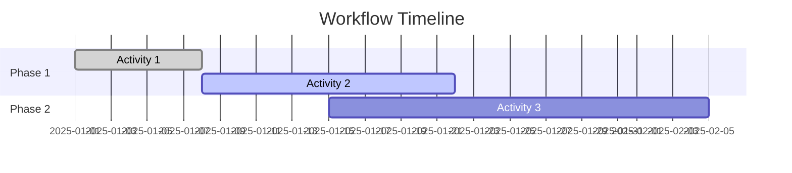

**Example Use Case:**
GenIP partnership timeline showing 6-month progression from initial contact through operational integration.

---

### 3. Sequence Diagram - For Multi-Stakeholder Workflows

**When to Use:**
- Workflows with multiple parties
- Handoffs between teams or organizations
- Back-and-forth interactions
- Communication-heavy processes

**Best For:**
- Client engagement (client ↔ 360 ↔ partner)
- Partnership negotiations (360 ↔ legal ↔ partner ↔ partner legal)
- Ecosystem coordination (multiple stakeholder interactions)
- Internal handoffs (BD → technical → delivery)

**Structure:**
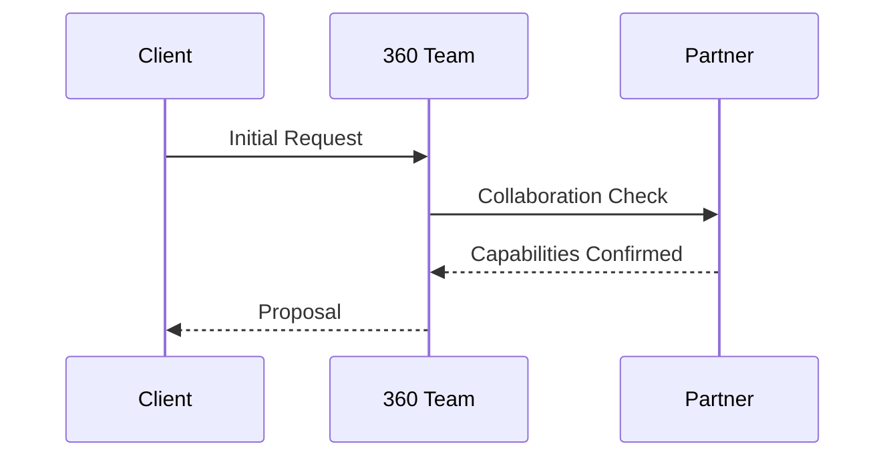

**Example Use Case:**
Client engagement showing interactions between client, 360 business development, technical team, and partner organization.

---

### 4. Sankey/Flow Diagram - For Volume-Based Flows

**When to Use:**
- Emphasis on volume distribution matters
- Conversion funnels
- Flow emphasis (thick = high volume, thin = low volume)
- Multiple parallel paths with different volumes

**Best For:**
- Client engagement pipeline (inquiry → qualified → won)
- Assessment execution paths (Fast Track vs Standard vs Complete)
- Partnership conversion funnel
- Service tier selection

**Note:** For simple Sankey, use Mermaid flowchart with volume labels. For complex Sankey (Vianeo-level), generate custom HTML/SVG.

**Structure:**
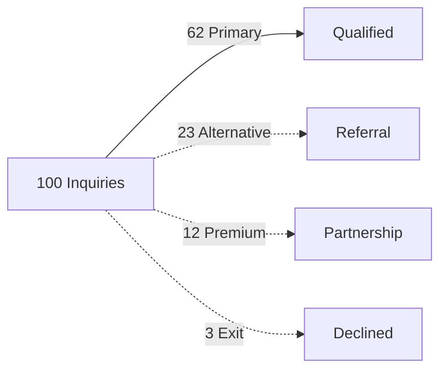

**Example Use Case:**
Client engagement showing conversion from 100 inquiries through qualification to project execution with volume percentages.

---

## Node Content Structure

### Required Elements for Every Node

1. **Phase/Activity Name** - Clear, action-oriented, concise (3-6 words)
2. **Brief Description** - 1-2 sentences max, specific outcome (if space permits)
3. **Owner/Role** - Who's responsible (team or individual)
4. **Duration/Timeline** - Specific estimate or range
5. **Decision Criteria** - (if applicable) What determines next step
6. **Volume Data** - (if known) Percentage or count flowing through

---

### Node Format Templates

#### Standard Node Format:
```
PhaseID["Phase Name
Duration: X weeks/days
Owner: Role/Team
Key Activity: Brief description
Success: Completion criteria"]
```

#### Minimal Node Format (when space constrained):
```
PhaseID["Phase Name<br/>Duration: X weeks<br/>Owner: Role"]
```

#### Decision Node Format:
```
DecisionID{Decision Question?}
```

---

### Example Nodes

**Standard Nodes:**

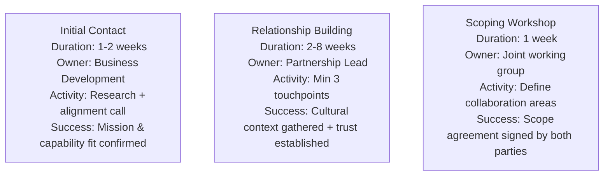

**Decision Nodes:**

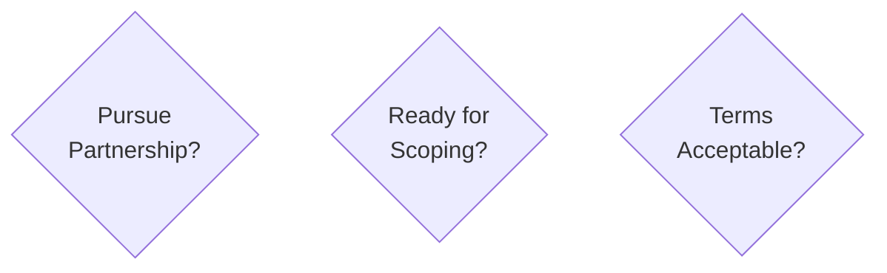

---

## Styling Standards

### Node Styling

**Apply styling using `style` directive:**

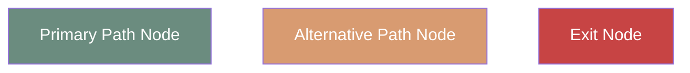

**Or using classes for reusability:**

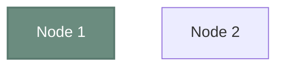

---

### Edge (Arrow) Styling

**Standard Edges:**
```mermaid
graph TD
    A --> B  /* Solid arrow (default) - primary flow */
    B -.-> C /* Dotted arrow - alternative/optional */
    C ==> D  /* Thick arrow - emphasized flow */
    D -.->|Label| E /* With label */
```

**Edge Labels:**
- Include percentages for volume distribution
- Use for decision outcomes ("Yes: 60%", "No: 40%")
- Brief descriptions for clarity

**Example:**
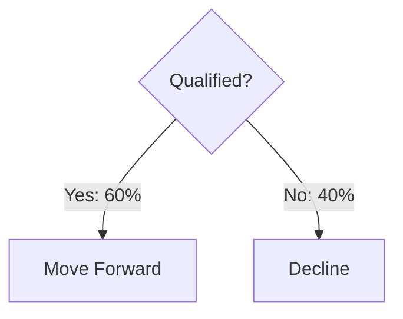

---

### Link Styling (Custom Colors)

**Color-code edges by path type:**

```mermaid
graph TD
    A --> B
    A --> C
    A --> D

    linkStyle 0 stroke:#6b8c7f,stroke-width:4px  /* Primary path */
    linkStyle 1 stroke:#d89b71,stroke-width:3px  /* Alternative */
    linkStyle 2 stroke:#c74444,stroke-width:2px  /* Exit path */
```

---

## Complete Example: Partnership Development

**Decision-Heavy Flowchart:**

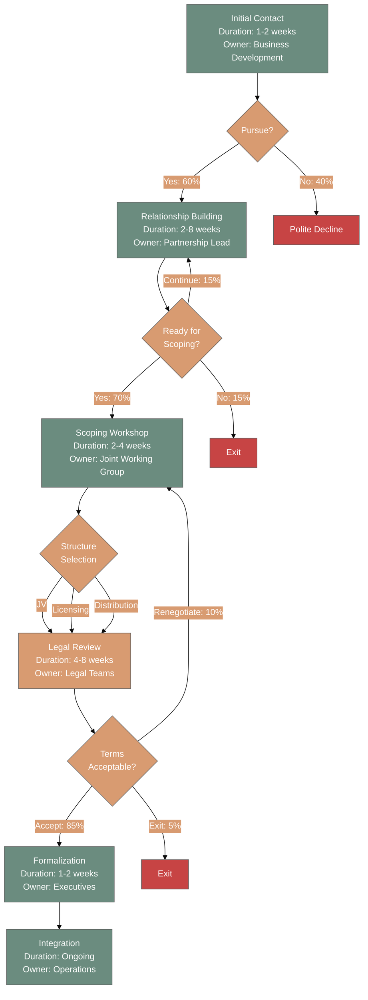

---

## Diagram Best Practices

### Readability

1. **Node Spacing:** Ensure adequate white space between nodes
2. **Text Size:** Keep node text concise (max 4-5 lines per node)
3. **Flow Direction:** Use TD (top-down) for most workflows, LR (left-right) for timelines
4. **Edge Crossing:** Minimize crossing arrows

### Consistency

1. **Color Usage:** Stick to 360 palette, don't introduce new colors
2. **Node Shape:** Rectangles for activities, diamonds for decisions, rounded for start/end
3. **Label Format:** Consistent format across all nodes (see templates above)
4. **Percentage Display:** Always show on decision edges when known

### Accessibility

1. **Color Contrast:** Ensure text is readable (white on dark backgrounds)
2. **Alternative Text:** Describe diagram in markdown around Mermaid code
3. **Font Size:** Don't make text too small in nodes

---

## Export and Usage

### Rendering Mermaid

**GitHub/GitLab:**
- Both platforms render Mermaid natively in markdown
- Commit `.md` file with Mermaid code blocks

**Mermaid Live Editor:**
- Visit https://mermaid.live
- Paste code for live preview
- Export as PNG/SVG for presentations

**Notion/Confluence:**
- Both support Mermaid in code blocks
- Use language tag: ```mermaid

**Standalone HTML:**
- Include Mermaid.js library
- Embed code in `<pre class="mermaid">` tags

---

### Export Formats

**For Presentations:**
- Export as SVG from Mermaid Live (scalable, crisp at any size)
- Import into PowerPoint/Keynote
- Maintains quality when zoomed

**For Documentation:**
- Keep as Mermaid code in markdown (version controllable, editable)
- Renders automatically in GitHub/Notion/Confluence

**For Printing:**
- Export as PNG at high resolution (300 DPI)
- Use for PDF reports

---

## Common Diagram Patterns

### Pattern 1: Linear Workflow with Decision Gates

**Use For:** Most standard workflows

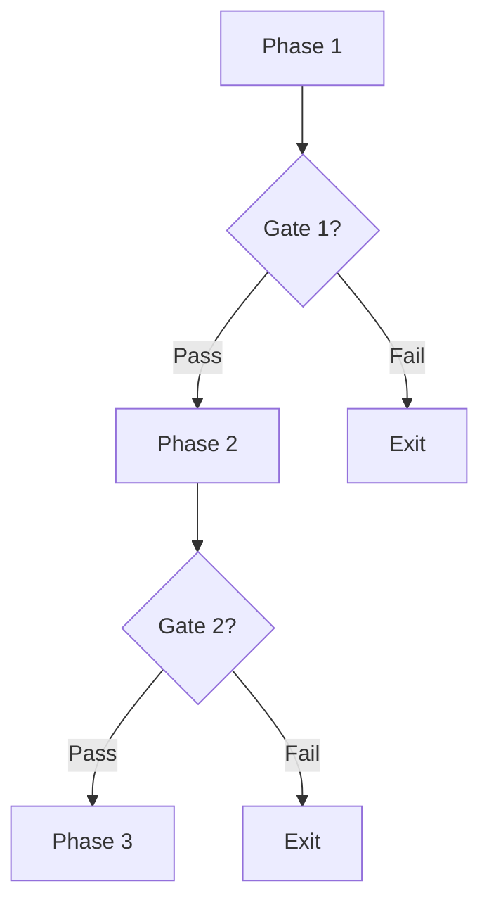

---

### Pattern 2: Parallel Paths (Service Tiers)

**Use For:** Multiple execution options (Fast Track / Standard / Complete)

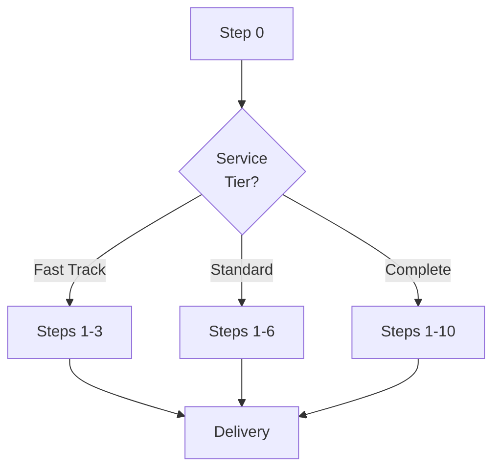

---

### Pattern 3: Iterative Loop

**Use For:** Review cycles, draft iterations

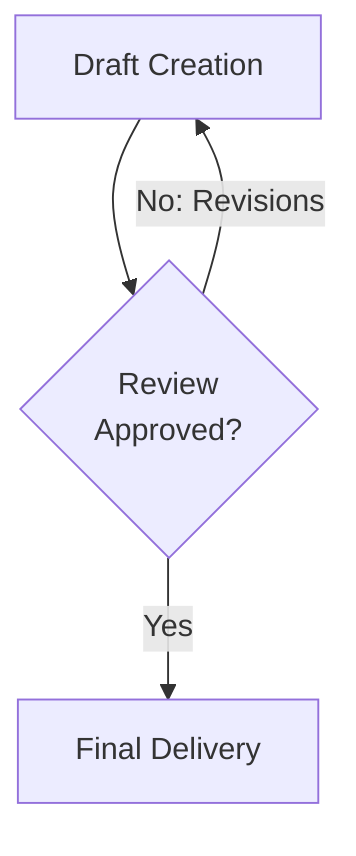

---

### Pattern 4: Multi-Stakeholder Handoff

**Use For:** Workflows with clear ownership transitions

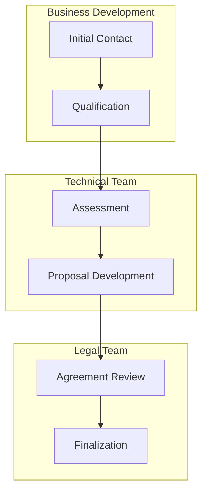

---

## Quality Checklist

**Before Finalizing Mermaid Diagram:**

### Visual Quality
- [ ] 360 color palette applied correctly
- [ ] Theme configuration included in code block
- [ ] Node text is readable at standard zoom
- [ ] No overlapping edges or nodes
- [ ] Consistent node shapes for node types

### Content Quality
- [ ] All nodes have duration/timeline
- [ ] Owners/roles specified
- [ ] Decision criteria clear
- [ ] Volume percentages on decision edges (if known)
- [ ] Success criteria noted (if applicable)

### Technical Quality
- [ ] Code renders without errors in Mermaid Live
- [ ] Compatible with GitHub markdown
- [ ] Exports cleanly to SVG/PNG
- [ ] Follows Mermaid syntax best practices

---

## Troubleshooting Common Issues

### Issue: Text Too Long in Node
**Solution:** Use `<br/>` for line breaks, or abbreviate

**Before:**
```
Node["This is a very long description that doesn't fit well in a single node"]
```

**After:**
```
Node["Concise Title<br/>Duration: 2 weeks<br/>Owner: Team Name"]
```

---

### Issue: Edges Crossing Awkwardly
**Solution:** Reorder node definitions or adjust flow direction

**Try:**
- Change `graph TD` to `graph LR`
- Define nodes in visual order (left to right, top to bottom)
- Use subgraphs to group related nodes

---

### Issue: Colors Not Applying
**Solution:** Ensure theme configuration is first line in code block

**Correct Format:**
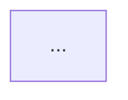

---

### Issue: Diagram Too Wide/Tall
**Solution:** Break into multiple diagrams or use subgraphs

- One diagram per major phase
- Link between diagrams in documentation
- Use "continued in next diagram" notation

---

## Advanced Techniques

### Subgraphs for Grouping

**Group related phases:**

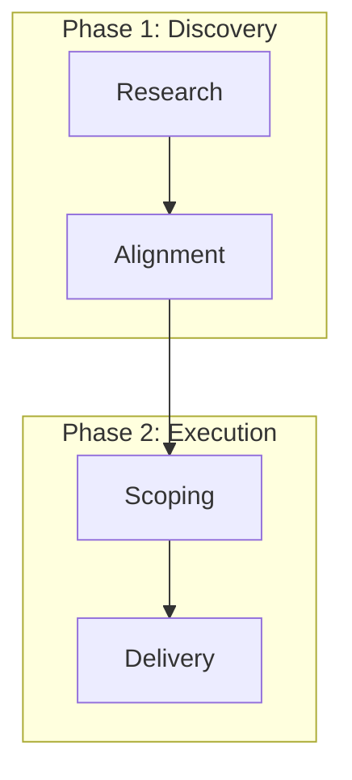

---

### Annotations with Notes

**Add explanatory notes:**

```mermaid
graph TD
    A[Phase 1] --> B[Phase 2]

    Note1["📝 Note: Brazil partnerships<br/>require 2-4 extra weeks here"] -.-> B
```

---

### Icons and Emoji

**Use sparingly for visual emphasis:**

```mermaid
graph TD
    Success["✅ Project Complete"]
    Warning["⚠️ Needs Review"]
    Error["❌ Failed Gate"]
```

---

## Version History

- **v1.0** - 2025-11-15 - Initial creation with comprehensive Mermaid standards for 360 workflows

---

**Next:** [Workflow Categories Guide](workflow-categories.md) - Understand the five workflow types and their characteristics
