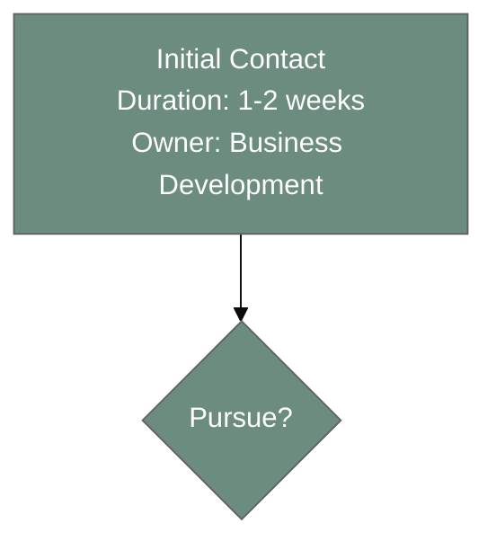

# Quality Checklist

Comprehensive quality standards for workflow documentation and visualization.

---

## Content Completeness

### Phase Documentation

**Every Phase Must Include:**

- [ ] **Phase Name** - Clear, action-oriented (verb-noun pattern preferred)
- [ ] **Duration** - Specific estimate or range (e.g., "2-4 weeks")
- [ ] **Owner/Role** - Who's responsible (team or individual)
- [ ] **Key Activities** - 2-5 specific actions within the phase
- [ ] **Inputs** - What's needed to start this phase
- [ ] **Outputs** - What's produced by end of phase
- [ ] **Success Criteria** - How to know phase is complete

**Example:**
```
✅ GOOD:
Phase 2: Relationship Building
Duration: 2-8 weeks (Brazil: 4-8 weeks)
Owner: Partnership Lead
Activities:
  - Minimum 3 touchpoints (calls, meetings)
  - Cultural context gathering
  - Stakeholder mapping
Inputs: Initial alignment confirmed
Outputs: Trust established, collaboration areas identified
Success: Both parties committed to scoping workshop

❌ BAD:
Phase 2: Relationship stuff
Duration: varies
Owner: someone
```

---

### Decision Point Documentation

**Every Decision Must Include:**

- [ ] **Decision Question** - Clear yes/no or option choice
- [ ] **Decision Criteria** - How to decide (specific, measurable when possible)
- [ ] **Options Available** - All possible paths from this decision
- [ ] **Volume Distribution** - Percentage or count for each option (if known)
- [ ] **Historical Data** - Past patterns (e.g., "85% accept terms")
- [ ] **Decision Owner** - Who makes the final call

**Example:**
```
✅ GOOD:
Decision: Ready for Scoping?
Criteria:
  - Trust established between teams
  - Clear collaboration areas identified (minimum 2)
  - Stakeholder buy-in secured from both sides
Options:
  - Yes (70%) → Proceed to Scoping Workshop
  - Continue Building (15%) → 2-4 more touchpoints
  - No (15%) → Polite exit
Owner: Partnership Lead (with Business Development approval)

❌ BAD:
Decision: Continue?
Criteria: If it feels right
Options: Yes or no
```

---

### Workflow Metadata

**Every Workflow Must Include:**

- [ ] **Workflow Name** - Descriptive and specific
- [ ] **Workflow Type** - One of the five categories
- [ ] **Total Duration** - End-to-end timeline (range acceptable)
- [ ] **Total Phases** - Count of major phases
- [ ] **Primary Owner** - Overall process owner
- [ ] **Success Metrics** - How to measure workflow effectiveness
- [ ] **Common Issues** - Known bottlenecks or failure modes
- [ ] **Data Source** - Where workflow data came from (Asana/Drive/Gmail)

---

### Edge Cases and Variations

**Document When Applicable:**

- [ ] **Geographic Variations** - International vs domestic differences
- [ ] **Scale Variations** - Small vs large project differences
- [ ] **Tier Variations** - Fast Track vs Standard vs Complete paths
- [ ] **Common Exceptions** - "What if X happens?"
- [ ] **Failure Modes** - Common reasons workflows fail
- [ ] **Recovery Procedures** - How to get back on track

---

## Visual Quality

### Diagram Readability

**Visual Standards:**

- [ ] **Readable at Standard Zoom** - No microscopic text
- [ ] **Node Text Concise** - Maximum 4-5 lines per node
- [ ] **Adequate Spacing** - Nodes don't overlap or crowd
- [ ] **Clear Flow Direction** - Easy to follow primary path
- [ ] **Minimal Edge Crossing** - Arrows don't tangle confusingly

**Test:** Can someone unfamiliar with the workflow understand it in 60 seconds?

---

### Color Coding

**360 Brand Palette Compliance:**

- [ ] **Primary Path:** #6b8c7f (sage green)
- [ ] **Alternative Path:** #d89b71 (terracotta)
- [ ] **Enhanced/Premium:** #9b8a9d (plum)
- [ ] **Exit/Failure:** #c74444 (red)
- [ ] **Neutral/Supporting:** #7a7a7a (gray)

**Rules:**
- [ ] Colors are meaningful (not arbitrary)
- [ ] Consistent color usage across workflow
- [ ] No introduction of new colors outside palette
- [ ] Sufficient contrast for readability

---

### Node Structure

**Formatting Standards:**

- [ ] **Consistent Format** - All nodes use same template
- [ ] **Hierarchy Clear** - Title, then details, then metadata
- [ ] **Line Breaks Proper** - Use `<br/>` for multi-line nodes
- [ ] **Abbreviations Explained** - Don't assume knowledge of acronyms

---

### Decision Diamonds

**Decision Node Standards:**

- [ ] **Visually Distinct** - Diamond shape used consistently
- [ ] **Concise Question** - Brief decision text (1-3 words ideal)
- [ ] **All Edges Labeled** - Every option has a label
- [ ] **Percentages Shown** - Volume data on decision edges (if known)

---

### Export Quality

**Format Requirements:**

- [ ] **Renders in Mermaid Live** - No syntax errors
- [ ] **GitHub Compatible** - Displays in markdown on GitHub
- [ ] **SVG Export Clean** - No artifacts when exported
- [ ] **Print-Friendly** - Looks good on paper if printed

---

## Data Quality

### Source Validation

**Data Accuracy:**

- [ ] **Source Cited** - Document where data came from
- [ ] **Source Currency** - Data is recent (within 6 months ideal)
- [ ] **Source Authority** - Data from authoritative source (not assumptions)
- [ ] **Multiple Source Confirmation** - Key facts confirmed by 2+ sources (ideal)

**Data Quality Indicators:**

| Quality Level | Criteria |
|---------------|----------|
| **High** | Multiple sources confirm same workflow, recent data (<3 months), active Asana project |
| **Medium** | Single authoritative source (Asana template), recent data (<6 months) |
| **Low** | Inferred from limited data, old data (>6 months), no cross-validation |

**Requirement:** Flag data quality level in documentation.

---

### Assumptions vs Facts

**Clearly Distinguish:**

- [ ] **Facts** - From actual data sources (Asana, Drive, Gmail)
- [ ] **Assumptions** - Inferred or estimated
- [ ] **User Input** - From conversation, not extracted
- [ ] **Historical Patterns** - Based on past data

**Flagging Method:**
```
Duration: 2-4 weeks (from Asana data) ✅ FACT
Duration: ~3 weeks (estimated based on similar workflows) ⚠️ ASSUMPTION
```

---

### Cross-Referencing

**Multi-Source Validation:**

- [ ] **Asana + Drive** - Does Drive documentation match Asana structure?
- [ ] **Asana + Gmail** - Does actual practice (Gmail) match template (Asana)?
- [ ] **Drive + Gmail** - Do procedures (Drive) match real execution (Gmail)?

**Discrepancy Handling:**
- Document both versions (designed vs actual)
- Note which is more current
- Recommend alignment if significant gap

---

### Version Currency

**Recency Standards:**

- [ ] **Asana Projects** - Not archived, actively used
- [ ] **Drive Documents** - Latest version (check "last modified")
- [ ] **Gmail Threads** - Recent threads (within 6 months ideal for patterns)

**If Data is Old:**
- Flag with date: "Based on 2024 data; process may have evolved"
- Recommend validation with process owner
- Offer to update when new data available

---

## Documentation Quality

### Markdown Structure

**File Organization:**

- [ ] **Clear Hierarchy** - Logical heading structure (H1 → H2 → H3)
- [ ] **Table of Contents** - For documents >500 words
- [ ] **Section Links** - Internal navigation for long docs
- [ ] **Consistent Formatting** - Same style throughout

---

### Writing Quality

**Clarity Standards:**

- [ ] **Active Voice** - "Team completes assessment" not "Assessment is completed"
- [ ] **Specific** - "Schedule 3 touchpoints over 2 weeks" not "Build relationship"
- [ ] **Concise** - Remove unnecessary words
- [ ] **Jargon-Free** - Explain acronyms and technical terms

**Tone:**
- Professional but approachable
- Instructive (how to) not just descriptive (what is)
- Objective (data-driven) not promotional

---

### Examples and Context

**Supporting Material:**

- [ ] **Real Examples** - Use actual partnership names, project names (when shareable)
- [ ] **Metrics Provided** - Show actual numbers (conversion rates, durations)
- [ ] **Context Explained** - Why does this workflow exist? What problem does it solve?
- [ ] **Usage Guidance** - When to use this workflow vs alternatives

---

### Navigation and Usability

**User Experience:**

- [ ] **README Entry Point** - Clear starting point for new users
- [ ] **INDEX Navigation** - Easy to find specific topics
- [ ] **Cross-Links** - Related documents linked
- [ ] **Quick Reference** - TL;DR summary for experienced users

---

## Artifact Quality

### Mermaid Code Block

**Technical Standards:**

- [ ] **Theme Configuration** - 360 color palette applied
- [ ] **Syntax Valid** - No errors in Mermaid Live Editor
- [ ] **Comments Included** - Explain complex sections
- [ ] **Formatted Clean** - Indentation consistent

**Example:**


---

### Surrounding Documentation

**Markdown Around Diagram:**

- [ ] **Overview Before** - What does this workflow show?
- [ ] **Phase Details After** - Detailed breakdown of each phase
- [ ] **Decision Points Explained** - Criteria for each decision
- [ ] **Metrics Provided** - Success rates, conversion rates, timelines
- [ ] **Insights Included** - Bottlenecks, optimizations, patterns
- [ ] **Next Steps** - What to do with this workflow

---

### Version Information

**Metadata:**

- [ ] **Version Number** - Semantic versioning (v1.0, v1.1, etc.)
- [ ] **Creation Date** - When first created
- [ ] **Last Updated** - Most recent modification
- [ ] **Change Log** - What changed in each version
- [ ] **Next Review Date** - When to review/update again

---

### Export Formats

**Multiple Format Availability:**

- [ ] **Mermaid Code** - Raw code for editing
- [ ] **Rendered PNG** - For presentations (300 DPI minimum)
- [ ] **SVG Export** - For scalable use
- [ ] **PDF Documentation** - Complete guide with diagram

---

## Context and Insights

### Analysis Provided

**Every Workflow Should Include:**

- [ ] **Key Insights** - What patterns emerge from the data?
- [ ] **Bottleneck Identification** - Where do delays occur?
- [ ] **Success Factors** - What makes this workflow succeed?
- [ ] **Failure Modes** - Common reasons for workflow failure
- [ ] **Optimization Opportunities** - How to improve efficiency

**Example:**
```
✅ GOOD:
Key Insight: Legal review (Phase 4) consistently takes 2x planned time,
primarily due to IP negotiation complexity. 65% of delays occur while
waiting for initial legal team review (avg 2.1 weeks). Recommendation:
Create standard IP template library to reduce review time by ~50%.

❌ BAD:
Insight: Sometimes things take longer.
```

---

### Recommendations Offered

**Actionable Next Steps:**

- [ ] **Process Improvements** - Specific changes to try
- [ ] **Data Gaps** - What data would improve accuracy
- [ ] **Tool Enhancements** - Asana/Drive/Gmail optimization ideas
- [ ] **Usage Guidance** - How to use this workflow effectively
- [ ] **Follow-Up** - What to do after workflow documentation

---

### Success Metrics

**Workflow Effectiveness Measures:**

- [ ] **Conversion Rates** - Percentage completing workflow
- [ ] **Cycle Time** - Average end-to-end duration
- [ ] **Bottleneck Duration** - Time spent in slowest phase
- [ ] **Satisfaction** - Stakeholder feedback scores
- [ ] **Efficiency Trend** - Is workflow improving over time?

---

## Presentation Quality

### For Internal Use (Standard Level)

**Requirements:**

- [ ] Clean Mermaid diagram
- [ ] Comprehensive markdown documentation
- [ ] Phase details and decision criteria
- [ ] Embeddable in Notion/Confluence
- [ ] Version controlled in GitHub

---

### For Executive Presentation (Premium Level)

**Additional Requirements:**

- [ ] Professional visual polish
- [ ] Interactive HTML (if appropriate)
- [ ] Board-meeting ready quality
- [ ] Success metrics dashboard
- [ ] Print-friendly format

**Quality Bar:** Would this be appropriate for a board deck or investor presentation?

---

### For Partner Documentation (External Use)

**Additional Requirements:**

- [ ] Polished and professional
- [ ] Free of internal jargon
- [ ] Cultural sensitivity (if international)
- [ ] Multi-language (if applicable)
- [ ] Shareable format (PDF or HTML)

**Quality Bar:** Would you be comfortable sending this to a partner organization?

---

## Final Quality Gates

### Pre-Delivery Checklist

**Before Sharing Workflow Documentation:**

**Content:**
- [ ] All phases documented completely
- [ ] All decisions have clear criteria
- [ ] Data sources cited
- [ ] Metrics and insights provided

**Visual:**
- [ ] Diagram renders without errors
- [ ] 360 color palette applied
- [ ] Readable at standard zoom
- [ ] Export formats available

**Documentation:**
- [ ] Well-structured markdown
- [ ] Clear writing (active voice, specific)
- [ ] Examples and context provided
- [ ] Version information included

**Quality:**
- [ ] Data quality level flagged
- [ ] Assumptions clearly marked
- [ ] Cross-referencing done (multi-source)
- [ ] Recommendations actionable

**Usability:**
- [ ] Easy to navigate
- [ ] Quick reference available
- [ ] Usage guidance clear
- [ ] Next steps obvious

---

## Quality Review Questions

**Ask These Before Finalizing:**

1. **Completeness:** Could someone unfamiliar with this workflow execute it based on this documentation alone?

2. **Accuracy:** Have I cross-referenced multiple sources to confirm workflow details?

3. **Clarity:** Can someone understand the main flow in 60 seconds?

4. **Actionability:** Are the recommendations specific enough to implement?

5. **Professional:** Would I be comfortable presenting this to the board or a partner?

6. **Current:** Is this workflow documentation based on recent, valid data?

7. **Useful:** Will this actually help someone (onboard, delegate, optimize)?

**If "No" to Any:** Revise before delivery.

---

## Quality Levels Summary

### Level 1: Quick Sketch
- [ ] Mermaid diagram with main phases
- [ ] Basic decision points
- [ ] Minimal styling (360 colors)
- **Time:** 15-30 minutes
- **Use:** Internal discussion, initial mapping

### Level 2: Standard Documentation
- [ ] Complete Mermaid diagram
- [ ] Comprehensive markdown with phase details
- [ ] Decision criteria documented
- [ ] Metrics and insights included
- **Time:** 45-90 minutes
- **Use:** Team onboarding, process playbooks

### Level 3: Executive Presentation
- [ ] Professional Mermaid or interactive HTML
- [ ] Polished documentation
- [ ] Success metrics dashboard
- [ ] Board-meeting quality
- **Time:** 2-4 hours
- **Use:** Board presentations, partner documentation, investor materials

---

## Version History

- **v1.0** - 2025-11-15 - Initial creation with comprehensive quality standards

---

**Next:** [Usage Scenarios](usage-scenarios.md) - See quality standards applied in real examples
